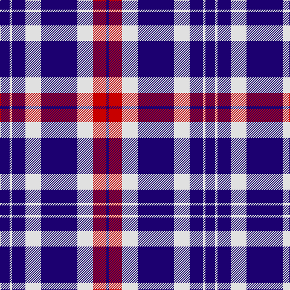

In pattern [BRWBWBWB](/stripes/brwbwbwb/).

This was sourced from tartans-authority.  It is a [8 stripe tartan](/stripes/stripes8/).

Original link http://www.tartansauthority.com/tartan-ferret/display/2566/

## Thread count
DB/16 LN4 DB22 LN26 DB60 LN26 R22 DB/4

## Palette
Each colour and its ΔE from the base-6 reference it is a variant of.

| Colour | Shade | Base | ΔE (OKLab) |
|---|---|---|---|
| DB | <code style="background-color:#1C0070;">#1C0070</code> `#1C0070` | B <code style="background-color:#2A418A;">#2A418A</code> | 0.14 |
| LN | <code style="background-color:#E0E0E0;">#E0E0E0</code> `#E0E0E0` | W <code style="background-color:#F7F7F7;">#F7F7F7</code> | 0.07 |
| R | <code style="background-color:#C80000;">#C80000</code> `#C80000` | R <code style="background-color:#CC0000;">#CC0000</code> | 0.01 |

# Sample pattern

## Nearest tartans

The nearest existing variants by ΔTartan distance.

1. [Jubilation](/setts/s14/r11w13db30w13db11w2db8w2db11w13db30w13r11db2~x2/) — ΔT 1.18
1. [Queen Margaret University (Corporate](/setts/s7/k1w3db2w4db8w1db1~x6/) — ΔT 1.36
1. [Ailsa, Navy (Dance)](/setts/s6/db8w3db28w32k3w4~x2/) — ΔT 1.57
1. [Good Morning America (Corporate)](/setts/s11/db2w2r2w2r2db2r2db12ly1db2w2~x4/) — ΔT 1.62
1. [America (Eagle version)](/setts/s10/db5r2db5w7db32w7r13db3r13w2~x2/) — ΔT 1.68
1. [Loughborough Sport](/setts/s7/k15n3w10n7dp40w3dp6~x2/) — ΔT 1.68
1. [Hydro-Electric](/setts/s10/db11k4w5k1r3k1w5k4db11r1~x4/) — ΔT 1.69
1. [Ikelman No 1](/setts/s6/w8k16w2db2w1k1~x4/) — ΔT 1.70
1. [Turnbull Dress, Bruce (Personal)](/setts/s5/db10g4w27db40r4~x2/) — ΔT 1.72
1. [Costa, David (Personal)](/setts/s12/w24db12w1db2w2db2w1db12dt3db4dt3db20~x2/) — ΔT 1.73

## Neighbour map

Every grey dot is one of 14299 variants placed by the first two principal components of the ΔTartan feature space (44% of its variance). Red is this tartan; blue dots are its nearest — click one to open its page.

<svg viewBox="0 0 640 380" role="img" style="max-width:100%;height:auto;border:1px solid #e0e0e0;border-radius:4px;display:block" xmlns="http://www.w3.org/2000/svg"><image href="/nn/cloud.v1.png" width="640" height="380"/><a href="/setts/s14/r11w13db30w13db11w2db8w2db11w13db30w13r11db2~x2/"><circle cx="258.4" cy="167.2" r="4" fill="#3465a4"><title>Jubilation</title></circle></a><a href="/setts/s7/k1w3db2w4db8w1db1~x6/"><circle cx="280.5" cy="208.6" r="4" fill="#3465a4"><title>Queen Margaret University (Corporate</title></circle></a><a href="/setts/s6/db8w3db28w32k3w4~x2/"><circle cx="279.3" cy="189.9" r="4" fill="#3465a4"><title>Ailsa, Navy (Dance)</title></circle></a><a href="/setts/s11/db2w2r2w2r2db2r2db12ly1db2w2~x4/"><circle cx="286.3" cy="141.9" r="4" fill="#3465a4"><title>Good Morning America (Corporate)</title></circle></a><a href="/setts/s10/db5r2db5w7db32w7r13db3r13w2~x2/"><circle cx="290.1" cy="157.4" r="4" fill="#3465a4"><title>America (Eagle version)</title></circle></a><a href="/setts/s7/k15n3w10n7dp40w3dp6~x2/"><circle cx="270.4" cy="160.6" r="4" fill="#3465a4"><title>Loughborough Sport</title></circle></a><a href="/setts/s10/db11k4w5k1r3k1w5k4db11r1~x4/"><circle cx="194.0" cy="170.6" r="4" fill="#3465a4"><title>Hydro-Electric</title></circle></a><a href="/setts/s6/w8k16w2db2w1k1~x4/"><circle cx="325.8" cy="175.5" r="4" fill="#3465a4"><title>Ikelman No 1</title></circle></a><a href="/setts/s5/db10g4w27db40r4~x2/"><circle cx="288.4" cy="200.2" r="4" fill="#3465a4"><title>Turnbull Dress, Bruce (Personal)</title></circle></a><a href="/setts/s12/w24db12w1db2w2db2w1db12dt3db4dt3db20~x2/"><circle cx="343.7" cy="130.0" r="4" fill="#3465a4"><title>Costa, David (Personal)</title></circle></a><circle cx="288.4" cy="188.1" r="5" fill="#c00000"/></svg>

ID: /setts/s8/db8w2db11w13db30w13r11db2~x2/
