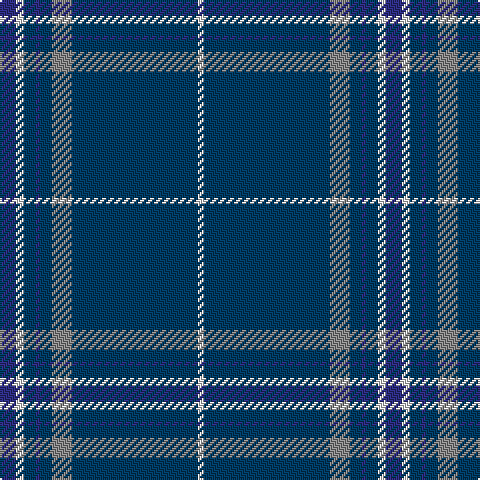

**Bands:** [BWBBBRBW](/stripes/bwbbbrbw/) · **Stripes:** [DB W DT DB DT O DT W](/stripes/stripes8/) DB W DT DB DT O DT W

This was sourced from register-of-tartans.  It is a [8 band tartan](/bands/bands8/).

Original link https://www.tartanregister.gov.uk/tartanDetails.aspx?ref=3382

## Attestations

This cloth appears in 2 source records; the oldest owns this page.

- 01/01/2007 — Pride of the Clyde (register-of-tartans, [record](https://www.tartanregister.gov.uk/tartanDetails.aspx?ref=3382))
- pre 2007 — Pride of the Clyde (Fashion) (tartans-authority, [record](http://www.tartansauthority.com/tartan-ferret/display/7298/))

## Register references

External register numbers recorded for this tartan.

- Scottish Register of Tartans: [3382](https://www.tartanregister.gov.uk/tartanDetails.aspx?ref=3382)
- Scottish Tartans Authority (ITI): 7298

## Thread count
DB/8 LN4 DBa6 DB2 DBa6 N10 DBa63 LN/3

## Palette
Each colour and its ΔE from the base-6 reference it is a variant of.

| Colour | Shade | Base | ΔE (OKLab) |
|---|---|---|---|
| DB | <code style="background-color:#2C2C80;">#2C2C80</code> `#2C2C80` | B <code style="background-color:#2A418A;">#2A418A</code> | 0.06 |
| DBa | <code style="background-color:#003C64;">#003C64</code> `#003C64` | B <code style="background-color:#2A418A;">#2A418A</code> | 0.08 |
| LN | <code style="background-color:#E0E0E0;">#E0E0E0</code> `#E0E0E0` | W <code style="background-color:#F7F7F7;">#F7F7F7</code> | 0.07 |
| N | <code style="background-color:#888888;">#888888</code> `#888888` | R <code style="background-color:#CC0000;">#CC0000</code> | 0.24 |

# Sample pattern

## Nearest tartans

The nearest existing variants by ΔTartan distance.

1. [Salvation Army, Hunting](/setts/s7/db40g8k1ly2k1g8db5~x4/) — ΔT 0.98
1. [United States Trade sett Tartan Tartan Number: 2126. Earliest known date: 1989 This design is different in warp and weft. The display gives the general appearance only. Produced to celebrate American tourism is Scotland. The colours are taken from the flags of the two nations and the Atlantic Ocean that separates them. See products available Copyright © Blair Urquhart, Comrie, 2015](/setts/s9/db7dt5lr6dt5r7dt2db2dt70lr2/) — ΔT 0.99
1. [Affara (Personal)](/setts/s7/db80k5g12k2ly2g2k10~x2/) — ΔT 1.22
1. [Seletar Shipping (Corporate)](/setts/s10/db6lo2db7g4db3g6db2g4db39ly2~x2/) — ΔT 1.23
1. [Calum's Cabin](/setts/s9/db32ly4db12db2db4db2o16db67ly6/) — ΔT 1.24
1. [Royal Conservatoire of Scotland](/setts/s8/dp11t90dy3t11dp7dy11dp13t11/) — ΔT 1.30
1. [North Tyneside Pipe Band](/setts/s7/b62db22w3db2w2db3r1~x2/) — ΔT 1.47
1. [Chateau](/setts/s10/n36k3dy3t1dy3k3n4dy6k1t2~x4/) — ΔT 1.50
1. [Tyneside Blue, North Tyneside Pipe Band](/setts/s7/db62k22w3k2w2k3r1~x2/) — ΔT 1.51
1. [Unidentified #64](/setts/s10/db57ly2db10dg4db4dg9r12db4r4lr2~x2/) — ΔT 1.51

## Neighbour map

Every grey dot is one of 14299 variants placed by the first two principal components of the ΔTartan feature space (44% of its variance). Red is this tartan; blue dots are its nearest — click one to open its page.

<svg viewBox="0 0 640 380" role="img" style="max-width:100%;height:auto;border:1px solid #e0e0e0;border-radius:4px;display:block" xmlns="http://www.w3.org/2000/svg"><image href="/nn/cloud.v1.png" width="640" height="380"/><a href="/setts/s7/db40g8k1ly2k1g8db5~x4/"><circle cx="487.3" cy="143.1" r="4" fill="#3465a4"><title>Salvation Army, Hunting</title></circle></a><a href="/setts/s9/db7dt5lr6dt5r7dt2db2dt70lr2/"><circle cx="571.8" cy="136.2" r="4" fill="#3465a4"><title>United States Trade sett Tartan Tartan Number: 2126. Earliest known date: 1989 This design is different in warp and weft. The display gives the general appearance only. Produced to celebrate American tourism is Scotland. The colours are taken from the flags of the two nations and the Atlantic Ocean that separates them. See products available Copyright © Blair Urquhart, Comrie, 2015</title></circle></a><a href="/setts/s7/db80k5g12k2ly2g2k10~x2/"><circle cx="535.8" cy="149.1" r="4" fill="#3465a4"><title>Affara (Personal)</title></circle></a><a href="/setts/s10/db6lo2db7g4db3g6db2g4db39ly2~x2/"><circle cx="525.2" cy="163.2" r="4" fill="#3465a4"><title>Seletar Shipping (Corporate)</title></circle></a><a href="/setts/s9/db32ly4db12db2db4db2o16db67ly6/"><circle cx="467.7" cy="140.5" r="4" fill="#3465a4"><title>Calum's Cabin</title></circle></a><a href="/setts/s8/dp11t90dy3t11dp7dy11dp13t11/"><circle cx="514.4" cy="164.1" r="4" fill="#3465a4"><title>Royal Conservatoire of Scotland</title></circle></a><a href="/setts/s7/b62db22w3db2w2db3r1~x2/"><circle cx="482.0" cy="129.0" r="4" fill="#3465a4"><title>North Tyneside Pipe Band</title></circle></a><a href="/setts/s10/n36k3dy3t1dy3k3n4dy6k1t2~x4/"><circle cx="451.0" cy="123.5" r="4" fill="#3465a4"><title>Chateau</title></circle></a><a href="/setts/s7/db62k22w3k2w2k3r1~x2/"><circle cx="476.9" cy="126.6" r="4" fill="#3465a4"><title>Tyneside Blue, North Tyneside Pipe Band</title></circle></a><a href="/setts/s10/db57ly2db10dg4db4dg9r12db4r4lr2~x2/"><circle cx="459.4" cy="118.1" r="4" fill="#3465a4"><title>Unidentified #64</title></circle></a><circle cx="510.5" cy="146.2" r="5" fill="#c00000"/></svg>

ID: /setts/s8/db8w4dt6db2dt6o10dt63w3/
