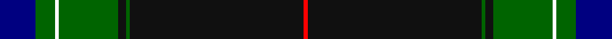

In pattern [BGWGKGKR](/stripes/bgwgkgkr/).

This was sourced from register-of-tartans.  It is a [8 stripe tartan](/stripes/stripes8/).

Original link https://www.tartanregister.gov.uk/tartanDetails.aspx?ref=10737

## Attestations

This cloth appears in 2 source records; the oldest owns this page.

- 16/10/2012 — Ataç, H.M. & I.C. (Personal) (register-of-tartans, [record](https://www.tartanregister.gov.uk/tartanDetails.aspx?ref=10737))
- undated — Ataç, H.M. & I.C. (Personal) Name Tartan Tartan Number: 10737. Earliest known date: 14 November 2012 In this design, numerical significance predominates with the marriage date of Mr & Mrs Ataç and the birthday of Mrs Ataç. The blue band between the narrow whites has 18 threads, the dark green next to it has 10 and the broad black has 88 giving the date of 18th October 1988.The broader dark grren has 30 threads and, teamed with the narrower dark green of 10, produces Mrs Ataç's birthday of the 30th of October. The colours of green and red also represent the corporate colours of Mr Ataç's company. See products available Copyright © Blair Urquhart, Comrie, 2015 (house-of-tartan, [record](http://www.house-of-tartan.scotland.net/house/TartanViewjs.asp?colr=Def&tnam=10737))

## Register references

External register numbers recorded for this tartan.

- Scottish Register of Tartans: [10737](https://www.tartanregister.gov.uk/tartanDetails.aspx?ref=10737)

## Thread count
DB/18 G10 W2 G30 K4 G2 K88 R/2

## Palette
Each colour and the base-6 reference it is a variant of.

| Colour | Shade | Base |
|---|---|---|
| DB | <code style="background-color:#000080;">#000080</code> `oklch(27.1% 0.188 264.1)` <small>#000080</small> | B <code style="background-color:#2A418A;">#2A418A</code> |
| G | <code style="background-color:#006400;">#006400</code> `oklch(43.6% 0.148 142.5)` <small>#006400</small> | G <code style="background-color:#006100;">#006100</code> |
| K | <code style="background-color:#101010;">#101010</code> `oklch(17.3% 0.000 89.9)` <small>#101010</small> | K <code style="background-color:#000000;">#000000</code> |
| R | <code style="background-color:#FF0000;">#FF0000</code> `oklch(62.8% 0.258 29.2)` <small>#FF0000</small> | R <code style="background-color:#CC0000;">#CC0000</code> |
| W | <code style="background-color:#FFFFFF;">#FFFFFF</code> `oklch(100.0% 0.000 89.9)` <small>#FFFFFF</small> | W <code style="background-color:#F7F7F7;">#F7F7F7</code> |

# Sample pattern

## Nearest tartans

The nearest existing variants by ΔTartan distance.

1. [Marsa Scout Group](/setts/s11/r4k1k1db8r2k44g8k1ly2k1g4~x2/) — ΔT 1.17
1. [Hot Boontjie](/setts/s8/r4k32dg18k1w2k1dg4m4~x2/) — ΔT 1.19
1. [Moran Family Ubique](/setts/s10/dg68k2dg2k2dg2lo8r8k8lo2db7~x2/) — ΔT 1.23
1. [Wells (2014)](/setts/s7/db50dg25lo3o8r1w1r1~x2/) — ΔT 1.30
1. [Victorian Highland Pipe Band Association (Australia)](/setts/s8/dt46w1lo3dg13w1r7g3w1~x2/) — ΔT 1.34
1. [Nocken Blue Modern Tartan (Personal)](/setts/s9/lr3k6w2k6dt2k2dt32k2n1~x2/) — ΔT 1.34
1. [Italian American](/setts/s9/r4k2w6k2db40k80dg10w6r3/) — ΔT 1.35
1. [Schwarzen Keiler, Die](/setts/s12/dg6k6r1w1k6dg32k6r1w1k6dg6ly2~x4/) — ΔT 1.35
1. [Estonian National Tartan (District)](/setts/s10/k53b3k2w1k2b3k5b32ly1r3~x2/) — ΔT 1.36
1. [MacDonnald of ye Ylis](/setts/s9/lr4dg30k1dg1k1dg3k12db10r3~x2/) — ΔT 1.37

## Neighbour map

Every grey dot is one of 14299 variants placed by the first two principal components of the ΔTartan feature space (44% of its variance). Red is this tartan; blue dots are its nearest — click one to open its page.

<svg viewBox="0 0 640 380" role="img" style="max-width:100%;height:auto;border:1px solid #e0e0e0;border-radius:4px;display:block" xmlns="http://www.w3.org/2000/svg"><image href="/nn/cloud.v1.png" width="640" height="380"/><a href="/setts/s11/r4k1k1db8r2k44g8k1ly2k1g4~x2/"><circle cx="421.0" cy="84.2" r="4" fill="#3465a4"><title>Marsa Scout Group</title></circle></a><a href="/setts/s8/r4k32dg18k1w2k1dg4m4~x2/"><circle cx="340.1" cy="130.4" r="4" fill="#3465a4"><title>Hot Boontjie</title></circle></a><a href="/setts/s10/dg68k2dg2k2dg2lo8r8k8lo2db7~x2/"><circle cx="442.4" cy="104.0" r="4" fill="#3465a4"><title>Moran Family Ubique</title></circle></a><a href="/setts/s7/db50dg25lo3o8r1w1r1~x2/"><circle cx="371.8" cy="103.9" r="4" fill="#3465a4"><title>Wells (2014)</title></circle></a><a href="/setts/s8/dt46w1lo3dg13w1r7g3w1~x2/"><circle cx="402.7" cy="95.7" r="4" fill="#3465a4"><title>Victorian Highland Pipe Band Association (Australia)</title></circle></a><a href="/setts/s9/lr3k6w2k6dt2k2dt32k2n1~x2/"><circle cx="408.5" cy="125.3" r="4" fill="#3465a4"><title>Nocken Blue Modern Tartan (Personal)</title></circle></a><a href="/setts/s9/r4k2w6k2db40k80dg10w6r3/"><circle cx="341.6" cy="97.0" r="4" fill="#3465a4"><title>Italian American</title></circle></a><a href="/setts/s12/dg6k6r1w1k6dg32k6r1w1k6dg6ly2~x4/"><circle cx="395.8" cy="123.8" r="4" fill="#3465a4"><title>Schwarzen Keiler, Die</title></circle></a><a href="/setts/s10/k53b3k2w1k2b3k5b32ly1r3~x2/"><circle cx="409.6" cy="86.1" r="4" fill="#3465a4"><title>Estonian National Tartan (District)</title></circle></a><a href="/setts/s9/lr4dg30k1dg1k1dg3k12db10r3~x2/"><circle cx="304.7" cy="125.6" r="4" fill="#3465a4"><title>MacDonnald of ye Ylis</title></circle></a><circle cx="402.4" cy="120.1" r="5" fill="#c00000"/></svg>

ID: /setts/s8/db9g5w1g15k2g1k44r1~x2/
