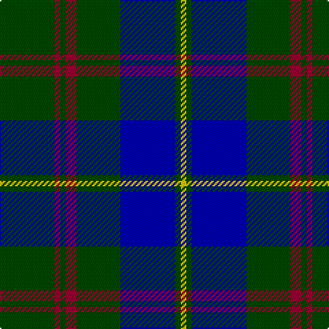

In pattern [GRGRGBGY](/stripes/grgrgbgy/).

This was sourced from register-of-tartans.  It is a [8 stripe tartan](/stripes/stripes8/).

Original link https://www.tartanregister.gov.uk/tartanDetails.aspx?ref=1376

## Attestations

This cloth appears in 2 source records; the oldest owns this page.

- 01/01/2002 — Glen Esk (register-of-tartans, [record](https://www.tartanregister.gov.uk/tartanDetails.aspx?ref=1376))
- pre 2002 — Glen Esk (Fashion) (tartans-authority, [record](http://www.tartansauthority.com/tartan-ferret/display/5006/))

## Register references

External register numbers recorded for this tartan.

- Scottish Register of Tartans: [1376](https://www.tartanregister.gov.uk/tartanDetails.aspx?ref=1376)
- Scottish Tartans Authority (ITI): 5006

## Thread count
G/40 DR4 G4 DR8 G32 B40 G4 Y/4

## Palette
Each colour and the base-6 reference it is a variant of.

| Colour | Shade | Base |
|---|---|---|
| B | <code style="background-color:#0000B4;">#0000B4</code> `oklch(34.8% 0.241 264.1)` <small>#0000B4</small> | B <code style="background-color:#2A418A;">#2A418A</code> |
| DR | <code style="background-color:#9C0030;">#9C0030</code> `oklch(44.0% 0.176 15.7)` <small>#9C0030</small> | R <code style="background-color:#CC0000;">#CC0000</code> |
| G | <code style="background-color:#004800;">#004800</code> `oklch(34.8% 0.118 142.5)` <small>#004800</small> | G <code style="background-color:#006100;">#006100</code> |
| Y | <code style="background-color:#FCC800;">#FCC800</code> `oklch(85.4% 0.175 89.6)` <small>#FCC800</small> | Y <code style="background-color:#F2BF00;">#F2BF00</code> |

# Sample pattern

## Nearest tartans

The nearest existing variants by ΔTartan distance.

1. [MacIntyre L](/setts/s6/dg4db12r3db12dg32lb4/) — ΔT 0.81
1. [Heritage Tartan, The](/setts/s6/db8r4db24g35lb4g8/) — ΔT 0.93
1. [MacIntyre LC](/setts/s6/dg4db12r3db12dg32lr4~x2/) — ΔT 0.99
1. [MacIntyre LC](/setts/s6/dg4db12r3db12dg32lr4/) — ΔT 0.99
1. [Rowan](/setts/s9/db1k1db8ly1g12ly1db8k1db1~x2/) — ΔT 1.02
1. [Greenways Marketing Intl (Corporate)](/setts/s7/db24g3db3g3lo2g18r2~x2/) — ΔT 1.04
1. [MacIntyre](/setts/s6/dg4db12r3db12dg32w4~x2/) — ΔT 1.08
1. [Greenways Marketing Intl](/setts/s12/g3db3g3db24g3db3g3lo2g18r2g18lo2~x2/) — ΔT 1.08
1. [MacHardy](/setts/s8/db3r3g18db16w2db26r3g3~x2/) — ΔT 1.09
1. [Kells Irish Pubs (Corporate)](/setts/s12/k17o2k3g2k3g2k24b8g4b4g3b8~x2/) — ΔT 1.09

## Neighbour map

Every grey dot is one of 14299 variants placed by the first two principal components of the ΔTartan feature space (44% of its variance). Red is this tartan; blue dots are its nearest — click one to open its page.

<svg viewBox="0 0 640 380" role="img" style="max-width:100%;height:auto;border:1px solid #e0e0e0;border-radius:4px;display:block" xmlns="http://www.w3.org/2000/svg"><image href="/nn/cloud.v1.png" width="640" height="380"/><a href="/setts/s6/dg4db12r3db12dg32lb4/"><circle cx="301.3" cy="218.4" r="4" fill="#3465a4"><title>MacIntyre L</title></circle></a><a href="/setts/s6/db8r4db24g35lb4g8/"><circle cx="284.9" cy="228.3" r="4" fill="#3465a4"><title>Heritage Tartan, The</title></circle></a><a href="/setts/s6/dg4db12r3db12dg32lr4~x2/"><circle cx="322.2" cy="228.7" r="4" fill="#3465a4"><title>MacIntyre LC</title></circle></a><a href="/setts/s6/dg4db12r3db12dg32lr4/"><circle cx="322.2" cy="228.7" r="4" fill="#3465a4"><title>MacIntyre LC</title></circle></a><a href="/setts/s9/db1k1db8ly1g12ly1db8k1db1~x2/"><circle cx="297.3" cy="177.1" r="4" fill="#3465a4"><title>Rowan</title></circle></a><a href="/setts/s7/db24g3db3g3lo2g18r2~x2/"><circle cx="312.4" cy="196.9" r="4" fill="#3465a4"><title>Greenways Marketing Intl (Corporate)</title></circle></a><a href="/setts/s6/dg4db12r3db12dg32w4~x2/"><circle cx="323.4" cy="225.9" r="4" fill="#3465a4"><title>MacIntyre</title></circle></a><a href="/setts/s12/g3db3g3db24g3db3g3lo2g18r2g18lo2~x2/"><circle cx="335.5" cy="174.5" r="4" fill="#3465a4"><title>Greenways Marketing Intl</title></circle></a><a href="/setts/s8/db3r3g18db16w2db26r3g3~x2/"><circle cx="360.5" cy="198.1" r="4" fill="#3465a4"><title>MacHardy</title></circle></a><a href="/setts/s12/k17o2k3g2k3g2k24b8g4b4g3b8~x2/"><circle cx="325.0" cy="180.4" r="4" fill="#3465a4"><title>Kells Irish Pubs (Corporate)</title></circle></a><circle cx="324.8" cy="207.8" r="5" fill="#c00000"/></svg>

ID: /setts/s8/dg10r1dg1r2dg8db10dg1ly1~x4/
