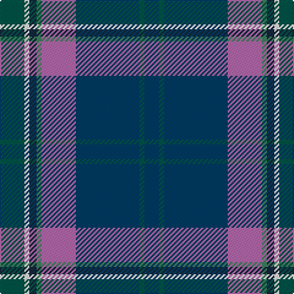

This page is one **sett** — a single exact thread-count. It belongs to the [tartan](/tartans/dg10w2dt3g2m14dti26dg2dti6/)
(the same proportion at any scale), whose colour order is pattern [BGBRGBWG](/stripes/bgbrgbwg/).

Sourced from tartans-authority.  It is a [8 stripe tartan](/stripes/stripes8/).

Original link http://www.tartansauthority.com/tartan-ferret/display/6526/

## Register references

External register numbers recorded for this tartan.

- Scottish Tartans Authority (ITI): 6526

## Thread count
Ga/20 W4 DN6 G4 P28 DB52 Ga4 DB/12

## Palette

Palette: <strong>Tartan Register</strong> <small style="color:#888">(5 of 6 colours)</small>
<table><thead><tr><th>Colour</th><th>Threads</th><th>Shade</th><th>Base</th><th>OKLCh</th></tr></thead><tbody><tr><td>Ga/</td><td style="text-align:right;font-variant-numeric:tabular-nums">20</td><td><code style="background-color:#005448;">#005448</code> <small style="color:#888">#005448</small></td><td>G <code style="background-color:#006100;">#006100</code></td><td><small style="color:#888">oklch(39.9% 0.073 178.8)</small></td></tr><tr><td>W</td><td style="text-align:right;font-variant-numeric:tabular-nums">4</td><td><code style="background-color:#F8F8F8;">#F8F8F8</code> <small style="color:#888">#F8F8F8</small></td><td>W <code style="background-color:#F7F7F7;">#F7F7F7</code></td><td><small style="color:#888">oklch(97.9% 0.000 89.9)</small></td></tr><tr><td>DN</td><td style="text-align:right;font-variant-numeric:tabular-nums">6</td><td><code style="background-color:#14283C;">#14283C</code> <small style="color:#888">#14283C</small></td><td>B <code style="background-color:#2A418A;">#2A418A</code></td><td><small style="color:#888">oklch(27.1% 0.046 249.9)</small></td></tr><tr><td>G</td><td style="text-align:right;font-variant-numeric:tabular-nums">4</td><td><code style="background-color:#408060;">#408060</code> <small style="color:#888">#408060</small></td><td>G <code style="background-color:#006100;">#006100</code></td><td><small style="color:#888">oklch(54.8% 0.084 160.1)</small></td></tr><tr><td>P</td><td style="text-align:right;font-variant-numeric:tabular-nums">28</td><td><code style="background-color:#B468AC;">#B468AC</code> <small style="color:#888">#B468AC</small></td><td>R <code style="background-color:#CC0000;">#CC0000</code></td><td><small style="color:#888">oklch(62.5% 0.131 330.9)</small></td></tr><tr><td>DB</td><td style="text-align:right;font-variant-numeric:tabular-nums">52</td><td><code style="background-color:#003C64;">#003C64</code> <small style="color:#888">#003C64</small></td><td>B <code style="background-color:#2A418A;">#2A418A</code></td><td><small style="color:#888">oklch(34.5% 0.089 246.0)</small></td></tr><tr><td>Ga</td><td style="text-align:right;font-variant-numeric:tabular-nums">4</td><td><code style="background-color:#005448;">#005448</code> <small style="color:#888">#005448</small></td><td>G <code style="background-color:#006100;">#006100</code></td><td><small style="color:#888">oklch(39.9% 0.073 178.8)</small></td></tr><tr><td>DB/</td><td style="text-align:right;font-variant-numeric:tabular-nums">12</td><td><code style="background-color:#003C64;">#003C64</code> <small style="color:#888">#003C64</small></td><td>B <code style="background-color:#2A418A;">#2A418A</code></td><td><small style="color:#888">oklch(34.5% 0.089 246.0)</small></td></tr></tbody></table>

# Sample pattern

## Nearest tartans

The nearest existing variants by ΔTartan distance, with this tartan at the top so the swatches line up against it.

ΔTartan

Tartan

Sett

—

<a href="/ttd/edit/#slug=dg10w2dt3g2m14dti26dg2dti6~x2">Spirit of Fife (Corporate)</a> <a class="nn-out" href="/setts/s8/dg10w2dt3g2m14dti26dg2dti6~x2/" title="open its dictionary page">↗</a>

0.77

<a href="/ttd/edit/#slug=db30n10y10db5r3ly3g3~x2">Wrigglesworth Family Canada (Personal)</a> <a class="nn-out" href="/setts/s7/db30n10y10db5r3ly3g3~x2/" title="open its dictionary page">↗</a>

0.82

<a href="/ttd/edit/#slug=dt5b43dt18lb4b6r5dy25lo5~x2">State Seal of Iowa (Fashion)</a> <a class="nn-out" href="/setts/s8/dt5b43dt18lb4b6r5dy25lo5~x2/" title="open its dictionary page">↗</a>

0.91

<a href="/ttd/edit/#slug=db4dy5g19dp5dy5k5dy5db36ly3~x2">Suzugamine (Corporate)</a> <a class="nn-out" href="/setts/s9/db4dy5g19dp5dy5k5dy5db36ly3~x2/" title="open its dictionary page">↗</a>

0.99

<a href="/ttd/edit/#slug=m4k3b18r3dt34w3~x2">Margach, William (Personal)</a> <a class="nn-out" href="/setts/s6/m4k3b18r3dt34w3~x2/" title="open its dictionary page">↗</a>

0.99

<a href="/ttd/edit/#slug=t27db9lb3g6db33lb3dr3ly2~x2">Blue Ridge Highlands Heritage</a> <a class="nn-out" href="/setts/s8/t27db9lb3g6db33lb3dr3ly2~x2/" title="open its dictionary page">↗</a>

1.09

<a href="/ttd/edit/#slug=dbi30w2r3w2db14lr3dg14dbi18r2dbi3~x2">Kansai St Andrews Society</a> <a class="nn-out" href="/setts/s10/dbi30w2r3w2db14lr3dg14dbi18r2dbi3~x2/" title="open its dictionary page">↗</a>

1.10

<a href="/ttd/edit/#slug=n9r1g9db19w2db19g9r1n9ri1~x2">Wilton (Toronto) (Personal)</a> <a class="nn-out" href="/setts/s10/n9r1g9db19w2db19g9r1n9ri1~x2/" title="open its dictionary page">↗</a>

1.15

<a href="/ttd/edit/#slug=db60loi3db5lo5db9do20loi4g32lb4~x2">State Seal of Ohio (Fashion)</a> <a class="nn-out" href="/setts/s9/db60loi3db5lo5db9do20loi4g32lb4~x2/" title="open its dictionary page">↗</a>

1.16

<a href="/ttd/edit/#slug=dy2db4ly3dg28db28w2db4n2~x2">Laurentian University</a> <a class="nn-out" href="/setts/s8/dy2db4ly3dg28db28w2db4n2~x2/" title="open its dictionary page">↗</a>

1.20

<a href="/ttd/edit/#slug=m4k3t18r3dp34w3~x2">Margach, William (Dumbarton)</a> <a class="nn-out" href="/setts/s6/m4k3t18r3dp34w3~x2/" title="open its dictionary page">↗</a>

## Neighbour map

Every grey dot is one of 14359 variants placed by the first two principal components of the ΔTartan feature space (44% of its variance). Red is this tartan; blue dots are its nearest — click one to open its page.

<svg viewBox="0 0 640 380" role="img" style="max-width:100%;height:auto;border:1px solid #e0e0e0;border-radius:4px;display:block" xmlns="http://www.w3.org/2000/svg"><image href="/nn/cloud.v1.png" width="640" height="380"/><a href="/setts/s7/db30n10y10db5r3ly3g3~x2/"><circle cx="275.2" cy="182.0" r="4" fill="#3465a4"><title>Wrigglesworth Family Canada (Personal)</title></circle></a><a href="/setts/s8/dt5b43dt18lb4b6r5dy25lo5~x2/"><circle cx="219.5" cy="176.8" r="4" fill="#3465a4"><title>State Seal of Iowa (Fashion)</title></circle></a><a href="/setts/s9/db4dy5g19dp5dy5k5dy5db36ly3~x2/"><circle cx="224.2" cy="156.8" r="4" fill="#3465a4"><title>Suzugamine (Corporate)</title></circle></a><a href="/setts/s6/m4k3b18r3dt34w3~x2/"><circle cx="275.8" cy="176.4" r="4" fill="#3465a4"><title>Margach, William (Personal)</title></circle></a><a href="/setts/s8/t27db9lb3g6db33lb3dr3ly2~x2/"><circle cx="263.3" cy="146.6" r="4" fill="#3465a4"><title>Blue Ridge Highlands Heritage</title></circle></a><a href="/setts/s10/dbi30w2r3w2db14lr3dg14dbi18r2dbi3~x2/"><circle cx="282.3" cy="149.2" r="4" fill="#3465a4"><title>Kansai St Andrews Society</title></circle></a><a href="/setts/s10/n9r1g9db19w2db19g9r1n9ri1~x2/"><circle cx="257.9" cy="161.9" r="4" fill="#3465a4"><title>Wilton (Toronto) (Personal)</title></circle></a><a href="/setts/s9/db60loi3db5lo5db9do20loi4g32lb4~x2/"><circle cx="285.6" cy="132.2" r="4" fill="#3465a4"><title>State Seal of Ohio (Fashion)</title></circle></a><a href="/setts/s8/dy2db4ly3dg28db28w2db4n2~x2/"><circle cx="300.5" cy="161.4" r="4" fill="#3465a4"><title>Laurentian University</title></circle></a><a href="/setts/s6/m4k3t18r3dp34w3~x2/"><circle cx="293.9" cy="176.2" r="4" fill="#3465a4"><title>Margach, William (Dumbarton)</title></circle></a><circle cx="252.2" cy="168.3" r="5" fill="#c00000"/></svg>

ID: /setts/s8/dg10w2dt3g2m14dti26dg2dti6~x2/
