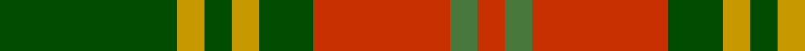

In pattern [GYGYGRGR](/stripes/gygygrgr/).

This was sourced from register-of-tartans.  It is a [8 stripe tartan](/stripes/stripes8/).

Original link https://www.tartanregister.gov.uk/tartanDetails.aspx?ref=3210

## Attestations

This cloth appears in 2 source records; the oldest owns this page.

- 01/01/2002 — Oakwood (register-of-tartans, [record](https://www.tartanregister.gov.uk/tartanDetails.aspx?ref=3210))
- pre 2002 — Oakwood (Fashion) (tartans-authority, [record](http://www.tartansauthority.com/tartan-ferret/display/5532/))

## Register references

External register numbers recorded for this tartan.

- Scottish Register of Tartans: [3210](https://www.tartanregister.gov.uk/tartanDetails.aspx?ref=3210)
- Scottish Tartans Authority (ITI): 5532

## Thread count
G/52 DY8 G8 DY8 G16 R40 Ga8 R/8

## Palette
Each colour and its ΔE from the base-6 reference it is a variant of.

| Colour | Shade | Base | ΔE (OKLab) |
|---|---|---|---|
| DY | <code style="background-color:#C89800;">#C89800</code> `#C89800` | Y <code style="background-color:#F2BF00;">#F2BF00</code> | 0.12 |
| G | <code style="background-color:#004C00;">#004C00</code> `#004C00` | G <code style="background-color:#006100;">#006100</code> | 0.07 |
| Ga | <code style="background-color:#48783C;">#48783C</code> `#48783C` | G <code style="background-color:#006100;">#006100</code> | 0.11 |
| R | <code style="background-color:#C83000;">#C83000</code> `#C83000` | R <code style="background-color:#CC0000;">#CC0000</code> | 0.03 |

# Sample pattern

## Nearest tartans

The nearest existing variants by ΔTartan distance.

1. [Invertere Corporate Tartan Tartan Number: 1882. Earliest known date: 1988 Overstripes are yellow in warp See products available Copyright © Blair Urquhart, Comrie, 2015](/setts/s8/ly5dg14dy4db4dy27dg3dy4ly5/) — ΔT 0.91
1. [Invertere (Daks #2) (Fashion)](/setts/s8/ly5g14dy4db4dy27g3dy4ly5~x2/) — ΔT 1.01
1. [Burnett](/setts/s8/r4g14ly3g14r4g3r29y4~x2/) — ΔT 1.24
1. [Unidentified #57](/setts/s8/dg20r8lr2r8dg5ly8dg2ly8~x2/) — ΔT 1.26
1. [MacCall/McCall](/setts/s8/r3k2r3g12r3w1r1g1~x4/) — ΔT 1.26
1. [Newfoundland](/setts/s7/r6g4do14w4do7g30lo4~x2/) — ΔT 1.29
1. [Invertere, (Daks)](/setts/s8/r5dg12o4db4o22dg3o4r5/) — ΔT 1.30
1. [Newfoundland (District)](/setts/s7/r6dg4do14w4do7dg30lo4~x2/) — ΔT 1.30
1. [Unidentified Plaid 6](/setts/s10/r4t3r32db30r4g32r3g32r3g3~x2/) — ΔT 1.30
1. [Lennox](/setts/s7/r2r1r10r2g10w1g2~x2/) — ΔT 1.31

## Neighbour map

Every grey dot is one of 14299 variants placed by the first two principal components of the ΔTartan feature space (44% of its variance). Red is this tartan; blue dots are its nearest — click one to open its page.

<svg viewBox="0 0 640 380" role="img" style="max-width:100%;height:auto;border:1px solid #e0e0e0;border-radius:4px;display:block" xmlns="http://www.w3.org/2000/svg"><image href="/nn/cloud.v1.png" width="640" height="380"/><a href="/setts/s8/ly5dg14dy4db4dy27dg3dy4ly5/"><circle cx="289.4" cy="201.7" r="4" fill="#3465a4"><title>Invertere Corporate Tartan Tartan Number: 1882. Earliest known date: 1988 Overstripes are yellow in warp See products available Copyright © Blair Urquhart, Comrie, 2015</title></circle></a><a href="/setts/s8/ly5g14dy4db4dy27g3dy4ly5~x2/"><circle cx="278.5" cy="194.4" r="4" fill="#3465a4"><title>Invertere (Daks #2) (Fashion)</title></circle></a><a href="/setts/s8/r4g14ly3g14r4g3r29y4~x2/"><circle cx="308.6" cy="193.9" r="4" fill="#3465a4"><title>Burnett</title></circle></a><a href="/setts/s8/dg20r8lr2r8dg5ly8dg2ly8~x2/"><circle cx="223.9" cy="210.3" r="4" fill="#3465a4"><title>Unidentified #57</title></circle></a><a href="/setts/s8/r3k2r3g12r3w1r1g1~x4/"><circle cx="307.8" cy="182.7" r="4" fill="#3465a4"><title>MacCall/McCall</title></circle></a><a href="/setts/s7/r6g4do14w4do7g30lo4~x2/"><circle cx="233.0" cy="196.9" r="4" fill="#3465a4"><title>Newfoundland</title></circle></a><a href="/setts/s8/r5dg12o4db4o22dg3o4r5/"><circle cx="285.5" cy="224.6" r="4" fill="#3465a4"><title>Invertere, (Daks)</title></circle></a><a href="/setts/s7/r6dg4do14w4do7dg30lo4~x2/"><circle cx="237.5" cy="199.6" r="4" fill="#3465a4"><title>Newfoundland (District)</title></circle></a><a href="/setts/s10/r4t3r32db30r4g32r3g32r3g3~x2/"><circle cx="261.3" cy="183.0" r="4" fill="#3465a4"><title>Unidentified Plaid 6</title></circle></a><a href="/setts/s7/r2r1r10r2g10w1g2~x2/"><circle cx="270.0" cy="191.3" r="4" fill="#3465a4"><title>Lennox</title></circle></a><circle cx="278.8" cy="216.9" r="5" fill="#c00000"/></svg>

ID: /setts/s8/dg13ly2dg2ly2dg4r10g2r2~x4/
