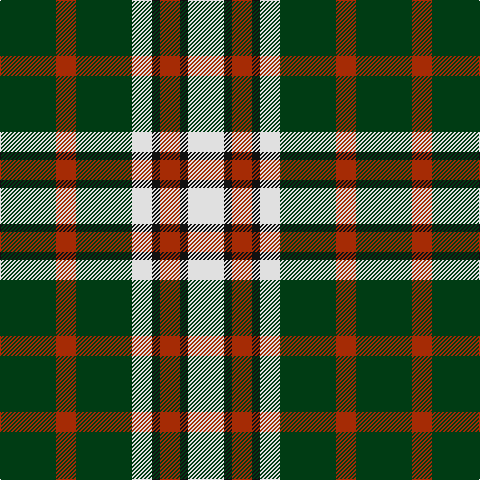

**Bands:** [GRGWKRKW](/stripes/grgwkrkw/) · **Stripes:** [DG O DG W K O K W](/stripes/stripes8/) DG O DG W K O K W

This was sourced from register-of-tartans.  It is a [8 band tartan](/bands/bands8/).

Original link https://www.tartanregister.gov.uk/tartanDetails.aspx?ref=4410

## Register references

External register numbers recorded for this tartan.

- Scottish Register of Tartans: [4410](https://www.tartanregister.gov.uk/tartanDetails.aspx?ref=4410)
- Scottish Tartans World Register: 1069

## Thread count
DG/56 R20 DG56 LN20 K8 R20 K8 LN/36

## Palette
Each colour and its ΔE from the base-6 reference it is a variant of.

| Colour | Shade | Base | ΔE (OKLab) |
|---|---|---|---|
| DG | <code style="background-color:#003C14;">#003C14</code> `#003C14` | G <code style="background-color:#006100;">#006100</code> | 0.13 |
| K | <code style="background-color:#101010;">#101010</code> `#101010` | K <code style="background-color:#000000;">#000000</code> | 0.17 |
| LN | <code style="background-color:#E0E0E0;">#E0E0E0</code> `#E0E0E0` | W <code style="background-color:#F7F7F7;">#F7F7F7</code> | 0.07 |
| R | <code style="background-color:#A52B05;">#A52B05</code> `#A52B05` | R <code style="background-color:#CC0000;">#CC0000</code> | 0.08 |

# Sample pattern

## Nearest tartans

The nearest existing variants by ΔTartan distance.

1. [Lawson, William 2002](/setts/s7/k4w19k11dg15k3dg16ly3~x2/) — ΔT 0.86
1. [Dalgliesh Dress](/setts/s11/g10k10lb4k2ly2k2lb3k12lb12k2lb3~x2/) — ΔT 1.01
1. [Lawsons' Whisky](/setts/s7/k9w38k22g31k5g31ly5/) — ΔT 1.14
1. [Black & White Golf (Corporate)](/setts/s7/lo9k32g6lb20lo3lb9k5~x2/) — ΔT 1.15
1. [MacMillan](/setts/s9/k6m2k12y3k6lb16y3lb16k2~x2/) — ΔT 1.15
1. [Daks (Brown)](/setts/s8/dy3k7dy2w2lo12k2lo2dy3~x2/) — ΔT 1.18
1. [Arkansas (Unofficial)](/setts/s9/dg10db4dg4db5dg6ly10r6dg18ly4/) — ΔT 1.19
1. [MacDona](/setts/s7/r35g52db18g17r12g17k18/) — ΔT 1.23
1. [Hill of Banchory Primary (School)](/setts/s7/db1ly6db8r1db8g6ly1~x4/) — ΔT 1.28
1. [St Andrews Bay](/setts/s7/lo30w4lo20g20k20lo3k6~x2/) — ΔT 1.29

## Neighbour map

Every grey dot is one of 14299 variants placed by the first two principal components of the ΔTartan feature space (44% of its variance). Red is this tartan; blue dots are its nearest — click one to open its page.

<svg viewBox="0 0 640 380" role="img" style="max-width:100%;height:auto;border:1px solid #e0e0e0;border-radius:4px;display:block" xmlns="http://www.w3.org/2000/svg"><image href="/nn/cloud.v1.png" width="640" height="380"/><a href="/setts/s7/k4w19k11dg15k3dg16ly3~x2/"><circle cx="148.6" cy="224.2" r="4" fill="#3465a4"><title>Lawson, William 2002</title></circle></a><a href="/setts/s11/g10k10lb4k2ly2k2lb3k12lb12k2lb3~x2/"><circle cx="166.3" cy="195.0" r="4" fill="#3465a4"><title>Dalgliesh Dress</title></circle></a><a href="/setts/s7/k9w38k22g31k5g31ly5/"><circle cx="151.6" cy="211.8" r="4" fill="#3465a4"><title>Lawsons' Whisky</title></circle></a><a href="/setts/s7/lo9k32g6lb20lo3lb9k5~x2/"><circle cx="190.2" cy="179.7" r="4" fill="#3465a4"><title>Black &amp; White Golf (Corporate)</title></circle></a><a href="/setts/s9/k6m2k12y3k6lb16y3lb16k2~x2/"><circle cx="208.5" cy="186.8" r="4" fill="#3465a4"><title>MacMillan</title></circle></a><a href="/setts/s8/dy3k7dy2w2lo12k2lo2dy3~x2/"><circle cx="179.3" cy="204.2" r="4" fill="#3465a4"><title>Daks (Brown)</title></circle></a><a href="/setts/s9/dg10db4dg4db5dg6ly10r6dg18ly4/"><circle cx="213.0" cy="239.5" r="4" fill="#3465a4"><title>Arkansas (Unofficial)</title></circle></a><a href="/setts/s7/r35g52db18g17r12g17k18/"><circle cx="182.0" cy="253.9" r="4" fill="#3465a4"><title>MacDona</title></circle></a><a href="/setts/s7/db1ly6db8r1db8g6ly1~x4/"><circle cx="234.4" cy="212.3" r="4" fill="#3465a4"><title>Hill of Banchory Primary (School)</title></circle></a><a href="/setts/s7/lo30w4lo20g20k20lo3k6~x2/"><circle cx="199.3" cy="197.7" r="4" fill="#3465a4"><title>St Andrews Bay</title></circle></a><circle cx="189.2" cy="211.9" r="5" fill="#c00000"/></svg>

ID: /setts/s8/dg14o5dg14w5k2o5k2w9~x4/
