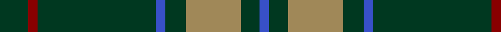

In pattern [BGYGBGRG](/stripes/bgygbgrg/).

This was sourced from tartans-authority.  It is a [8 stripe tartan](/stripes/stripes8/).

Original link http://www.tartansauthority.com/tartan-ferret/display/193/

## Thread count
DG/18 DR6 DG75 B6 DG13 LT35 DG12 B/6

## Palette
Each colour and its ΔE from the base-6 reference it is a variant of.

| Colour | Shade | Base | ΔE (OKLab) |
|---|---|---|---|
| B | <code style="background-color:#3850C8;">#3850C8</code> `#3850C8` | B <code style="background-color:#2A418A;">#2A418A</code> | 0.11 |
| DG | <code style="background-color:#003820;">#003820</code> `#003820` | G <code style="background-color:#006100;">#006100</code> | 0.15 |
| DR | <code style="background-color:#880000;">#880000</code> `#880000` | R <code style="background-color:#CC0000;">#CC0000</code> | 0.15 |
| LT | <code style="background-color:#A08858;">#A08858</code> `#A08858` | Y <code style="background-color:#F2BF00;">#F2BF00</code> | 0.21 |

# Sample pattern

## Nearest tartans

The nearest existing variants by ΔTartan distance.

1. [McCall, F W (Personal)](/setts/s9/dg6do2m1dg15m3do1dg15g6m1~x2/) — ΔT 0.98
1. [Scottish Scouts (1957) (Corporate)](/setts/s7/r3g22db16g14r2g6lo2~x2/) — ΔT 1.09
1. [Island Weavers (Corporate)](/setts/s10/g33db2g33r2db12r12g4r2g4w3~x2/) — ΔT 1.15
1. [Kinfauns Castle](/setts/s10/r4p12dg2p2dg24dg2dg2dg16dg2w1~x2/) — ΔT 1.31
1. [Glenfeshie (Personal)](/setts/s9/r4g3dp3g44dp16g10w2g2dp2~x2/) — ΔT 1.37
1. [Sarros, Terrence (USA) (Personal)](/setts/s8/k2w2dt8k4dg33r2dg16w2~x2/) — ΔT 1.37
1. [MacArthur-Fox Green](/setts/s10/r4g4k2g31k10ly3g5k11g6k3~x2/) — ΔT 1.38
1. [MacHardy (Clan)](/setts/s8/dt6r3g26dt26w2dt27r5g5~x2/) — ΔT 1.38
1. [Duke of York Hunting](/setts/s8/g99db20w8db30ly8db10ly8g46/) — ΔT 1.40
1. [McCall, F.W. (Personal)](/setts/s9/dg6dy2m1dg15m3dy1dg15g6m1~x2/) — ΔT 1.41

## Neighbour map

Every grey dot is one of 14299 variants placed by the first two principal components of the ΔTartan feature space (44% of its variance). Red is this tartan; blue dots are its nearest — click one to open its page.

<svg viewBox="0 0 640 380" role="img" style="max-width:100%;height:auto;border:1px solid #e0e0e0;border-radius:4px;display:block" xmlns="http://www.w3.org/2000/svg"><image href="/nn/cloud.v1.png" width="640" height="380"/><a href="/setts/s9/dg6do2m1dg15m3do1dg15g6m1~x2/"><circle cx="453.2" cy="205.8" r="4" fill="#3465a4"><title>McCall, F W (Personal)</title></circle></a><a href="/setts/s7/r3g22db16g14r2g6lo2~x2/"><circle cx="365.8" cy="226.6" r="4" fill="#3465a4"><title>Scottish Scouts (1957) (Corporate)</title></circle></a><a href="/setts/s10/g33db2g33r2db12r12g4r2g4w3~x2/"><circle cx="414.5" cy="167.7" r="4" fill="#3465a4"><title>Island Weavers (Corporate)</title></circle></a><a href="/setts/s10/r4p12dg2p2dg24dg2dg2dg16dg2w1~x2/"><circle cx="476.6" cy="164.0" r="4" fill="#3465a4"><title>Kinfauns Castle</title></circle></a><a href="/setts/s9/r4g3dp3g44dp16g10w2g2dp2~x2/"><circle cx="449.9" cy="147.7" r="4" fill="#3465a4"><title>Glenfeshie (Personal)</title></circle></a><a href="/setts/s8/k2w2dt8k4dg33r2dg16w2~x2/"><circle cx="431.0" cy="170.7" r="4" fill="#3465a4"><title>Sarros, Terrence (USA) (Personal)</title></circle></a><a href="/setts/s10/r4g4k2g31k10ly3g5k11g6k3~x2/"><circle cx="349.8" cy="176.0" r="4" fill="#3465a4"><title>MacArthur-Fox Green</title></circle></a><a href="/setts/s8/dt6r3g26dt26w2dt27r5g5~x2/"><circle cx="365.5" cy="216.1" r="4" fill="#3465a4"><title>MacHardy (Clan)</title></circle></a><a href="/setts/s8/g99db20w8db30ly8db10ly8g46/"><circle cx="357.0" cy="188.3" r="4" fill="#3465a4"><title>Duke of York Hunting</title></circle></a><a href="/setts/s9/dg6dy2m1dg15m3dy1dg15g6m1~x2/"><circle cx="476.3" cy="217.6" r="4" fill="#3465a4"><title>McCall, F.W. (Personal)</title></circle></a><circle cx="424.2" cy="201.4" r="5" fill="#c00000"/></svg>

ID: /setts/s8/dg18r6dg75b6dg13lo35dg12b6/
