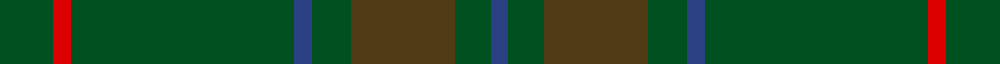
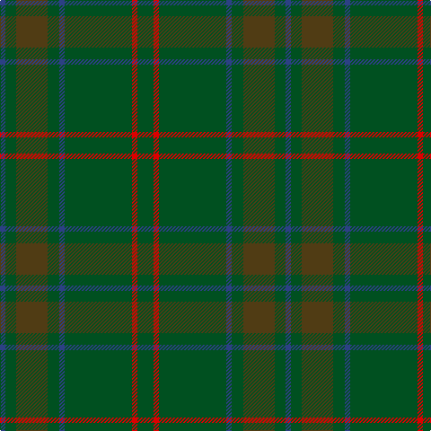

In pattern [BGGGBGRG](/stripes/bgggbgrg/).

This was sourced from register-of-tartans.  It is a [8 stripe tartan](/stripes/stripes8/).

Original link https://www.tartanregister.gov.uk/tartanDetails.aspx?ref=1321

## Also known as

This cloth is also recorded under:

- Glenlivet

## Register references

External register numbers recorded for this tartan.

- Scottish Register of Tartans: [1321](https://www.tartanregister.gov.uk/tartanDetails.aspx?ref=1321)
- Scottish Tartans World Register: 197

## Thread count
G/18 R6 G75 B6 G13 T35 G12 B/6

## Palette
Each colour and the base-6 reference it is a variant of.

| Colour | Shade | Base |
|---|---|---|
| B | <code style="background-color:#2C4084;">#2C4084</code> `oklch(39.4% 0.117 268.3)` <small>#2C4084</small> | B <code style="background-color:#2A418A;">#2A418A</code> |
| G | <code style="background-color:#005020;">#005020</code> `oklch(37.7% 0.105 149.6)` <small>#005020</small> | G <code style="background-color:#006100;">#006100</code> |
| R | <code style="background-color:#DC0000;">#DC0000</code> `oklch(56.2% 0.230 29.2)` <small>#DC0000</small> | R <code style="background-color:#CC0000;">#CC0000</code> |
| T | <code style="background-color:#503C14;">#503C14</code> `oklch(37.0% 0.062 81.8)` <small>#503C14</small> | G <code style="background-color:#006100;">#006100</code> |

# Sample pattern

## Nearest tartans

The nearest existing variants by ΔTartan distance, with this tartan at the top so the swatches line up against it.

ΔTartan

Tartan

Sett

—

<a href="/ttd/edit/#slug=dg18r6dg75db6dg13dy35dg12db6">Gayre Bodyguard</a> <a class="nn-out" href="/setts/s8/dg18r6dg75db6dg13dy35dg12db6/" title="open its dictionary page">↗</a>

1.52

<a href="/ttd/edit/#slug=dg27dg39db3dg3db4dg3db3dg39db3dg3db4dg3~x2">Montgomerie/Montgomery</a> <a class="nn-out" href="/setts/s12/dg27dg39db3dg3db4dg3db3dg39db3dg3db4dg3~x2/" title="open its dictionary page">↗</a>

1.63

<a href="/ttd/edit/#slug=g13dy3g1do3dy1~x6">Glen Boig</a> <a class="nn-out" href="/setts/s5/g13dy3g1do3dy1~x6/" title="open its dictionary page">↗</a>

1.79

<a href="/ttd/edit/#slug=y37dy9y3do9dy3~x2">Glen Boig Trade Tartan Tartan Number: 915. Earliest known date: Modern Many new designs have been given district names to promote their Scottish connections. However, these names should not be confused with the District tartans which have earned their title through 'use and wont' and not a little history. See products available Copyright © Blair Urquhart, Comrie, 2015</a> <a class="nn-out" href="/setts/s5/y37dy9y3do9dy3~x2/" title="open its dictionary page">↗</a>

1.85

<a href="/ttd/edit/#slug=dg4db2dg17dg2r4dg2dg3dg11dg2~x2">Conlon</a> <a class="nn-out" href="/setts/s9/dg4db2dg17dg2r4dg2dg3dg11dg2~x2/" title="open its dictionary page">↗</a>

1.86

<a href="/ttd/edit/#slug=g18r6g75db6g13dy35g12db6">Glenlivet Corporate Tartan Tartan Number: 193. Earliest known date: 1989 Designed for Glenlivet Distilleries Ltd, Strathspey. See products available Copyright © Blair Urquhart, Comrie, 2015</a> <a class="nn-out" href="/setts/s8/g18r6g75db6g13dy35g12db6/" title="open its dictionary page">↗</a>

1.98

<a href="/ttd/edit/#slug=g40dg15g4dg4g4~x2">Celtic 2009 (Sports)</a> <a class="nn-out" href="/setts/s5/g40dg15g4dg4g4~x2/" title="open its dictionary page">↗</a>

2.00

<a href="/ttd/edit/#slug=do1n2g6n1do3t1n12do1n1g1~x4">Wicklow, County (District)</a> <a class="nn-out" href="/setts/s10/do1n2g6n1do3t1n12do1n1g1~x4/" title="open its dictionary page">↗</a>

2.08

<a href="/ttd/edit/#slug=y3dy3y4k4dy14k3y41g2~x2">Huntsman</a> <a class="nn-out" href="/setts/s8/y3dy3y4k4dy14k3y41g2~x2/" title="open its dictionary page">↗</a>

2.08

<a href="/ttd/edit/#slug=dg20dg2ly3dg2dg32dg32dg2r3dg2dg32dg12~x2">Galloway District Tartan Tartan Number: 1469. Earliest known date: 1950 In contemporary correspondence Mr Hannay said that the Galloway 'everyday' tartan was 'in four shades of green with yellow and red stripe'. Cree Mills of Newton-Stewart, however, used only two shades in the manufacture on Mr Hannay's behalf. MacGregor Hastie's collection includes this sett with the pale yellow rendered in white and called Galloway Hunting. See products available Copyright © Blair Urquhart, Comrie, 2015</a> <a class="nn-out" href="/setts/s11/dg20dg2ly3dg2dg32dg32dg2r3dg2dg32dg12~x2/" title="open its dictionary page">↗</a>

2.09

<a href="/ttd/edit/#slug=dg24r2dg2dg40dg25dg2dg2r2dg2dg20~x2">Donachie of Brockloch Hunting Clan Tartan Tartan Number: 3002. Earliest known date: 2004 Based on the Robertson sett No. 893 with red changed to green. The Donachie's are part of the Robertson clan, also known as Clan Donnachaidh. See products available Copyright © Blair Urquhart, Comrie, 2015</a> <a class="nn-out" href="/setts/s10/dg24r2dg2dg40dg25dg2dg2r2dg2dg20~x2/" title="open its dictionary page">↗</a>

## Neighbour map

Every grey dot is one of 14299 variants placed by the first two principal components of the ΔTartan feature space (44% of its variance). Red is this tartan; blue dots are its nearest — click one to open its page.

<svg viewBox="0 0 640 380" role="img" style="max-width:100%;height:auto;border:1px solid #e0e0e0;border-radius:4px;display:block" xmlns="http://www.w3.org/2000/svg"><image href="/nn/cloud.v1.png" width="640" height="380"/><a href="/setts/s12/dg27dg39db3dg3db4dg3db3dg39db3dg3db4dg3~x2/"><circle cx="549.2" cy="255.2" r="4" fill="#3465a4"><title>Montgomerie/Montgomery</title></circle></a><a href="/setts/s5/g13dy3g1do3dy1~x6/"><circle cx="568.5" cy="307.0" r="4" fill="#3465a4"><title>Glen Boig</title></circle></a><a href="/setts/s5/y37dy9y3do9dy3~x2/"><circle cx="554.6" cy="298.1" r="4" fill="#3465a4"><title>Glen Boig Trade Tartan Tartan Number: 915. Earliest known date: Modern Many new designs have been given district names to promote their Scottish connections. However, these names should not be confused with the District tartans which have earned their title through 'use and wont' and not a little history. See products available Copyright © Blair Urquhart, Comrie, 2015</title></circle></a><a href="/setts/s9/dg4db2dg17dg2r4dg2dg3dg11dg2~x2/"><circle cx="444.1" cy="288.8" r="4" fill="#3465a4"><title>Conlon</title></circle></a><a href="/setts/s8/g18r6g75db6g13dy35g12db6/"><circle cx="498.3" cy="244.0" r="4" fill="#3465a4"><title>Glenlivet Corporate Tartan Tartan Number: 193. Earliest known date: 1989 Designed for Glenlivet Distilleries Ltd, Strathspey. See products available Copyright © Blair Urquhart, Comrie, 2015</title></circle></a><a href="/setts/s5/g40dg15g4dg4g4~x2/"><circle cx="487.9" cy="307.2" r="4" fill="#3465a4"><title>Celtic 2009 (Sports)</title></circle></a><a href="/setts/s10/do1n2g6n1do3t1n12do1n1g1~x4/"><circle cx="455.6" cy="245.1" r="4" fill="#3465a4"><title>Wicklow, County (District)</title></circle></a><a href="/setts/s8/y3dy3y4k4dy14k3y41g2~x2/"><circle cx="499.9" cy="192.6" r="4" fill="#3465a4"><title>Huntsman</title></circle></a><a href="/setts/s11/dg20dg2ly3dg2dg32dg32dg2r3dg2dg32dg12~x2/"><circle cx="428.0" cy="241.1" r="4" fill="#3465a4"><title>Galloway District Tartan Tartan Number: 1469. Earliest known date: 1950 In contemporary correspondence Mr Hannay said that the Galloway 'everyday' tartan was 'in four shades of green with yellow and red stripe'. Cree Mills of Newton-Stewart, however, used only two shades in the manufacture on Mr Hannay's behalf. MacGregor Hastie's collection includes this sett with the pale yellow rendered in white and called Galloway Hunting. See products available Copyright © Blair Urquhart, Comrie, 2015</title></circle></a><a href="/setts/s10/dg24r2dg2dg40dg25dg2dg2r2dg2dg20~x2/"><circle cx="515.9" cy="268.7" r="4" fill="#3465a4"><title>Donachie of Brockloch Hunting Clan Tartan Tartan Number: 3002. Earliest known date: 2004 Based on the Robertson sett No. 893 with red changed to green. The Donachie's are part of the Robertson clan, also known as Clan Donnachaidh. See products available Copyright © Blair Urquhart, Comrie, 2015</title></circle></a><circle cx="541.2" cy="270.1" r="5" fill="#c00000"/></svg>

ID: /setts/s8/dg18r6dg75db6dg13dy35dg12db6/
