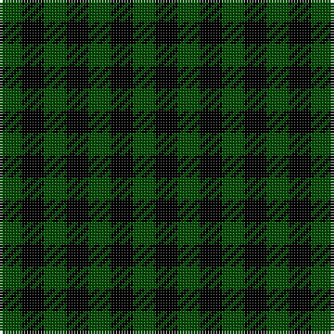

**Bands:** [GKGKGKGK](/stripes/gkgkgkgk/) · **Stripes:** [DG K DG K DG K DG K](/stripes/stripes8/) DG K DG K DG K DG K

This was sourced from tartans-authority.  It is a [8 band tartan](/bands/bands8/).

Original link http://www.tartansauthority.com/tartan-ferret/display/3641/

## Variants

Other setts woven to the same stripe pattern.

- [Menzies Green](/setts/s8/k19dg10k6dg10k12dg6k4dg14~x2/)

## Thread count
Ga/8 K8 G8 K8 G8 K8 G8 K/8

## Palette
Each colour and its ΔE from the base-6 reference it is a variant of.

| Colour | Shade | Base | ΔE (OKLab) |
|---|---|---|---|
| G | <code style="background-color:#004C00;">#004C00</code> `#004C00` | G <code style="background-color:#006100;">#006100</code> | 0.07 |
| Ga | <code style="background-color:#004C00;">#004C00</code> `#004C00` | G <code style="background-color:#006100;">#006100</code> | 0.07 |
| K | <code style="background-color:#000000;">#000000</code> `#000000` | K <code style="background-color:#000000;">#000000</code> | 0.00 |

# Sample pattern

## Nearest tartans

The nearest existing variants by ΔTartan distance.

1. [Wilson's No.187](/setts/s4/g1r1g1k1~x8/) — ΔT 2.55
1. [Dupplin (Estate Check)](/setts/s9/k1k1r1k1k1k1r1k1r1~x6/) — ΔT 2.84
1. [Glen Lyon](/setts/s3/db8g7k8~x2/) — ΔT 2.99
1. [Ballindalloch Check](/setts/s5/dg1o1dr1o1dr1~x8/) — ΔT 3.03
1. [Seaforth (Estate Check)](/setts/s9/r1o1k1o1y1o1k1o1y1~x12/) — ΔT 3.19
1. [Seaforth Estate Check Estate Check Weavers Tartan Tartan Number: 5344. Earliest known date: pre 1990 No details. See products available Copyright © Blair Urquhart, Comrie, 2015](/setts/s9/r1o1k1o1y1o1k1o1y1~x6/) — ΔT 3.19
1. [Wilson's No.185](/setts/s3/k11g9dp10~x2/) — ΔT 3.31
1. [Seaforth Estate Check](/setts/s16/o1k1o1y1o1k1o1y1o1k1o1y1o1k1o1r1~x12/) — ΔT 3.31
1. [Wilson's, No 185](/setts/s3/k11p10g9~x2/) — ΔT 3.35
1. [Bell, Siobhan (Personal)](/setts/s10/dp1k1db1k1db1k1db1g1r1k1~x10/) — ΔT 3.39

## Neighbour map

Every grey dot is one of 14313 variants placed by the first two principal components of the ΔTartan feature space (44% of its variance). Red is this tartan; blue dots are its nearest — click one to open its page.

<svg viewBox="0 0 640 380" role="img" style="max-width:100%;height:auto;border:1px solid #e0e0e0;border-radius:4px;display:block" xmlns="http://www.w3.org/2000/svg"><image href="/nn/cloud.v1.png" width="640" height="380"/><a href="/setts/s4/g1r1g1k1~x8/"><circle cx="89.7" cy="366.0" r="4" fill="#3465a4"><title>Wilson's No.187</title></circle></a><a href="/setts/s9/k1k1r1k1k1k1r1k1r1~x6/"><circle cx="14.0" cy="366.0" r="4" fill="#3465a4"><title>Dupplin (Estate Check)</title></circle></a><a href="/setts/s3/db8g7k8~x2/"><circle cx="22.4" cy="366.0" r="4" fill="#3465a4"><title>Glen Lyon</title></circle></a><a href="/setts/s5/dg1o1dr1o1dr1~x8/"><circle cx="67.3" cy="366.0" r="4" fill="#3465a4"><title>Ballindalloch Check</title></circle></a><a href="/setts/s9/r1o1k1o1y1o1k1o1y1~x12/"><circle cx="14.0" cy="366.0" r="4" fill="#3465a4"><title>Seaforth (Estate Check)</title></circle></a><a href="/setts/s9/r1o1k1o1y1o1k1o1y1~x6/"><circle cx="14.0" cy="366.0" r="4" fill="#3465a4"><title>Seaforth Estate Check Estate Check Weavers Tartan Tartan Number: 5344. Earliest known date: pre 1990 No details. See products available Copyright © Blair Urquhart, Comrie, 2015</title></circle></a><a href="/setts/s3/k11g9dp10~x2/"><circle cx="77.6" cy="366.0" r="4" fill="#3465a4"><title>Wilson's No.185</title></circle></a><a href="/setts/s16/o1k1o1y1o1k1o1y1o1k1o1y1o1k1o1r1~x12/"><circle cx="14.0" cy="363.5" r="4" fill="#3465a4"><title>Seaforth Estate Check</title></circle></a><a href="/setts/s3/k11p10g9~x2/"><circle cx="35.6" cy="366.0" r="4" fill="#3465a4"><title>Wilson's, No 185</title></circle></a><a href="/setts/s10/dp1k1db1k1db1k1db1g1r1k1~x10/"><circle cx="14.0" cy="366.0" r="4" fill="#3465a4"><title>Bell, Siobhan (Personal)</title></circle></a><circle cx="90.2" cy="366.0" r="5" fill="#c00000"/></svg>

ID: /setts/s8/dg1k1dg1k1dg1k1dg1k1~x8/
