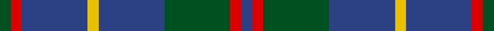
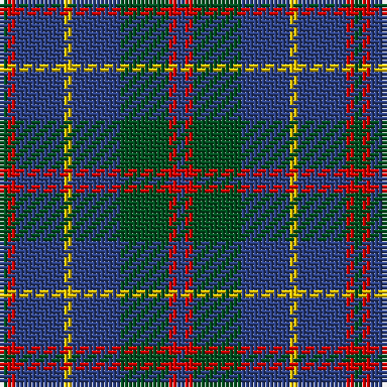

In pattern [BRGBYBRG](/stripes/brgbybrg/).

This was sourced from register-of-tartans.  It is a [8 stripe tartan](/stripes/stripes8/).

Original link https://www.tartanregister.gov.uk/tartanDetails.aspx?ref=2466

## Register references

External register numbers recorded for this tartan.

- Scottish Register of Tartans: [2466](https://www.tartanregister.gov.uk/tartanDetails.aspx?ref=2466)
- Scottish Tartans World Register: 513

## Thread count
G/2 R2 B12 Y2 B12 G12 R2 B/2

## Palette
Each colour and the base-6 reference it is a variant of.

| Colour | Shade | Base |
|---|---|---|
| B | <code style="background-color:#2C4084;">#2C4084</code> `oklch(39.4% 0.117 268.3)` <small>#2C4084</small> | B <code style="background-color:#2A418A;">#2A418A</code> |
| G | <code style="background-color:#005020;">#005020</code> `oklch(37.7% 0.105 149.6)` <small>#005020</small> | G <code style="background-color:#006100;">#006100</code> |
| R | <code style="background-color:#DC0000;">#DC0000</code> `oklch(56.2% 0.230 29.2)` <small>#DC0000</small> | R <code style="background-color:#CC0000;">#CC0000</code> |
| Y | <code style="background-color:#E8C000;">#E8C000</code> `oklch(81.9% 0.168 93.7)` <small>#E8C000</small> | Y <code style="background-color:#F2BF00;">#F2BF00</code> |

# Sample pattern

## Nearest tartans

The nearest existing variants by ΔTartan distance.

1. [MacHardy](/setts/s8/db1r1g6db6ly1db6r1g1~x2/) — ΔT 0.86
1. [MacHardy, Blue](/setts/s8/db6r3g26db26w4db26r5g5~x2/) — ΔT 1.11
1. [Glen Nevis #1 (Fashion)](/setts/s8/dg8r2dg2r3dg8db12dg2ly2~x2/) — ΔT 1.14
1. [Cameron Hunting](/setts/s6/do15r5do30b32do4lo3~x2/) — ΔT 1.27
1. [Davidson, Half](/setts/s6/k3g22db3g3db19r3~x2/) — ΔT 1.28
1. [HMS Duncan (Military)](/setts/s6/dp3o15dt15r2dt15ly3~x2/) — ΔT 1.32
1. [Connaught Green](/setts/s6/r1db12y5db2y4lb1~x2/) — ΔT 1.34
1. [Bean Hunting Clan Tartan Tartan Number: 106. Earliest known date: 1987 The weaving and wearing of this tartan is 'Restricted'. This is not a legal definition and is applied by the Scottish Tartans Society irrespective of Design Patent or Copyright, in the spirit of a gentlemans agreement. Interested parties should contact the person listed under 'Source:' in this document. See products available Copyright © Blair Urquhart, Comrie, 2015](/setts/s7/db6dg41db20r15dg41r15db6/) — ΔT 1.34
1. [Thorburn (Lochcarron)](/setts/s6/dt3t14dt3o16dt34r3~x2/) — ΔT 1.37
1. [Bean of Freeport (Personal)](/setts/s7/dt6r15dg41r15dt20dg41db6/) — ΔT 1.37

## Neighbour map

Every grey dot is one of 14299 variants placed by the first two principal components of the ΔTartan feature space (44% of its variance). Red is this tartan; blue dots are its nearest — click one to open its page.

<svg viewBox="0 0 640 380" role="img" style="max-width:100%;height:auto;border:1px solid #e0e0e0;border-radius:4px;display:block" xmlns="http://www.w3.org/2000/svg"><image href="/nn/cloud.v1.png" width="640" height="380"/><a href="/setts/s8/db1r1g6db6ly1db6r1g1~x2/"><circle cx="291.6" cy="228.7" r="4" fill="#3465a4"><title>MacHardy</title></circle></a><a href="/setts/s8/db6r3g26db26w4db26r5g5~x2/"><circle cx="303.6" cy="215.0" r="4" fill="#3465a4"><title>MacHardy, Blue</title></circle></a><a href="/setts/s8/dg8r2dg2r3dg8db12dg2ly2~x2/"><circle cx="264.0" cy="246.1" r="4" fill="#3465a4"><title>Glen Nevis #1 (Fashion)</title></circle></a><a href="/setts/s6/do15r5do30b32do4lo3~x2/"><circle cx="349.0" cy="234.3" r="4" fill="#3465a4"><title>Cameron Hunting</title></circle></a><a href="/setts/s6/k3g22db3g3db19r3~x2/"><circle cx="291.9" cy="239.0" r="4" fill="#3465a4"><title>Davidson, Half</title></circle></a><a href="/setts/s6/dp3o15dt15r2dt15ly3~x2/"><circle cx="279.3" cy="231.6" r="4" fill="#3465a4"><title>HMS Duncan (Military)</title></circle></a><a href="/setts/s6/r1db12y5db2y4lb1~x2/"><circle cx="353.7" cy="219.6" r="4" fill="#3465a4"><title>Connaught Green</title></circle></a><a href="/setts/s7/db6dg41db20r15dg41r15db6/"><circle cx="306.4" cy="258.4" r="4" fill="#3465a4"><title>Bean Hunting Clan Tartan Tartan Number: 106. Earliest known date: 1987 The weaving and wearing of this tartan is 'Restricted'. This is not a legal definition and is applied by the Scottish Tartans Society irrespective of Design Patent or Copyright, in the spirit of a gentlemans agreement. Interested parties should contact the person listed under 'Source:' in this document. See products available Copyright © Blair Urquhart, Comrie, 2015</title></circle></a><a href="/setts/s6/dt3t14dt3o16dt34r3~x2/"><circle cx="333.0" cy="225.4" r="4" fill="#3465a4"><title>Thorburn (Lochcarron)</title></circle></a><a href="/setts/s7/dt6r15dg41r15dt20dg41db6/"><circle cx="311.2" cy="262.4" r="4" fill="#3465a4"><title>Bean of Freeport (Personal)</title></circle></a><circle cx="310.0" cy="238.9" r="5" fill="#c00000"/></svg>

ID: /setts/s8/dg1r1db6ly1db6dg6r1db1~x2/
