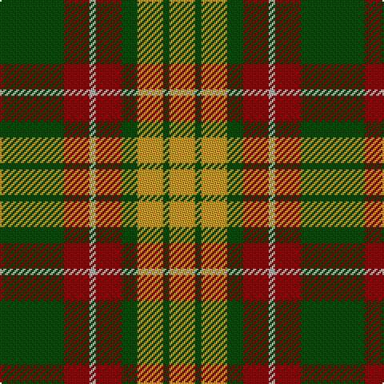

In pattern [GRYRGYGY](/stripes/gryrgygy/).

This was sourced from register-of-tartans.  It is a [8 stripe tartan](/stripes/stripes8/).

Original link https://www.tartanregister.gov.uk/tartanDetails.aspx?ref=4258

## Register references

External register numbers recorded for this tartan.

- Scottish Register of Tartans: [4258](https://www.tartanregister.gov.uk/tartanDetails.aspx?ref=4258)
- Scottish Tartans Authority (ITI): 4601

## Thread count
G/40 DR16 N4 DR16 G10 DY16 G4 DY/16

## Palette
Each colour and the base-6 reference it is a variant of.

| Colour | Shade | Base |
|---|---|---|
| DR | <code style="background-color:#8C0000;">#8C0000</code> `oklch(40.2% 0.165 29.2)` <small>#8C0000</small> | R <code style="background-color:#CC0000;">#CC0000</code> |
| DY | <code style="background-color:#C89800;">#C89800</code> `oklch(70.6% 0.144 85.9)` <small>#C89800</small> | Y <code style="background-color:#F2BF00;">#F2BF00</code> |
| G | <code style="background-color:#004C00;">#004C00</code> `oklch(36.1% 0.123 142.5)` <small>#004C00</small> | G <code style="background-color:#006100;">#006100</code> |
| N | <code style="background-color:#B0B0B0;">#B0B0B0</code> `oklch(75.7% 0.000 89.9)` <small>#B0B0B0</small> | Y <code style="background-color:#F2BF00;">#F2BF00</code> |

# Sample pattern

## Nearest tartans

The nearest existing variants by ΔTartan distance, with this tartan at the top so the swatches line up against it.

ΔTartan

Tartan

Sett

—

<a href="/ttd/edit/#slug=dg20r8lr2r8dg5ly8dg2ly8~x2">Unidentified #57</a> <a class="nn-out" href="/setts/s8/dg20r8lr2r8dg5ly8dg2ly8~x2/" title="open its dictionary page">↗</a>

0.98

<a href="/ttd/edit/#slug=lo12dg4lo24k9lo8dg36r4">Harmer (Corporate)</a> <a class="nn-out" href="/setts/s7/lo12dg4lo24k9lo8dg36r4/" title="open its dictionary page">↗</a>

1.12

<a href="/ttd/edit/#slug=k2o20k8dg18o3w2~x2">Celtic Combat</a> <a class="nn-out" href="/setts/s6/k2o20k8dg18o3w2~x2/" title="open its dictionary page">↗</a>

1.17

<a href="/ttd/edit/#slug=g12t6g6r15k1r1k2~x4">McCook/Cook (Name)</a> <a class="nn-out" href="/setts/s7/g12t6g6r15k1r1k2~x4/" title="open its dictionary page">↗</a>

1.19

<a href="/ttd/edit/#slug=o6k2dg12lo8o5k2dg3~x4">Londonderry, County</a> <a class="nn-out" href="/setts/s7/o6k2dg12lo8o5k2dg3~x4/" title="open its dictionary page">↗</a>

1.22

<a href="/ttd/edit/#slug=m4k2g17r6g6r6g15r20ly3~x2">Fulton</a> <a class="nn-out" href="/setts/s9/m4k2g17r6g6r6g15r20ly3~x2/" title="open its dictionary page">↗</a>

1.23

<a href="/ttd/edit/#slug=o6k2g12lo8o5k2g3~x4">Londonderry, County (District)</a> <a class="nn-out" href="/setts/s7/o6k2g12lo8o5k2g3~x4/" title="open its dictionary page">↗</a>

1.25

<a href="/ttd/edit/#slug=y30k4ly10k4o5ly5o15~x2">Alister Grant 'Mohr', the Laird's Champion</a> <a class="nn-out" href="/setts/s7/y30k4ly10k4o5ly5o15~x2/" title="open its dictionary page">↗</a>

1.25

<a href="/ttd/edit/#slug=r16k3r16g44k3g8k3ly20k4~x2">MacMillan Society of Glasgow</a> <a class="nn-out" href="/setts/s9/r16k3r16g44k3g8k3ly20k4~x2/" title="open its dictionary page">↗</a>

1.25

<a href="/ttd/edit/#slug=r10g44o5dg40o62r5o10">Ballintrae</a> <a class="nn-out" href="/setts/s7/r10g44o5dg40o62r5o10/" title="open its dictionary page">↗</a>

1.26

<a href="/ttd/edit/#slug=db3k5r2g2r3g12r6k1r3~x4">Fulton (1999) (Name)</a> <a class="nn-out" href="/setts/s9/db3k5r2g2r3g12r6k1r3~x4/" title="open its dictionary page">↗</a>

## Neighbour map

Every grey dot is one of 14299 variants placed by the first two principal components of the ΔTartan feature space (44% of its variance). Red is this tartan; blue dots are its nearest — click one to open its page.

<svg viewBox="0 0 640 380" role="img" style="max-width:100%;height:auto;border:1px solid #e0e0e0;border-radius:4px;display:block" xmlns="http://www.w3.org/2000/svg"><image href="/nn/cloud.v1.png" width="640" height="380"/><a href="/setts/s7/lo12dg4lo24k9lo8dg36r4/"><circle cx="238.8" cy="207.3" r="4" fill="#3465a4"><title>Harmer (Corporate)</title></circle></a><a href="/setts/s6/k2o20k8dg18o3w2~x2/"><circle cx="237.3" cy="204.2" r="4" fill="#3465a4"><title>Celtic Combat</title></circle></a><a href="/setts/s7/g12t6g6r15k1r1k2~x4/"><circle cx="249.3" cy="188.7" r="4" fill="#3465a4"><title>McCook/Cook (Name)</title></circle></a><a href="/setts/s7/o6k2dg12lo8o5k2dg3~x4/"><circle cx="170.3" cy="240.6" r="4" fill="#3465a4"><title>Londonderry, County</title></circle></a><a href="/setts/s9/m4k2g17r6g6r6g15r20ly3~x2/"><circle cx="242.1" cy="184.3" r="4" fill="#3465a4"><title>Fulton</title></circle></a><a href="/setts/s7/o6k2g12lo8o5k2g3~x4/"><circle cx="184.9" cy="248.3" r="4" fill="#3465a4"><title>Londonderry, County (District)</title></circle></a><a href="/setts/s7/y30k4ly10k4o5ly5o15~x2/"><circle cx="214.0" cy="210.1" r="4" fill="#3465a4"><title>Alister Grant 'Mohr', the Laird's Champion</title></circle></a><a href="/setts/s9/r16k3r16g44k3g8k3ly20k4~x2/"><circle cx="237.5" cy="159.7" r="4" fill="#3465a4"><title>MacMillan Society of Glasgow</title></circle></a><a href="/setts/s7/r10g44o5dg40o62r5o10/"><circle cx="254.3" cy="207.1" r="4" fill="#3465a4"><title>Ballintrae</title></circle></a><a href="/setts/s9/db3k5r2g2r3g12r6k1r3~x4/"><circle cx="209.9" cy="190.3" r="4" fill="#3465a4"><title>Fulton (1999) (Name)</title></circle></a><circle cx="223.9" cy="210.3" r="5" fill="#c00000"/></svg>

ID: /setts/s8/dg20r8lr2r8dg5ly8dg2ly8~x2/
