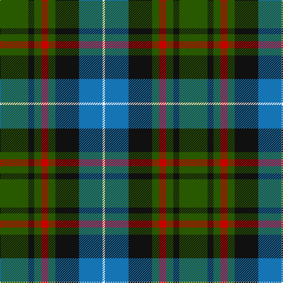

**Bands:** [GKGRGKBW](/stripes/gkgrgkbw/) · **Stripes:** [DG K DG R DG K B W](/stripes/stripes8/) DG K DG R DG K B W

This was sourced from tartans-authority.  It is a [8 band tartan](/bands/bands8/).

Original link http://www.tartansauthority.com/tartan-ferret/display/8891/

## Thread count
G/48 K10 G12 R12 G12 K40 B40 W/4

## Palette
Each colour and its ΔE from the base-6 reference it is a variant of.

| Colour | Shade | Base | ΔE (OKLab) |
|---|---|---|---|
| B | <code style="background-color:#1474B4;">#1474B4</code> `#1474B4` | B <code style="background-color:#2A418A;">#2A418A</code> | 0.15 |
| G | <code style="background-color:#285800;">#285800</code> `#285800` | G <code style="background-color:#006100;">#006100</code> | 0.03 |
| K | <code style="background-color:#101010;">#101010</code> `#101010` | K <code style="background-color:#000000;">#000000</code> | 0.17 |
| R | <code style="background-color:#C80000;">#C80000</code> `#C80000` | R <code style="background-color:#CC0000;">#CC0000</code> | 0.01 |
| W | <code style="background-color:#FCFCFC;">#FCFCFC</code> `#FCFCFC` | W <code style="background-color:#F7F7F7;">#F7F7F7</code> | 0.01 |

# Sample pattern

## Nearest tartans

The nearest existing variants by ΔTartan distance.

1. [Paterson (Personal)](/setts/s7/g3db12w1k12g13r2g2~x2/) — ΔT 0.58
1. [Dove (Personal)](/setts/s9/n33k16g17o3g17k16n15k3w3~x2/) — ΔT 0.61
1. [Tait #1](/setts/s8/ly5k2g28k19g4db19k2r5~x2/) — ΔT 0.70
1. [Huntly Gordon Fancy Tartan Tartan Number: 3215. Earliest known date: 2001 Unknown until House of Edgar published their own Old and Rare. See products available Copyright © Blair Urquhart, Comrie, 2015](/setts/s9/b22k12g11ly2g11k12b11k2r2~x2/) — ΔT 0.76
1. [Wilson's No.111](/setts/s8/dp19w2g12t3k4t3g12w2~x2/) — ΔT 0.82
1. [MacMillan Htg (1906) (Clan)](/setts/s10/db3ly1db12k4ly2k4dg8r2dg8r1~x4/) — ΔT 0.84
1. [Mantle (Personal)](/setts/s8/g3db16w2k14g18r3g2r3~x2/) — ΔT 0.86
1. [Rhun (Fashion)](/setts/s7/r12db68w7k39g75r6g6/) — ΔT 0.87
1. [City of Guelph](/setts/s8/g28k4g5dr4g5k19db19y2~x2/) — ΔT 0.89
1. [MacFadzean/MacPhedran](/setts/s7/g3db12w1k12g13r2g2~x4/) — ΔT 0.91

## Neighbour map

Every grey dot is one of 14313 variants placed by the first two principal components of the ΔTartan feature space (44% of its variance). Red is this tartan; blue dots are its nearest — click one to open its page.

<svg viewBox="0 0 640 380" role="img" style="max-width:100%;height:auto;border:1px solid #e0e0e0;border-radius:4px;display:block" xmlns="http://www.w3.org/2000/svg"><image href="/nn/cloud.v1.png" width="640" height="380"/><a href="/setts/s7/g3db12w1k12g13r2g2~x2/"><circle cx="200.7" cy="194.5" r="4" fill="#3465a4"><title>Paterson (Personal)</title></circle></a><a href="/setts/s9/n33k16g17o3g17k16n15k3w3~x2/"><circle cx="179.7" cy="203.4" r="4" fill="#3465a4"><title>Dove (Personal)</title></circle></a><a href="/setts/s8/ly5k2g28k19g4db19k2r5~x2/"><circle cx="184.4" cy="172.0" r="4" fill="#3465a4"><title>Tait #1</title></circle></a><a href="/setts/s9/b22k12g11ly2g11k12b11k2r2~x2/"><circle cx="171.2" cy="203.3" r="4" fill="#3465a4"><title>Huntly Gordon Fancy Tartan Tartan Number: 3215. Earliest known date: 2001 Unknown until House of Edgar published their own Old and Rare. See products available Copyright © Blair Urquhart, Comrie, 2015</title></circle></a><a href="/setts/s8/dp19w2g12t3k4t3g12w2~x2/"><circle cx="183.3" cy="183.4" r="4" fill="#3465a4"><title>Wilson's No.111</title></circle></a><a href="/setts/s10/db3ly1db12k4ly2k4dg8r2dg8r1~x4/"><circle cx="162.9" cy="179.1" r="4" fill="#3465a4"><title>MacMillan Htg (1906) (Clan)</title></circle></a><a href="/setts/s8/g3db16w2k14g18r3g2r3~x2/"><circle cx="174.5" cy="195.7" r="4" fill="#3465a4"><title>Mantle (Personal)</title></circle></a><a href="/setts/s7/r12db68w7k39g75r6g6/"><circle cx="196.8" cy="183.2" r="4" fill="#3465a4"><title>Rhun (Fashion)</title></circle></a><a href="/setts/s8/g28k4g5dr4g5k19db19y2~x2/"><circle cx="209.4" cy="179.4" r="4" fill="#3465a4"><title>City of Guelph</title></circle></a><a href="/setts/s7/g3db12w1k12g13r2g2~x4/"><circle cx="193.8" cy="187.3" r="4" fill="#3465a4"><title>MacFadzean/MacPhedran</title></circle></a><circle cx="182.0" cy="193.6" r="5" fill="#c00000"/></svg>

ID: /setts/s8/dg24k5dg6r6dg6k20b20w2~x2/
