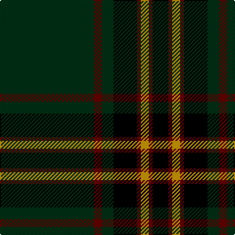

In pattern [GRGKRYRK](/stripes/grgkryrk/).

This was sourced from register-of-tartans.  It is a [8 stripe tartan](/stripes/stripes8/).

Original link https://www.tartanregister.gov.uk/tartanDetails.aspx?ref=1525

## Register references

External register numbers recorded for this tartan.

- Scottish Register of Tartans: [1525](https://www.tartanregister.gov.uk/tartanDetails.aspx?ref=1525)
- Scottish Tartans Authority (ITI): 5113

## Thread count
DG/96 DR8 DG12 K24 DR4 DY8 DR4 K/16

## Palette
Each colour and the base-6 reference it is a variant of.

| Colour | Shade | Base |
|---|---|---|
| DG | <code style="background-color:#003014;">#003014</code> `oklch(27.1% 0.071 152.1)` <small>#003014</small> | G <code style="background-color:#006100;">#006100</code> |
| DR | <code style="background-color:#640000;">#640000</code> `oklch(31.6% 0.130 29.2)` <small>#640000</small> | R <code style="background-color:#CC0000;">#CC0000</code> |
| DY | <code style="background-color:#C89800;">#C89800</code> `oklch(70.6% 0.144 85.9)` <small>#C89800</small> | Y <code style="background-color:#F2BF00;">#F2BF00</code> |
| K | <code style="background-color:#000000;">#000000</code> `oklch(0.0% 0.000 0.0)` <small>#000000</small> | K <code style="background-color:#000000;">#000000</code> |

# Sample pattern

## Nearest tartans

The nearest existing variants by ΔTartan distance.

1. [Dryfe](/setts/s11/dg42k10lr2k2r2k2dg10r6k2r3dg2~x2/) — ΔT 1.23
1. [Entier](/setts/s12/k2g4k6lr2k31ly2k1ly2k16g20ly1lr2~x2/) — ΔT 1.29
1. [Scottish Chieftain](/setts/s10/k19r1dg3k2k3k2dg2k2dg20w2~x2/) — ΔT 1.30
1. [Reagan (Personal)](/setts/s10/k4g12k3g4k3g3k36g3k2ly3~x2/) — ΔT 1.42
1. [MacDiarmid](/setts/s9/k12r2k28dg12k1w3k1dg12r4~x2/) — ΔT 1.47
1. [Hall, from Springbrook and Newtown (Personal)](/setts/s8/w3m11db4m6dg48o2dg3o2~x2/) — ΔT 1.48
1. [Paxton (Personal)](/setts/s11/k48dp5k9g3k2g3k2g14dp7k2dp10~x2/) — ΔT 1.48
1. [Ataç, H.M. & I.C. (Personal)](/setts/s8/db9g5w1g15k2g1k44r1~x2/) — ΔT 1.49
1. [Milne of Corstorphine #1 (Personal)](/setts/s12/k20dg1k2dg1k20ly1dg16r2dg16ly1k30dg1~x2/) — ΔT 1.51
1. [Moran Family Ubique](/setts/s10/dg68k2dg2k2dg2lo8r8k8lo2db7~x2/) — ΔT 1.52

## Neighbour map

Every grey dot is one of 14299 variants placed by the first two principal components of the ΔTartan feature space (44% of its variance). Red is this tartan; blue dots are its nearest — click one to open its page.

<svg viewBox="0 0 640 380" role="img" style="max-width:100%;height:auto;border:1px solid #e0e0e0;border-radius:4px;display:block" xmlns="http://www.w3.org/2000/svg"><image href="/nn/cloud.v1.png" width="640" height="380"/><a href="/setts/s11/dg42k10lr2k2r2k2dg10r6k2r3dg2~x2/"><circle cx="416.1" cy="138.0" r="4" fill="#3465a4"><title>Dryfe</title></circle></a><a href="/setts/s12/k2g4k6lr2k31ly2k1ly2k16g20ly1lr2~x2/"><circle cx="406.8" cy="132.1" r="4" fill="#3465a4"><title>Entier</title></circle></a><a href="/setts/s10/k19r1dg3k2k3k2dg2k2dg20w2~x2/"><circle cx="361.3" cy="165.3" r="4" fill="#3465a4"><title>Scottish Chieftain</title></circle></a><a href="/setts/s10/k4g12k3g4k3g3k36g3k2ly3~x2/"><circle cx="445.1" cy="172.6" r="4" fill="#3465a4"><title>Reagan (Personal)</title></circle></a><a href="/setts/s9/k12r2k28dg12k1w3k1dg12r4~x2/"><circle cx="352.3" cy="157.8" r="4" fill="#3465a4"><title>MacDiarmid</title></circle></a><a href="/setts/s8/w3m11db4m6dg48o2dg3o2~x2/"><circle cx="427.3" cy="137.9" r="4" fill="#3465a4"><title>Hall, from Springbrook and Newtown (Personal)</title></circle></a><a href="/setts/s11/k48dp5k9g3k2g3k2g14dp7k2dp10~x2/"><circle cx="394.6" cy="147.1" r="4" fill="#3465a4"><title>Paxton (Personal)</title></circle></a><a href="/setts/s8/db9g5w1g15k2g1k44r1~x2/"><circle cx="402.4" cy="120.1" r="4" fill="#3465a4"><title>Ataç, H.M. &amp; I.C. (Personal)</title></circle></a><a href="/setts/s12/k20dg1k2dg1k20ly1dg16r2dg16ly1k30dg1~x2/"><circle cx="462.2" cy="168.4" r="4" fill="#3465a4"><title>Milne of Corstorphine #1 (Personal)</title></circle></a><a href="/setts/s10/dg68k2dg2k2dg2lo8r8k8lo2db7~x2/"><circle cx="442.4" cy="104.0" r="4" fill="#3465a4"><title>Moran Family Ubique</title></circle></a><circle cx="424.4" cy="165.1" r="5" fill="#c00000"/></svg>

ID: /setts/s8/dg24o2dg3k6o1ly2o1k4~x4/
