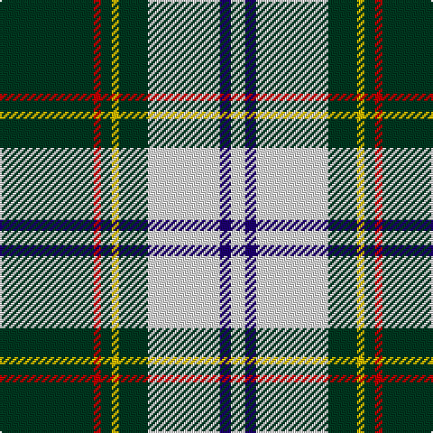

This page is one **sett** — a single exact thread-count. It belongs to the [tartan](/tartans/dg26r2dg3ly2dg8w20db3w4/)
(the same proportion at any scale), whose colour order is pattern [GRGYGWBW](/stripes/grgygwbw/).

Sourced from register-of-tartans.  It is a [8 stripe tartan](/stripes/stripes8/).

Original link https://www.tartanregister.gov.uk/tartanDetails.aspx?ref=1524

2 attestations — the source records this cloth was collapsed from (oldest owns this page)

<ul>
<li>01/01/2002 — Green Mountain (register-of-tartans, <a href="https://www.tartanregister.gov.uk/tartanDetails.aspx?ref=1524">record</a>)</li>
<li>2002 — Green Mountain (District) (tartans-authority, <a href="http://www.tartansauthority.com/tartan-ferret/display/5849/">record</a>)</li>
</ul>

## Register references

External register numbers recorded for this tartan.

- Scottish Register of Tartans: [1524](https://www.tartanregister.gov.uk/tartanDetails.aspx?ref=1524)
- Scottish Tartans Authority (ITI): 5849

## Thread count
DG/52 R4 DG6 Y4 DG16 LN40 DB6 LN/8

## Palette

Palette: <strong>Tartan Register</strong>
<table><thead><tr><th>Colour</th><th>Threads</th><th>Shade</th><th>Base</th><th>OKLCh</th></tr></thead><tbody><tr><td>DG/</td><td style="text-align:right;font-variant-numeric:tabular-nums">52</td><td><code style="background-color:#003820;">#003820</code> <small style="color:#888">#003820</small></td><td>G <code style="background-color:#006100;">#006100</code></td><td><small style="color:#888">oklch(30.0% 0.070 158.3)</small></td></tr><tr><td>R</td><td style="text-align:right;font-variant-numeric:tabular-nums">4</td><td><code style="background-color:#C80000;">#C80000</code> <small style="color:#888">#C80000</small></td><td>R <code style="background-color:#CC0000;">#CC0000</code></td><td><small style="color:#888">oklch(52.3% 0.215 29.2)</small></td></tr><tr><td>DG</td><td style="text-align:right;font-variant-numeric:tabular-nums">6</td><td><code style="background-color:#003820;">#003820</code> <small style="color:#888">#003820</small></td><td>G <code style="background-color:#006100;">#006100</code></td><td><small style="color:#888">oklch(30.0% 0.070 158.3)</small></td></tr><tr><td>Y</td><td style="text-align:right;font-variant-numeric:tabular-nums">4</td><td><code style="background-color:#E8C000;">#E8C000</code> <small style="color:#888">#E8C000</small></td><td>Y <code style="background-color:#F2BF00;">#F2BF00</code></td><td><small style="color:#888">oklch(81.9% 0.168 93.7)</small></td></tr><tr><td>DG</td><td style="text-align:right;font-variant-numeric:tabular-nums">16</td><td><code style="background-color:#003820;">#003820</code> <small style="color:#888">#003820</small></td><td>G <code style="background-color:#006100;">#006100</code></td><td><small style="color:#888">oklch(30.0% 0.070 158.3)</small></td></tr><tr><td>LN</td><td style="text-align:right;font-variant-numeric:tabular-nums">40</td><td><code style="background-color:#E0E0E0;">#E0E0E0</code> <small style="color:#888">#E0E0E0</small></td><td>W <code style="background-color:#F7F7F7;">#F7F7F7</code></td><td><small style="color:#888">oklch(90.7% 0.000 89.9)</small></td></tr><tr><td>DB</td><td style="text-align:right;font-variant-numeric:tabular-nums">6</td><td><code style="background-color:#1C0070;">#1C0070</code> <small style="color:#888">#1C0070</small></td><td>B <code style="background-color:#2A418A;">#2A418A</code></td><td><small style="color:#888">oklch(26.3% 0.162 277.1)</small></td></tr><tr><td>LN/</td><td style="text-align:right;font-variant-numeric:tabular-nums">8</td><td><code style="background-color:#E0E0E0;">#E0E0E0</code> <small style="color:#888">#E0E0E0</small></td><td>W <code style="background-color:#F7F7F7;">#F7F7F7</code></td><td><small style="color:#888">oklch(90.7% 0.000 89.9)</small></td></tr></tbody></table>

# Sample pattern

## Nearest tartans

The nearest existing variants by ΔTartan distance, with this tartan at the top so the swatches line up against it.

ΔTartan

Tartan

Sett

—

<a href="/ttd/edit/#slug=dg26r2dg3ly2dg8w20db3w4~x2">Green Mountain</a> <a class="nn-out" href="/setts/s8/dg26r2dg3ly2dg8w20db3w4~x2/" title="open its dictionary page">↗</a>

1.29

<a href="/ttd/edit/#slug=ly8k2dt20t4w1k2~x4">Solberg-Bell</a> <a class="nn-out" href="/setts/s6/ly8k2dt20t4w1k2~x4/" title="open its dictionary page">↗</a>

1.31

<a href="/ttd/edit/#slug=r3dt4w10dg2w2dg5dt34ly3~x2">Royal Troon Golf Club, The</a> <a class="nn-out" href="/setts/s8/r3dt4w10dg2w2dg5dt34ly3~x2/" title="open its dictionary page">↗</a>

1.37

<a href="/ttd/edit/#slug=lr2dg17w6b5r1~x4">Scotstown</a> <a class="nn-out" href="/setts/s5/lr2dg17w6b5r1~x4/" title="open its dictionary page">↗</a>

1.37

<a href="/ttd/edit/#slug=p26g6k8g3k8g30w3g3~x2">Riley (Personal)</a> <a class="nn-out" href="/setts/s8/p26g6k8g3k8g30w3g3~x2/" title="open its dictionary page">↗</a>

1.39

<a href="/ttd/edit/#slug=dg50r5dg8w10dg8db8dg8lo21~x2">St Patrick's Krewe</a> <a class="nn-out" href="/setts/s8/dg50r5dg8w10dg8db8dg8lo21~x2/" title="open its dictionary page">↗</a>

1.39

<a href="/ttd/edit/#slug=r3g2k9lr2k2lr24ly2lr2ly1~x4">Bell of the Borders</a> <a class="nn-out" href="/setts/s9/r3g2k9lr2k2lr24ly2lr2ly1~x4/" title="open its dictionary page">↗</a>

1.41

<a href="/ttd/edit/#slug=lo1n8lb2k15lb20r1lb1r1lb8n3lb1~x2">Harris (Personal)</a> <a class="nn-out" href="/setts/s11/lo1n8lb2k15lb20r1lb1r1lb8n3lb1~x2/" title="open its dictionary page">↗</a>

1.41

<a href="/ttd/edit/#slug=w3p3w30k20w3k9ly3~x2">MacPherson Dress (1951)</a> <a class="nn-out" href="/setts/s7/w3p3w30k20w3k9ly3~x2/" title="open its dictionary page">↗</a>

1.42

<a href="/ttd/edit/#slug=w1m2w17k11w2k4ly1~x4">MacPherson - 1842 (VS) Dress</a> <a class="nn-out" href="/setts/s7/w1m2w17k11w2k4ly1~x4/" title="open its dictionary page">↗</a>

1.44

<a href="/ttd/edit/#slug=w4k2w16k4w4k37dg12k4ly4~x2">Gordon Dress (MacGregor-Hastie)</a> <a class="nn-out" href="/setts/s9/w4k2w16k4w4k37dg12k4ly4~x2/" title="open its dictionary page">↗</a>

## Neighbour map

Every grey dot is one of 14359 variants placed by the first two principal components of the ΔTartan feature space (44% of its variance). Red is this tartan; blue dots are its nearest — click one to open its page.

<svg viewBox="0 0 640 380" role="img" style="max-width:100%;height:auto;border:1px solid #e0e0e0;border-radius:4px;display:block" xmlns="http://www.w3.org/2000/svg"><image href="/nn/cloud.v1.png" width="640" height="380"/><a href="/setts/s6/ly8k2dt20t4w1k2~x4/"><circle cx="266.2" cy="141.7" r="4" fill="#3465a4"><title>Solberg-Bell</title></circle></a><a href="/setts/s8/r3dt4w10dg2w2dg5dt34ly3~x2/"><circle cx="302.0" cy="119.4" r="4" fill="#3465a4"><title>Royal Troon Golf Club, The</title></circle></a><a href="/setts/s5/lr2dg17w6b5r1~x4/"><circle cx="256.0" cy="165.5" r="4" fill="#3465a4"><title>Scotstown</title></circle></a><a href="/setts/s8/p26g6k8g3k8g30w3g3~x2/"><circle cx="223.2" cy="179.6" r="4" fill="#3465a4"><title>Riley (Personal)</title></circle></a><a href="/setts/s8/dg50r5dg8w10dg8db8dg8lo21~x2/"><circle cx="293.5" cy="165.6" r="4" fill="#3465a4"><title>St Patrick's Krewe</title></circle></a><a href="/setts/s9/r3g2k9lr2k2lr24ly2lr2ly1~x4/"><circle cx="307.9" cy="92.2" r="4" fill="#3465a4"><title>Bell of the Borders</title></circle></a><a href="/setts/s11/lo1n8lb2k15lb20r1lb1r1lb8n3lb1~x2/"><circle cx="254.5" cy="101.9" r="4" fill="#3465a4"><title>Harris (Personal)</title></circle></a><a href="/setts/s7/w3p3w30k20w3k9ly3~x2/"><circle cx="246.6" cy="164.5" r="4" fill="#3465a4"><title>MacPherson Dress (1951)</title></circle></a><a href="/setts/s7/w1m2w17k11w2k4ly1~x4/"><circle cx="280.8" cy="140.7" r="4" fill="#3465a4"><title>MacPherson - 1842 (VS) Dress</title></circle></a><a href="/setts/s9/w4k2w16k4w4k37dg12k4ly4~x2/"><circle cx="275.4" cy="136.7" r="4" fill="#3465a4"><title>Gordon Dress (MacGregor-Hastie)</title></circle></a><circle cx="255.6" cy="142.5" r="5" fill="#c00000"/></svg>

ID: /setts/s8/dg26r2dg3ly2dg8w20db3w4~x2/
