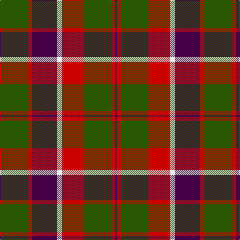

This page is one **sett** — a single exact thread-count. It belongs to the [tartan](/tartans/g28r4dp25w5r22g27r4dp2/)
(the same proportion at any scale), whose colour order is pattern [BRGRWBRG](/stripes/brgrwbrg/).

Sourced from tartans-authority.  It is a [8 stripe tartan](/stripes/stripes8/).

Original link http://www.tartansauthority.com/tartan-ferret/display/11166/

## Thread count
G/56 R8 DP50 W10 R44 G54 R8 DP/4

## Palette
Each colour and the base-6 reference it is a variant of.

| Colour | Shade | Base |
|---|---|---|
| DP | <code style="background-color:#440044;">#440044</code> `oklch(27.1% 0.125 328.4)` <small>#440044</small> | B <code style="background-color:#2A418A;">#2A418A</code> |
| G | <code style="background-color:#285800;">#285800</code> `oklch(41.0% 0.122 135.8)` <small>#285800</small> | G <code style="background-color:#006100;">#006100</code> |
| R | <code style="background-color:#C80000;">#C80000</code> `oklch(52.3% 0.215 29.2)` <small>#C80000</small> | R <code style="background-color:#CC0000;">#CC0000</code> |
| W | <code style="background-color:#FCFCFC;">#FCFCFC</code> `oklch(99.1% 0.000 89.9)` <small>#FCFCFC</small> | W <code style="background-color:#F7F7F7;">#F7F7F7</code> |

# Sample pattern

## Nearest tartans

The nearest existing variants by ΔTartan distance, with this tartan at the top so the swatches line up against it.

ΔTartan

Tartan

Sett

—

<a href="/ttd/edit/#slug=dg28r4dp25w5r22dg27r4dp2~x2">New Glasgow (Canada)</a> <a class="nn-out" href="/setts/s8/dg28r4dp25w5r22dg27r4dp2~x2/" title="open its dictionary page">↗</a>

0.58

<a href="/ttd/edit/#slug=k2r12db6r3g12r4db1~x2">MacBean, MacElvain</a> <a class="nn-out" href="/setts/s7/k2r12db6r3g12r4db1~x2/" title="open its dictionary page">↗</a>

0.68

<a href="/ttd/edit/#slug=dg12g6dg6r15k1r1k2~x2">Cook (Name)</a> <a class="nn-out" href="/setts/s7/dg12g6dg6r15k1r1k2~x2/" title="open its dictionary page">↗</a>

0.82

<a href="/ttd/edit/#slug=dp8r3ly1r3dg14r3ly1~x4">Logan - 1819 (with yellow)</a> <a class="nn-out" href="/setts/s7/dp8r3ly1r3dg14r3ly1~x4/" title="open its dictionary page">↗</a>

0.85

<a href="/ttd/edit/#slug=db3k5r2g2r3g12r6k1r3~x4">Fulton (1999) (Name)</a> <a class="nn-out" href="/setts/s9/db3k5r2g2r3g12r6k1r3~x4/" title="open its dictionary page">↗</a>

0.87

<a href="/ttd/edit/#slug=r6dg16r4db12r16lb1r2~x2">MacQuarrie LO</a> <a class="nn-out" href="/setts/s7/r6dg16r4db12r16lb1r2~x2/" title="open its dictionary page">↗</a>

0.88

<a href="/ttd/edit/#slug=g12t6g6r15k1r1k2~x4">McCook/Cook (Name)</a> <a class="nn-out" href="/setts/s7/g12t6g6r15k1r1k2~x4/" title="open its dictionary page">↗</a>

0.89

<a href="/ttd/edit/#slug=dp1r5g15r3dp9r10w1~x4">Geddes</a> <a class="nn-out" href="/setts/s7/dp1r5g15r3dp9r10w1~x4/" title="open its dictionary page">↗</a>

0.91

<a href="/ttd/edit/#slug=r15db2r1db2r3db7g13g3~x2">Cranston Dress</a> <a class="nn-out" href="/setts/s8/r15db2r1db2r3db7g13g3~x2/" title="open its dictionary page">↗</a>

0.92

<a href="/ttd/edit/#slug=dp8r3ly1r3g14r3ly1~x4">Logan with Yellow</a> <a class="nn-out" href="/setts/s7/dp8r3ly1r3g14r3ly1~x4/" title="open its dictionary page">↗</a>

0.93

<a href="/ttd/edit/#slug=k2r12db6r3dg12r4db1~x2">MacBean/MacElvain</a> <a class="nn-out" href="/setts/s7/k2r12db6r3dg12r4db1~x2/" title="open its dictionary page">↗</a>

## Neighbour map

Every grey dot is one of 14299 variants placed by the first two principal components of the ΔTartan feature space (44% of its variance). Red is this tartan; blue dots are its nearest — click one to open its page.

<svg viewBox="0 0 640 380" role="img" style="max-width:100%;height:auto;border:1px solid #e0e0e0;border-radius:4px;display:block" xmlns="http://www.w3.org/2000/svg"><image href="/nn/cloud.v1.png" width="640" height="380"/><a href="/setts/s7/k2r12db6r3g12r4db1~x2/"><circle cx="250.2" cy="196.7" r="4" fill="#3465a4"><title>MacBean, MacElvain</title></circle></a><a href="/setts/s7/dg12g6dg6r15k1r1k2~x2/"><circle cx="253.2" cy="191.0" r="4" fill="#3465a4"><title>Cook (Name)</title></circle></a><a href="/setts/s7/dp8r3ly1r3dg14r3ly1~x4/"><circle cx="248.6" cy="180.2" r="4" fill="#3465a4"><title>Logan - 1819 (with yellow)</title></circle></a><a href="/setts/s9/db3k5r2g2r3g12r6k1r3~x4/"><circle cx="209.9" cy="190.3" r="4" fill="#3465a4"><title>Fulton (1999) (Name)</title></circle></a><a href="/setts/s7/r6dg16r4db12r16lb1r2~x2/"><circle cx="268.3" cy="186.1" r="4" fill="#3465a4"><title>MacQuarrie LO</title></circle></a><a href="/setts/s7/g12t6g6r15k1r1k2~x4/"><circle cx="249.3" cy="188.7" r="4" fill="#3465a4"><title>McCook/Cook (Name)</title></circle></a><a href="/setts/s7/dp1r5g15r3dp9r10w1~x4/"><circle cx="243.5" cy="187.3" r="4" fill="#3465a4"><title>Geddes</title></circle></a><a href="/setts/s8/r15db2r1db2r3db7g13g3~x2/"><circle cx="229.4" cy="169.2" r="4" fill="#3465a4"><title>Cranston Dress</title></circle></a><a href="/setts/s7/dp8r3ly1r3g14r3ly1~x4/"><circle cx="247.4" cy="177.9" r="4" fill="#3465a4"><title>Logan with Yellow</title></circle></a><a href="/setts/s7/k2r12db6r3dg12r4db1~x2/"><circle cx="260.0" cy="198.1" r="4" fill="#3465a4"><title>MacBean/MacElvain</title></circle></a><circle cx="249.7" cy="188.7" r="5" fill="#c00000"/></svg>

ID: /setts/s8/dg28r4dp25w5r22dg27r4dp2~x2/
