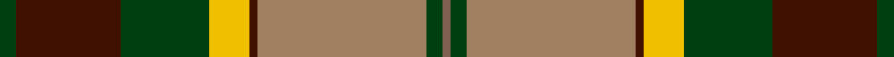

In pattern [GBGYBRGR](/stripes/gbgybrgr/).

This was sourced from weddslist.  It is a [8 stripe tartan](/stripes/stripes8/).

Original link http://www.weddslist.com/cgi-bin/tartans/pg.pl?source=sts

## Thread count
DG/4 DR26 DG22 Y10 DR2 LT42 DG4 LTa/2

## Palette
Each colour and the base-6 reference it is a variant of.

| Colour | Shade | Base |
|---|---|---|
| DG | <code style="background-color:#004010;">#004010</code> `oklch(32.3% 0.098 146.3)` <small>#004010</small> | G <code style="background-color:#006100;">#006100</code> |
| DR | <code style="background-color:#401000;">#401000</code> `oklch(25.3% 0.079 39.9)` <small>#401000</small> | B <code style="background-color:#2A418A;">#2A418A</code> |
| LT | <code style="background-color:#A08060;">#A08060</code> `oklch(62.2% 0.060 66.3)` <small>#A08060</small> | R <code style="background-color:#CC0000;">#CC0000</code> |
| LTa | <code style="background-color:#806050;">#806050</code> `oklch(51.7% 0.049 47.8)` <small>#806050</small> | R <code style="background-color:#CC0000;">#CC0000</code> |
| Y | <code style="background-color:#F0C000;">#F0C000</code> `oklch(82.7% 0.169 90.5)` <small>#F0C000</small> | Y <code style="background-color:#F2BF00;">#F2BF00</code> |

# Sample pattern

## Nearest tartans

The nearest existing variants by ΔTartan distance.

1. [St. Lawrence #2 (Fashion)](/setts/s8/g2do13g11ly5do1lo21g2dy1~x2/) — ΔT 0.68
1. [Golden Wedding (Fashion)](/setts/s8/r8lo44k32w2o52k7o7w3/) — ΔT 0.86
1. [Forrester (Clan)](/setts/s9/w3dt4w1dt15r24dg15ly1dg4ly3~x4/) — ΔT 0.89
1. [Windsor](/setts/s10/r4n12k18n4y22lb1y2lb2y3lb2~x4/) — ΔT 0.91
1. [Ford & Etal](/setts/s8/k3w1r16k1g21b9k6w1~x4/) — ΔT 0.98
1. [Dinwoodie (Name)](/setts/s10/dy12o2k2o42k13g25o6k2r4k10~x2/) — ΔT 1.06
1. [Stuart/Stewart Riding Cloak](/setts/s11/w1db4dy8r4w1r4w1r4dg16db2w1~x2/) — ΔT 1.07
1. [Forrester / Foster](/setts/s9/w4db6w1db15r23g15ly1g6ly4~x2/) — ΔT 1.08
1. [Pope of Wales](/setts/s12/k10r26k2r4k2r26k3g36k3g30k3y2/) — ΔT 1.09
1. [Dalveen (Fashion)](/setts/s8/k3g2k21w11g1y21g2y3~x2/) — ΔT 1.09

## Neighbour map

Every grey dot is one of 14299 variants placed by the first two principal components of the ΔTartan feature space (44% of its variance). Red is this tartan; blue dots are its nearest — click one to open its page.

<svg viewBox="0 0 640 380" role="img" style="max-width:100%;height:auto;border:1px solid #e0e0e0;border-radius:4px;display:block" xmlns="http://www.w3.org/2000/svg"><image href="/nn/cloud.v1.png" width="640" height="380"/><a href="/setts/s8/g2do13g11ly5do1lo21g2dy1~x2/"><circle cx="210.7" cy="142.6" r="4" fill="#3465a4"><title>St. Lawrence #2 (Fashion)</title></circle></a><a href="/setts/s8/r8lo44k32w2o52k7o7w3/"><circle cx="208.4" cy="123.7" r="4" fill="#3465a4"><title>Golden Wedding (Fashion)</title></circle></a><a href="/setts/s9/w3dt4w1dt15r24dg15ly1dg4ly3~x4/"><circle cx="200.1" cy="124.3" r="4" fill="#3465a4"><title>Forrester (Clan)</title></circle></a><a href="/setts/s10/r4n12k18n4y22lb1y2lb2y3lb2~x4/"><circle cx="215.0" cy="132.9" r="4" fill="#3465a4"><title>Windsor</title></circle></a><a href="/setts/s8/k3w1r16k1g21b9k6w1~x4/"><circle cx="191.3" cy="135.4" r="4" fill="#3465a4"><title>Ford &amp; Etal</title></circle></a><a href="/setts/s10/dy12o2k2o42k13g25o6k2r4k10~x2/"><circle cx="229.1" cy="135.8" r="4" fill="#3465a4"><title>Dinwoodie (Name)</title></circle></a><a href="/setts/s11/w1db4dy8r4w1r4w1r4dg16db2w1~x2/"><circle cx="174.4" cy="131.6" r="4" fill="#3465a4"><title>Stuart/Stewart Riding Cloak</title></circle></a><a href="/setts/s9/w4db6w1db15r23g15ly1g6ly4~x2/"><circle cx="161.5" cy="132.1" r="4" fill="#3465a4"><title>Forrester / Foster</title></circle></a><a href="/setts/s12/k10r26k2r4k2r26k3g36k3g30k3y2/"><circle cx="209.2" cy="134.7" r="4" fill="#3465a4"><title>Pope of Wales</title></circle></a><a href="/setts/s8/k3g2k21w11g1y21g2y3~x2/"><circle cx="198.4" cy="130.7" r="4" fill="#3465a4"><title>Dalveen (Fashion)</title></circle></a><circle cx="208.2" cy="140.5" r="5" fill="#c00000"/></svg>

ID: /setts/s8/dg2dr13dg11ly5dr1o21dg2o1~x2/
