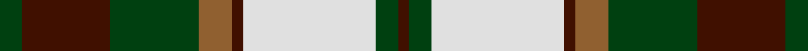
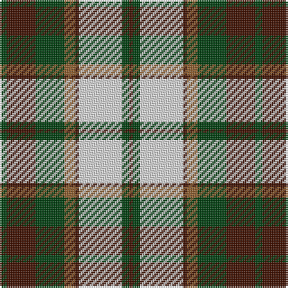

In pattern [BGWBRGBG](/stripes/bgwbrgbg/).

This was sourced from weddslist.  It is a [8 stripe tartan](/stripes/stripes8/).

Original link http://www.weddslist.com/cgi-bin/tartans/pg.pl?source=sts

## Thread count
DG/4 DR16 DG16 LT6 DR2 LN24 DG4 DR/2

## Palette
Each colour and the base-6 reference it is a variant of.

| Colour | Shade | Base |
|---|---|---|
| DG | <code style="background-color:#004010;">#004010</code> `oklch(32.3% 0.098 146.3)` <small>#004010</small> | G <code style="background-color:#006100;">#006100</code> |
| DR | <code style="background-color:#401000;">#401000</code> `oklch(25.3% 0.079 39.9)` <small>#401000</small> | B <code style="background-color:#2A418A;">#2A418A</code> |
| LN | <code style="background-color:#E0E0E0;">#E0E0E0</code> `oklch(90.7% 0.000 89.9)` <small>#E0E0E0</small> | W <code style="background-color:#F7F7F7;">#F7F7F7</code> |
| LT | <code style="background-color:#906030;">#906030</code> `oklch(53.1% 0.089 63.7)` <small>#906030</small> | R <code style="background-color:#CC0000;">#CC0000</code> |

# Sample pattern

## Nearest tartans

The nearest existing variants by ΔTartan distance.

1. [Bannockbane Light Tan](/setts/s8/k4ly2k13ly1w8lo13ly2lo4~x2/) — ΔT 0.50
1. [Dalveen (1981)](/setts/s8/k3g2k10w11g1dy10g2dy3~x6/) — ΔT 0.51
1. [National Trust](/setts/s8/g2do8g8lo3do1w12g2do1~x2/) — ΔT 0.64
1. [Bannockbane Grey #1](/setts/s8/k4ly2k13ly1w8o13ly2o4~x2/) — ΔT 0.68
1. [Bannockbane Hunting (MacBean and Bishop)](/setts/s8/dg3o2dg14o1w10y14o2y3~x2/) — ΔT 0.69
1. [Cape Breton (yellow stripes)](/setts/s7/ly6k6y30k8lb18k6ly3~x2/) — ΔT 0.79
1. [National Trust Corporate Tartan Tartan Number: 2117. Earliest known date: pre 1991 Sent in by Tweedmill for information. See products available Copyright © Blair Urquhart, Comrie, 2015](/setts/s8/dg2do8dg8r3do1w12dg2y1~x2/) — ΔT 0.90
1. [Bannock Bane M.407](/setts/s8/db4dy3db21dy2w14o22dy3o4~x2/) — ΔT 0.93
1. [Bannockbane, Dark Tan](/setts/s8/dr4ly2dr13ly1w8t13ly2t4~x2/) — ΔT 0.94
1. [Unidentified (ex Tony Murray)](/setts/s8/dt8w22dt5w4k24r6k2r6~x2/) — ΔT 1.01

## Neighbour map

Every grey dot is one of 14299 variants placed by the first two principal components of the ΔTartan feature space (44% of its variance). Red is this tartan; blue dots are its nearest — click one to open its page.

<svg viewBox="0 0 640 380" role="img" style="max-width:100%;height:auto;border:1px solid #e0e0e0;border-radius:4px;display:block" xmlns="http://www.w3.org/2000/svg"><image href="/nn/cloud.v1.png" width="640" height="380"/><a href="/setts/s8/k4ly2k13ly1w8lo13ly2lo4~x2/"><circle cx="157.3" cy="168.1" r="4" fill="#3465a4"><title>Bannockbane Light Tan</title></circle></a><a href="/setts/s8/k3g2k10w11g1dy10g2dy3~x6/"><circle cx="126.2" cy="181.6" r="4" fill="#3465a4"><title>Dalveen (1981)</title></circle></a><a href="/setts/s8/g2do8g8lo3do1w12g2do1~x2/"><circle cx="145.1" cy="169.5" r="4" fill="#3465a4"><title>National Trust</title></circle></a><a href="/setts/s8/k4ly2k13ly1w8o13ly2o4~x2/"><circle cx="152.2" cy="166.9" r="4" fill="#3465a4"><title>Bannockbane Grey #1</title></circle></a><a href="/setts/s8/dg3o2dg14o1w10y14o2y3~x2/"><circle cx="167.8" cy="167.2" r="4" fill="#3465a4"><title>Bannockbane Hunting (MacBean and Bishop)</title></circle></a><a href="/setts/s7/ly6k6y30k8lb18k6ly3~x2/"><circle cx="148.1" cy="179.5" r="4" fill="#3465a4"><title>Cape Breton (yellow stripes)</title></circle></a><a href="/setts/s8/dg2do8dg8r3do1w12dg2y1~x2/"><circle cx="123.0" cy="151.9" r="4" fill="#3465a4"><title>National Trust Corporate Tartan Tartan Number: 2117. Earliest known date: pre 1991 Sent in by Tweedmill for information. See products available Copyright © Blair Urquhart, Comrie, 2015</title></circle></a><a href="/setts/s8/db4dy3db21dy2w14o22dy3o4~x2/"><circle cx="159.4" cy="166.8" r="4" fill="#3465a4"><title>Bannock Bane M.407</title></circle></a><a href="/setts/s8/dr4ly2dr13ly1w8t13ly2t4~x2/"><circle cx="163.9" cy="170.8" r="4" fill="#3465a4"><title>Bannockbane, Dark Tan</title></circle></a><a href="/setts/s8/dt8w22dt5w4k24r6k2r6~x2/"><circle cx="140.2" cy="164.5" r="4" fill="#3465a4"><title>Unidentified (ex Tony Murray)</title></circle></a><circle cx="144.0" cy="168.9" r="5" fill="#c00000"/></svg>

ID: /setts/s8/dg2dr8dg8o3dr1w12dg2dr1~x2/
