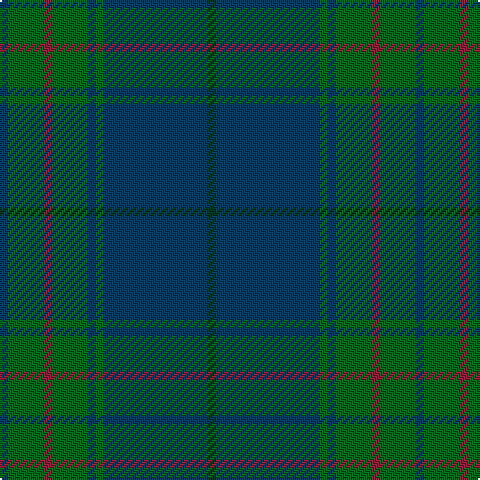

In pattern [BGRGBGBG](/stripes/bgrgbgbg/).

This was sourced from register-of-tartans.  It is a [8 stripe tartan](/stripes/stripes8/).

Original link https://www.tartanregister.gov.uk/tartanDetails.aspx?ref=2040

## Also known as

This cloth is also recorded under:

- Land's End

## Register references

External register numbers recorded for this tartan.

- Scottish Register of Tartans: [2040](https://www.tartanregister.gov.uk/tartanDetails.aspx?ref=2040)
- Scottish Tartans Authority (ITI): 2579
- Scottish Tartans World Register: 2579

## Thread count
DG/4 DB52 G4 DB4 G18 DR4 G18 DB/4

## Palette
Each colour and the base-6 reference it is a variant of.

| Colour | Shade | Base |
|---|---|---|
| DB | <code style="background-color:#003C64;">#003C64</code> `oklch(34.5% 0.089 246.0)` <small>#003C64</small> | B <code style="background-color:#2A418A;">#2A418A</code> |
| DG | <code style="background-color:#003820;">#003820</code> `oklch(30.0% 0.070 158.3)` <small>#003820</small> | G <code style="background-color:#006100;">#006100</code> |
| DR | <code style="background-color:#901C38;">#901C38</code> `oklch(43.2% 0.150 13.1)` <small>#901C38</small> | R <code style="background-color:#CC0000;">#CC0000</code> |
| G | <code style="background-color:#006818;">#006818</code> `oklch(45.0% 0.142 145.0)` <small>#006818</small> | G <code style="background-color:#006100;">#006100</code> |

# Sample pattern

## Nearest tartans

The nearest existing variants by ΔTartan distance, with this tartan at the top so the swatches line up against it.

ΔTartan

Tartan

Sett

—

<a href="/ttd/edit/#slug=dg2dt26g2dt2g9r2g9dt2~x2">Land's End Blue</a> <a class="nn-out" href="/setts/s8/dg2dt26g2dt2g9r2g9dt2~x2/" title="open its dictionary page">↗</a>

1.07

<a href="/ttd/edit/#slug=dg36db3dg3db3dg6n34r4n4~x2">Wcwm 1530</a> <a class="nn-out" href="/setts/s8/dg36db3dg3db3dg6n34r4n4~x2/" title="open its dictionary page">↗</a>

1.34

<a href="/ttd/edit/#slug=dp4dt18r2dt2r2dt9g20dt3g4~x2">St. Andrews New Golf Club</a> <a class="nn-out" href="/setts/s9/dp4dt18r2dt2r2dt9g20dt3g4~x2/" title="open its dictionary page">↗</a>

1.45

<a href="/ttd/edit/#slug=dg4ly2dg17dg2r4dg2dg3dg11dg2~x2">Armagh, County</a> <a class="nn-out" href="/setts/s9/dg4ly2dg17dg2r4dg2dg3dg11dg2~x2/" title="open its dictionary page">↗</a>

1.49

<a href="/ttd/edit/#slug=r4db2dg7db15dg3db3dg3db7dg28k7dg6k2~x2">Walker Hunting (Name)</a> <a class="nn-out" href="/setts/s12/r4db2dg7db15dg3db3dg3db7dg28k7dg6k2~x2/" title="open its dictionary page">↗</a>

1.55

<a href="/ttd/edit/#slug=dt17g5dt5g17dt4g17k2dy2k2g5~x2">Hueg (Hunting) (Personal)</a> <a class="nn-out" href="/setts/s10/dt17g5dt5g17dt4g17k2dy2k2g5~x2/" title="open its dictionary page">↗</a>

1.60

<a href="/ttd/edit/#slug=y24r2y2dg40y25dg2y2r2y2dg20~x2">Donachie of Brockloch Htg (Clan)</a> <a class="nn-out" href="/setts/s10/y24r2y2dg40y25dg2y2r2y2dg20~x2/" title="open its dictionary page">↗</a>

1.67

<a href="/ttd/edit/#slug=db6t3db3t15dg7db7dg5db17dg46dg4">Jones (Welsh Name)</a> <a class="nn-out" href="/setts/s10/db6t3db3t15dg7db7dg5db17dg46dg4/" title="open its dictionary page">↗</a>

1.85

<a href="/ttd/edit/#slug=dg20k2dg20dp25w2n3~x2">Lawrence of Broughty Ferry</a> <a class="nn-out" href="/setts/s6/dg20k2dg20dp25w2n3~x2/" title="open its dictionary page">↗</a>

1.89

<a href="/ttd/edit/#slug=dg8do2dg13db4dg12n22dg5ly3~x2">Scottish Pup</a> <a class="nn-out" href="/setts/s8/dg8do2dg13db4dg12n22dg5ly3~x2/" title="open its dictionary page">↗</a>

1.89

<a href="/ttd/edit/#slug=dg4db1dg12db12w1db4~x2">Unidentified Tweed</a> <a class="nn-out" href="/setts/s6/dg4db1dg12db12w1db4~x2/" title="open its dictionary page">↗</a>

## Neighbour map

Every grey dot is one of 14299 variants placed by the first two principal components of the ΔTartan feature space (44% of its variance). Red is this tartan; blue dots are its nearest — click one to open its page.

<svg viewBox="0 0 640 380" role="img" style="max-width:100%;height:auto;border:1px solid #e0e0e0;border-radius:4px;display:block" xmlns="http://www.w3.org/2000/svg"><image href="/nn/cloud.v1.png" width="640" height="380"/><a href="/setts/s8/dg36db3dg3db3dg6n34r4n4~x2/"><circle cx="361.3" cy="218.1" r="4" fill="#3465a4"><title>Wcwm 1530</title></circle></a><a href="/setts/s9/dp4dt18r2dt2r2dt9g20dt3g4~x2/"><circle cx="341.2" cy="233.2" r="4" fill="#3465a4"><title>St. Andrews New Golf Club</title></circle></a><a href="/setts/s9/dg4ly2dg17dg2r4dg2dg3dg11dg2~x2/"><circle cx="385.9" cy="256.1" r="4" fill="#3465a4"><title>Armagh, County</title></circle></a><a href="/setts/s12/r4db2dg7db15dg3db3dg3db7dg28k7dg6k2~x2/"><circle cx="377.2" cy="211.6" r="4" fill="#3465a4"><title>Walker Hunting (Name)</title></circle></a><a href="/setts/s10/dt17g5dt5g17dt4g17k2dy2k2g5~x2/"><circle cx="380.7" cy="256.0" r="4" fill="#3465a4"><title>Hueg (Hunting) (Personal)</title></circle></a><a href="/setts/s10/y24r2y2dg40y25dg2y2r2y2dg20~x2/"><circle cx="446.0" cy="223.6" r="4" fill="#3465a4"><title>Donachie of Brockloch Htg (Clan)</title></circle></a><a href="/setts/s10/db6t3db3t15dg7db7dg5db17dg46dg4/"><circle cx="349.4" cy="198.1" r="4" fill="#3465a4"><title>Jones (Welsh Name)</title></circle></a><a href="/setts/s6/dg20k2dg20dp25w2n3~x2/"><circle cx="360.6" cy="237.3" r="4" fill="#3465a4"><title>Lawrence of Broughty Ferry</title></circle></a><a href="/setts/s8/dg8do2dg13db4dg12n22dg5ly3~x2/"><circle cx="358.1" cy="250.2" r="4" fill="#3465a4"><title>Scottish Pup</title></circle></a><a href="/setts/s6/dg4db1dg12db12w1db4~x2/"><circle cx="385.7" cy="269.5" r="4" fill="#3465a4"><title>Unidentified Tweed</title></circle></a><circle cx="425.6" cy="230.7" r="5" fill="#c00000"/></svg>

ID: /setts/s8/dg2dt26g2dt2g9r2g9dt2~x2/
