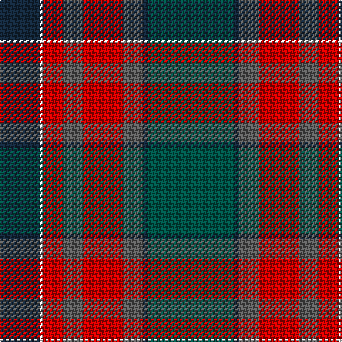

**Bands:** [BWRBRBBG](/stripes/bwrbrbbg/) · **Stripes:** [DT W R N R N DT DG](/stripes/stripes8/) DT W R N R N DT DG

This was sourced from tartans-authority.  It is a [8 band tartan](/bands/bands8/).

Original link http://www.tartansauthority.com/tartan-ferret/display/6796/

## Thread count
DN/28 W2 R14 N14 R28 N14 DN4 G/60

## Palette
Each colour and its ΔE from the base-6 reference it is a variant of.

| Colour | Shade | Base | ΔE (OKLab) |
|---|---|---|---|
| DN | <code style="background-color:#14283C;">#14283C</code> `#14283C` | B <code style="background-color:#2A418A;">#2A418A</code> | 0.15 |
| G | <code style="background-color:#005448;">#005448</code> `#005448` | G <code style="background-color:#006100;">#006100</code> | 0.10 |
| N | <code style="background-color:#5C5C5C;">#5C5C5C</code> `#5C5C5C` | B <code style="background-color:#2A418A;">#2A418A</code> | 0.15 |
| R | <code style="background-color:#C80000;">#C80000</code> `#C80000` | R <code style="background-color:#CC0000;">#CC0000</code> | 0.01 |
| W | <code style="background-color:#F8F8F8;">#F8F8F8</code> `#F8F8F8` | W <code style="background-color:#F7F7F7;">#F7F7F7</code> | 0.00 |

# Sample pattern

## Nearest tartans

The nearest existing variants by ΔTartan distance.

1. [Livingstone Aus. Dress (Personal)](/setts/s8/db24g4k2ly1k2g4r25g15~x2/) — ΔT 0.96
1. [Knockando Woolmill (Corporate)](/setts/s9/t16k1r7k1r7k1t7y24lo4~x2/) — ΔT 1.08
1. [Harding Personal Tartan Tartan Number: 6796. Earliest known date: 2005 The tartan is part of a personal design project bringing together textile, silver and jewelry design and leatherworking, all inspired by the richness of the Scottish design and craft heritage. See products available Copyright © Blair Urquhart, Comrie, 2015](/setts/s8/g30db2o7r14o7r7w1db14~x2/) — ΔT 1.14
1. [Eachaidh (Personal)](/setts/s6/k6t1r18db6dg18k2~x2/) — ΔT 1.17
1. [Aberuchill](/setts/s8/m8k2dy10dp30dy30g55k4lo6/) — ΔT 1.19
1. [Eachaidh](/setts/s6/k6y1r18b6dg18k2~x2/) — ΔT 1.19
1. [Redgate Htg #1 (Name)](/setts/s9/db1r4db12r1k7y12k7dy21lb1~x2/) — ΔT 1.31
1. [Queen of Scots (Commemorative))](/setts/s9/g22k3g1k3g2dp8r1dp8r16~x2/) — ΔT 1.31
1. [Mann](/setts/s9/k3r2dy4r1db25g12dy14db3r1~x2/) — ΔT 1.32
1. [Norham and Ladykirk (District)](/setts/s11/dg50db12o7db12r10o7k2o7k2o7r10~x2/) — ΔT 1.33

## Neighbour map

Every grey dot is one of 14313 variants placed by the first two principal components of the ΔTartan feature space (44% of its variance). Red is this tartan; blue dots are its nearest — click one to open its page.

<svg viewBox="0 0 640 380" role="img" style="max-width:100%;height:auto;border:1px solid #e0e0e0;border-radius:4px;display:block" xmlns="http://www.w3.org/2000/svg"><image href="/nn/cloud.v1.png" width="640" height="380"/><a href="/setts/s8/db24g4k2ly1k2g4r25g15~x2/"><circle cx="243.1" cy="158.0" r="4" fill="#3465a4"><title>Livingstone Aus. Dress (Personal)</title></circle></a><a href="/setts/s9/t16k1r7k1r7k1t7y24lo4~x2/"><circle cx="248.4" cy="153.3" r="4" fill="#3465a4"><title>Knockando Woolmill (Corporate)</title></circle></a><a href="/setts/s8/g30db2o7r14o7r7w1db14~x2/"><circle cx="217.9" cy="145.0" r="4" fill="#3465a4"><title>Harding Personal Tartan Tartan Number: 6796. Earliest known date: 2005 The tartan is part of a personal design project bringing together textile, silver and jewelry design and leatherworking, all inspired by the richness of the Scottish design and craft heritage. See products available Copyright © Blair Urquhart, Comrie, 2015</title></circle></a><a href="/setts/s6/k6t1r18db6dg18k2~x2/"><circle cx="237.4" cy="197.8" r="4" fill="#3465a4"><title>Eachaidh (Personal)</title></circle></a><a href="/setts/s8/m8k2dy10dp30dy30g55k4lo6/"><circle cx="232.5" cy="141.3" r="4" fill="#3465a4"><title>Aberuchill</title></circle></a><a href="/setts/s6/k6y1r18b6dg18k2~x2/"><circle cx="251.3" cy="203.9" r="4" fill="#3465a4"><title>Eachaidh</title></circle></a><a href="/setts/s9/db1r4db12r1k7y12k7dy21lb1~x2/"><circle cx="191.0" cy="159.4" r="4" fill="#3465a4"><title>Redgate Htg #1 (Name)</title></circle></a><a href="/setts/s9/g22k3g1k3g2dp8r1dp8r16~x2/"><circle cx="267.8" cy="166.1" r="4" fill="#3465a4"><title>Queen of Scots (Commemorative))</title></circle></a><a href="/setts/s9/k3r2dy4r1db25g12dy14db3r1~x2/"><circle cx="295.0" cy="159.6" r="4" fill="#3465a4"><title>Mann</title></circle></a><a href="/setts/s11/dg50db12o7db12r10o7k2o7k2o7r10~x2/"><circle cx="247.3" cy="133.5" r="4" fill="#3465a4"><title>Norham and Ladykirk (District)</title></circle></a><circle cx="244.9" cy="161.9" r="5" fill="#c00000"/></svg>

ID: /setts/s8/dg30dt2n7r14n7r7w1dt14~x2/
