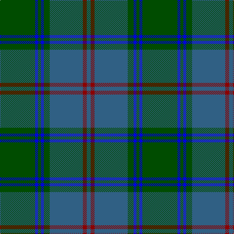

This page is one **sett** — a single exact thread-count. It belongs to the [tartan](/tartans/dg36db3dg3db3dg6n34r4n4/)
(the same proportion at any scale), whose colour order is pattern [BRBGBGBG](/stripes/brbgbgbg/).

Sourced from register-of-tartans.  It is a [8 stripe tartan](/stripes/stripes8/).

Original link https://www.tartanregister.gov.uk/tartanDetails.aspx?ref=4528

## Register references

External register numbers recorded for this tartan.

- Scottish Register of Tartans: [4528](https://www.tartanregister.gov.uk/tartanDetails.aspx?ref=4528)
- Scottish Tartans Authority (ITI): 4303

## Thread count
G/72 B6 G6 B6 G12 Ba68 DR8 Ba/8

## Palette

Palette: <strong>Tartan Register</strong> <small style="color:#888">(1 of 4 colours)</small>
<table><thead><tr><th>Colour</th><th>Threads</th><th>Shade</th><th>Base</th><th>OKLCh</th></tr></thead><tbody><tr><td>G/</td><td style="text-align:right;font-variant-numeric:tabular-nums">72</td><td><code style="background-color:#004C00;">#004C00</code> <small style="color:#888">#004C00</small></td><td>G <code style="background-color:#006100;">#006100</code></td><td><small style="color:#888">oklch(36.1% 0.123 142.5)</small></td></tr><tr><td>B</td><td style="text-align:right;font-variant-numeric:tabular-nums">6</td><td><code style="background-color:#0000E0;">#0000E0</code> <small style="color:#888">#0000E0</small></td><td>B <code style="background-color:#2A418A;">#2A418A</code></td><td><small style="color:#888">oklch(41.0% 0.284 264.1)</small></td></tr><tr><td>G</td><td style="text-align:right;font-variant-numeric:tabular-nums">6</td><td><code style="background-color:#004C00;">#004C00</code> <small style="color:#888">#004C00</small></td><td>G <code style="background-color:#006100;">#006100</code></td><td><small style="color:#888">oklch(36.1% 0.123 142.5)</small></td></tr><tr><td>B</td><td style="text-align:right;font-variant-numeric:tabular-nums">6</td><td><code style="background-color:#0000E0;">#0000E0</code> <small style="color:#888">#0000E0</small></td><td>B <code style="background-color:#2A418A;">#2A418A</code></td><td><small style="color:#888">oklch(41.0% 0.284 264.1)</small></td></tr><tr><td>G</td><td style="text-align:right;font-variant-numeric:tabular-nums">12</td><td><code style="background-color:#004C00;">#004C00</code> <small style="color:#888">#004C00</small></td><td>G <code style="background-color:#006100;">#006100</code></td><td><small style="color:#888">oklch(36.1% 0.123 142.5)</small></td></tr><tr><td>Ba</td><td style="text-align:right;font-variant-numeric:tabular-nums">68</td><td><code style="background-color:#306084;">#306084</code> <small style="color:#888">#306084</small></td><td>B <code style="background-color:#2A418A;">#2A418A</code></td><td><small style="color:#888">oklch(47.2% 0.079 243.2)</small></td></tr><tr><td>DR</td><td style="text-align:right;font-variant-numeric:tabular-nums">8</td><td><code style="background-color:#8C0000;">#8C0000</code> <small style="color:#888">#8C0000</small></td><td>R <code style="background-color:#CC0000;">#CC0000</code></td><td><small style="color:#888">oklch(40.2% 0.165 29.2)</small></td></tr><tr><td>Ba/</td><td style="text-align:right;font-variant-numeric:tabular-nums">8</td><td><code style="background-color:#306084;">#306084</code> <small style="color:#888">#306084</small></td><td>B <code style="background-color:#2A418A;">#2A418A</code></td><td><small style="color:#888">oklch(47.2% 0.079 243.2)</small></td></tr></tbody></table>

# Sample pattern

## Nearest tartans

The nearest existing variants by ΔTartan distance, with this tartan at the top so the swatches line up against it.

ΔTartan

Tartan

Sett

—

<a href="/ttd/edit/#slug=dg36db3dg3db3dg6n34r4n4~x2">Wcwm 1530</a> <a class="nn-out" href="/setts/s8/dg36db3dg3db3dg6n34r4n4~x2/" title="open its dictionary page">↗</a>

0.81

<a href="/ttd/edit/#slug=dp4dt18r2dt2r2dt9g20dt3g4~x2">St. Andrews New Golf Club</a> <a class="nn-out" href="/setts/s9/dp4dt18r2dt2r2dt9g20dt3g4~x2/" title="open its dictionary page">↗</a>

1.07

<a href="/ttd/edit/#slug=dg2dt26g2dt2g9r2g9dt2~x2">Land's End Blue</a> <a class="nn-out" href="/setts/s8/dg2dt26g2dt2g9r2g9dt2~x2/" title="open its dictionary page">↗</a>

1.14

<a href="/ttd/edit/#slug=db6t3db3t15dg7db7dg5db17dg46dg4">Jones (Welsh Name)</a> <a class="nn-out" href="/setts/s10/db6t3db3t15dg7db7dg5db17dg46dg4/" title="open its dictionary page">↗</a>

1.35

<a href="/ttd/edit/#slug=db20dy2db2dy2db2dy6g15dy2~x2">Gammell (Brown) (Personal)</a> <a class="nn-out" href="/setts/s8/db20dy2db2dy2db2dy6g15dy2~x2/" title="open its dictionary page">↗</a>

1.36

<a href="/ttd/edit/#slug=dg11r4dg4r7dg41db11t4db41r4db8">Stuart/Stewart of Appin #2</a> <a class="nn-out" href="/setts/s10/dg11r4dg4r7dg41db11t4db41r4db8/" title="open its dictionary page">↗</a>

1.40

<a href="/ttd/edit/#slug=w6dg5k6dg42n42k5n5k5">Ben Lomond Fashion Tartan Tartan Number: 6500. Earliest known date: pre 2005 See products available Copyright © Blair Urquhart, Comrie, 2015</a> <a class="nn-out" href="/setts/s8/w6dg5k6dg42n42k5n5k5/" title="open its dictionary page">↗</a>

1.46

<a href="/ttd/edit/#slug=dg38w2dg6db24o6db2o3db2~x2">MacAuliffe/McAucliffe</a> <a class="nn-out" href="/setts/s8/dg38w2dg6db24o6db2o3db2~x2/" title="open its dictionary page">↗</a>

1.46

<a href="/ttd/edit/#slug=db32do3db3do3db3do10g24r3~x2">Gammell Family Tartan Tartan Number: 597. Earliest known date: 1965 Designed (probably by David Thomas and Arthur Mackie of Strathmore Woollen Co) for the Hill family of Angus as a personal tartan. Tommy Gemmell (6.3.05) said &quot;The tartan was designed using the largest Government sett by Mrs Hill's mother - a Mrs Gammell - who was a handweaver.&quot; See products available Copyright © Blair Urquhart, Comrie, 2015</a> <a class="nn-out" href="/setts/s8/db32do3db3do3db3do10g24r3~x2/" title="open its dictionary page">↗</a>

1.47

<a href="/ttd/edit/#slug=r4db2dg7db15dg3db3dg3db7dg28k7dg6k2~x2">Walker Hunting (Name)</a> <a class="nn-out" href="/setts/s12/r4db2dg7db15dg3db3dg3db7dg28k7dg6k2~x2/" title="open its dictionary page">↗</a>

1.47

<a href="/ttd/edit/#slug=k2r2k4lo3g24k2g16b17r2~x2">Shanahan (Corporate)</a> <a class="nn-out" href="/setts/s9/k2r2k4lo3g24k2g16b17r2~x2/" title="open its dictionary page">↗</a>

## Neighbour map

Every grey dot is one of 14299 variants placed by the first two principal components of the ΔTartan feature space (44% of its variance). Red is this tartan; blue dots are its nearest — click one to open its page.

<svg viewBox="0 0 640 380" role="img" style="max-width:100%;height:auto;border:1px solid #e0e0e0;border-radius:4px;display:block" xmlns="http://www.w3.org/2000/svg"><image href="/nn/cloud.v1.png" width="640" height="380"/><a href="/setts/s9/dp4dt18r2dt2r2dt9g20dt3g4~x2/"><circle cx="341.2" cy="233.2" r="4" fill="#3465a4"><title>St. Andrews New Golf Club</title></circle></a><a href="/setts/s8/dg2dt26g2dt2g9r2g9dt2~x2/"><circle cx="425.6" cy="230.7" r="4" fill="#3465a4"><title>Land's End Blue</title></circle></a><a href="/setts/s10/db6t3db3t15dg7db7dg5db17dg46dg4/"><circle cx="349.4" cy="198.1" r="4" fill="#3465a4"><title>Jones (Welsh Name)</title></circle></a><a href="/setts/s8/db20dy2db2dy2db2dy6g15dy2~x2/"><circle cx="340.6" cy="238.9" r="4" fill="#3465a4"><title>Gammell (Brown) (Personal)</title></circle></a><a href="/setts/s10/dg11r4dg4r7dg41db11t4db41r4db8/"><circle cx="305.6" cy="206.3" r="4" fill="#3465a4"><title>Stuart/Stewart of Appin #2</title></circle></a><a href="/setts/s8/w6dg5k6dg42n42k5n5k5/"><circle cx="294.4" cy="229.0" r="4" fill="#3465a4"><title>Ben Lomond Fashion Tartan Tartan Number: 6500. Earliest known date: pre 2005 See products available Copyright © Blair Urquhart, Comrie, 2015</title></circle></a><a href="/setts/s8/dg38w2dg6db24o6db2o3db2~x2/"><circle cx="364.5" cy="179.2" r="4" fill="#3465a4"><title>MacAuliffe/McAucliffe</title></circle></a><a href="/setts/s8/db32do3db3do3db3do10g24r3~x2/"><circle cx="315.5" cy="216.8" r="4" fill="#3465a4"><title>Gammell Family Tartan Tartan Number: 597. Earliest known date: 1965 Designed (probably by David Thomas and Arthur Mackie of Strathmore Woollen Co) for the Hill family of Angus as a personal tartan. Tommy Gemmell (6.3.05) said &quot;The tartan was designed using the largest Government sett by Mrs Hill's mother - a Mrs Gammell - who was a handweaver.&quot; See products available Copyright © Blair Urquhart, Comrie, 2015</title></circle></a><a href="/setts/s12/r4db2dg7db15dg3db3dg3db7dg28k7dg6k2~x2/"><circle cx="377.2" cy="211.6" r="4" fill="#3465a4"><title>Walker Hunting (Name)</title></circle></a><a href="/setts/s9/k2r2k4lo3g24k2g16b17r2~x2/"><circle cx="320.7" cy="191.8" r="4" fill="#3465a4"><title>Shanahan (Corporate)</title></circle></a><circle cx="361.3" cy="218.1" r="5" fill="#c00000"/></svg>

ID: /setts/s8/dg36db3dg3db3dg6n34r4n4~x2/
