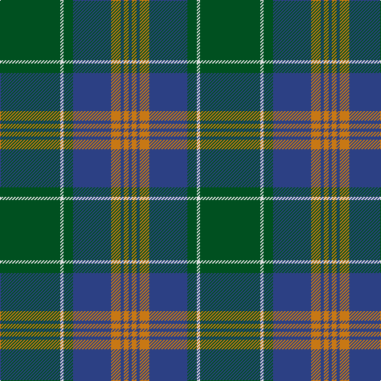

**Bands:** [GWGBRBRB](/stripes/gwgbrbrb/) · **Stripes:** [DG W DG DB O DB O DB](/stripes/stripes8/) DG W DG DB O DB O DB

This was sourced from register-of-tartans.  It is a [8 band tartan](/bands/bands8/).

Original link https://www.tartanregister.gov.uk/tartanDetails.aspx?ref=2289

## Register references

External register numbers recorded for this tartan.

- Scottish Register of Tartans: [2289](https://www.tartanregister.gov.uk/tartanDetails.aspx?ref=2289)
- Scottish Tartans World Register: 2839

## Thread count
G/76 LN4 G12 B48 O12 B4 O6 B/4

## Palette
Each colour and its ΔE from the base-6 reference it is a variant of.

| Colour | Shade | Base | ΔE (OKLab) |
|---|---|---|---|
| B | <code style="background-color:#2C4084;">#2C4084</code> `#2C4084` | B <code style="background-color:#2A418A;">#2A418A</code> | 0.01 |
| G | <code style="background-color:#005020;">#005020</code> `#005020` | G <code style="background-color:#006100;">#006100</code> | 0.07 |
| LN | <code style="background-color:#E0E0E0;">#E0E0E0</code> `#E0E0E0` | W <code style="background-color:#F7F7F7;">#F7F7F7</code> | 0.07 |
| O | <code style="background-color:#C87814;">#C87814</code> `#C87814` | R <code style="background-color:#CC0000;">#CC0000</code> | 0.17 |

# Sample pattern

## Nearest tartans

The nearest existing variants by ΔTartan distance.

1. [US Marine Corps](/setts/s8/g40r3g4r3g12db32lo4r3~x2/) — ΔT 0.90
1. [U.S. Marine Corps (Military?)](/setts/s8/dg40r3dg4r3dg12db32ly4r3~x2/) — ΔT 0.93
1. [Leatherneck U.S.Marine Corps Corporate Tartan Tartan Number: 975. Earliest known date: 1986 Designed by Madam Leask and the Scottish Tartans Society Accredited in 1981. See products available Copyright © Blair Urquhart, Comrie, 2015](/setts/s8/g28r2g2r2g8db24ly3r2~x2/) — ΔT 0.98
1. [Leatherneck, U.S.Marine Corps](/setts/s8/g28r2g2r2g8db24y3r2~x2/) — ΔT 1.08
1. [Harley (Leslie), Robert](/setts/s8/g2k3ly1k3g2db8g16k1~x4/) — ΔT 1.10
1. [Shaw (Clan 1)](/setts/s6/g24k2db3k2db8r2~x2/) — ΔT 1.17
1. [Wicklow](/setts/s10/dr2db4g12db3dr6t2db24dr2db2g2~x2/) — ΔT 1.19
1. [Harley (Leslie), Robert](/setts/s8/dg2k3ly1k3dg2db8dg16k1~x4/) — ΔT 1.19
1. [Maine, Original State of (Fashion)](/setts/s11/dg2db2t23db2t2db6t2db2dg33r2t2~x2/) — ΔT 1.23
1. [Unidentified (Pahls)](/setts/s10/lo4g4db2g29w1db12g2lo16g4db2~x2/) — ΔT 1.24

## Neighbour map

Every grey dot is one of 14299 variants placed by the first two principal components of the ΔTartan feature space (44% of its variance). Red is this tartan; blue dots are its nearest — click one to open its page.

<svg viewBox="0 0 640 380" role="img" style="max-width:100%;height:auto;border:1px solid #e0e0e0;border-radius:4px;display:block" xmlns="http://www.w3.org/2000/svg"><image href="/nn/cloud.v1.png" width="640" height="380"/><a href="/setts/s8/g40r3g4r3g12db32lo4r3~x2/"><circle cx="343.8" cy="189.0" r="4" fill="#3465a4"><title>US Marine Corps</title></circle></a><a href="/setts/s8/dg40r3dg4r3dg12db32ly4r3~x2/"><circle cx="342.6" cy="188.7" r="4" fill="#3465a4"><title>U.S. Marine Corps (Military?)</title></circle></a><a href="/setts/s8/g28r2g2r2g8db24ly3r2~x2/"><circle cx="330.5" cy="180.5" r="4" fill="#3465a4"><title>Leatherneck U.S.Marine Corps Corporate Tartan Tartan Number: 975. Earliest known date: 1986 Designed by Madam Leask and the Scottish Tartans Society Accredited in 1981. See products available Copyright © Blair Urquhart, Comrie, 2015</title></circle></a><a href="/setts/s8/g28r2g2r2g8db24y3r2~x2/"><circle cx="341.3" cy="187.0" r="4" fill="#3465a4"><title>Leatherneck, U.S.Marine Corps</title></circle></a><a href="/setts/s8/g2k3ly1k3g2db8g16k1~x4/"><circle cx="338.0" cy="188.9" r="4" fill="#3465a4"><title>Harley (Leslie), Robert</title></circle></a><a href="/setts/s6/g24k2db3k2db8r2~x2/"><circle cx="369.8" cy="208.6" r="4" fill="#3465a4"><title>Shaw (Clan 1)</title></circle></a><a href="/setts/s10/dr2db4g12db3dr6t2db24dr2db2g2~x2/"><circle cx="348.4" cy="189.2" r="4" fill="#3465a4"><title>Wicklow</title></circle></a><a href="/setts/s8/dg2k3ly1k3dg2db8dg16k1~x4/"><circle cx="346.2" cy="196.2" r="4" fill="#3465a4"><title>Harley (Leslie), Robert</title></circle></a><a href="/setts/s11/dg2db2t23db2t2db6t2db2dg33r2t2~x2/"><circle cx="321.4" cy="155.2" r="4" fill="#3465a4"><title>Maine, Original State of (Fashion)</title></circle></a><a href="/setts/s10/lo4g4db2g29w1db12g2lo16g4db2~x2/"><circle cx="341.5" cy="150.8" r="4" fill="#3465a4"><title>Unidentified (Pahls)</title></circle></a><circle cx="364.5" cy="179.2" r="5" fill="#c00000"/></svg>

ID: /setts/s8/dg38w2dg6db24o6db2o3db2~x2/
