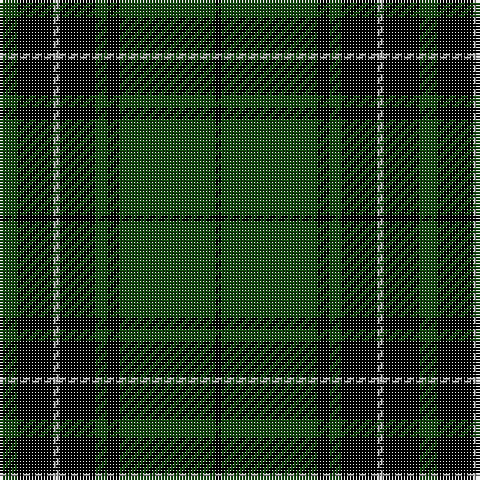

This page is one **sett** — a single exact thread-count. It belongs to the [tartan](/tartans/dg3k6n1k6dg2k2dg16k1/)
(the same proportion at any scale), whose colour order is pattern [GKYKGKGK](/stripes/gkykgkgk/).

Sourced from weddslist.  It is a [8 stripe tartan](/stripes/stripes8/).

Original link http://www.weddslist.com/cgi-bin/tartans/pg.pl?source=tinsel

2 attestations — the source records this cloth was collapsed from (oldest owns this page)

<ul>
<li>undated — MacLean VS (weddslist, <a href="http://www.weddslist.com/cgi-bin/tartans/pg.pl?source=tinsel">record</a>)</li>
<li>undated — MacLean VS (weddslist, <a href="http://www.weddslist.com/cgi-bin/tartans/pg.pl?source=x">record</a>)</li>
</ul>

## Thread count
DG/6 K12 N2 K12 DG4 K4 DG32 K/2

## Palette
Each colour and the base-6 reference it is a variant of.

| Colour | Shade | Base |
|---|---|---|
| DG | <code style="background-color:#11450D;">#11450D</code> `oklch(34.4% 0.101 142.1)` <small>#11450D</small> | G <code style="background-color:#006100;">#006100</code> |
| K | <code style="background-color:#000000;">#000000</code> `oklch(0.0% 0.000 0.0)` <small>#000000</small> | K <code style="background-color:#000000;">#000000</code> |
| N | <code style="background-color:#AAAAAA;">#AAAAAA</code> `oklch(73.8% 0.000 89.9)` <small>#AAAAAA</small> | Y <code style="background-color:#F2BF00;">#F2BF00</code> |

# Sample pattern

## Nearest tartans

The nearest existing variants by ΔTartan distance, with this tartan at the top so the swatches line up against it.

ΔTartan

Tartan

Sett

—

<a href="/ttd/edit/#slug=dg3k6lr1k6dg2k2dg16k1~x2">MacLean VS</a> <a class="nn-out" href="/setts/s8/dg3k6lr1k6dg2k2dg16k1~x2/" title="open its dictionary page">↗</a>

0.44

<a href="/ttd/edit/#slug=dg3k6lb1k6dg2k2dg16k1~x2">MacLean VS</a> <a class="nn-out" href="/setts/s8/dg3k6lb1k6dg2k2dg16k1~x2/" title="open its dictionary page">↗</a>

0.88

<a href="/ttd/edit/#slug=dg1k8dg1k8dg15r1~x2">Gunn VS</a> <a class="nn-out" href="/setts/s6/dg1k8dg1k8dg15r1~x2/" title="open its dictionary page">↗</a>

0.93

<a href="/ttd/edit/#slug=dg1k8dg1k8dg15r1~x4">Gunn VS</a> <a class="nn-out" href="/setts/s6/dg1k8dg1k8dg15r1~x4/" title="open its dictionary page">↗</a>

1.09

<a href="/ttd/edit/#slug=r1dg16k8dg3k4ly1~x2">Forbes VS</a> <a class="nn-out" href="/setts/s6/r1dg16k8dg3k4ly1~x2/" title="open its dictionary page">↗</a>

1.24

<a href="/ttd/edit/#slug=r1dg16k8dg3k4ly1">Forbes VS</a> <a class="nn-out" href="/setts/s6/r1dg16k8dg3k4ly1/" title="open its dictionary page">↗</a>

1.34

<a href="/ttd/edit/#slug=k22g5k2g5k11g33k2r4~x2">MacArthur-Fox 1993 (Personal)</a> <a class="nn-out" href="/setts/s8/k22g5k2g5k11g33k2r4~x2/" title="open its dictionary page">↗</a>

1.42

<a href="/ttd/edit/#slug=k4g12k3g4k3g3k36g3k2ly3~x2">Reagan (Personal)</a> <a class="nn-out" href="/setts/s10/k4g12k3g4k3g3k36g3k2ly3~x2/" title="open its dictionary page">↗</a>

1.44

<a href="/ttd/edit/#slug=g3k6r2k6g3k2g16k1~x4">Glenbarr</a> <a class="nn-out" href="/setts/s8/g3k6r2k6g3k2g16k1~x4/" title="open its dictionary page">↗</a>

1.51

<a href="/ttd/edit/#slug=k8y28k8dg17k88dg17k8y28k8r6">Childers (Gurkha Rifles)</a> <a class="nn-out" href="/setts/s10/k8y28k8dg17k88dg17k8y28k8r6/" title="open its dictionary page">↗</a>

1.52

<a href="/ttd/edit/#slug=dg6k16lb1k16dg8k4dg12r2~x2">MacAulay Hunting</a> <a class="nn-out" href="/setts/s8/dg6k16lb1k16dg8k4dg12r2~x2/" title="open its dictionary page">↗</a>

## Neighbour map

Every grey dot is one of 14299 variants placed by the first two principal components of the ΔTartan feature space (44% of its variance). Red is this tartan; blue dots are its nearest — click one to open its page.

<svg viewBox="0 0 640 380" role="img" style="max-width:100%;height:auto;border:1px solid #e0e0e0;border-radius:4px;display:block" xmlns="http://www.w3.org/2000/svg"><image href="/nn/cloud.v1.png" width="640" height="380"/><a href="/setts/s8/dg3k6lb1k6dg2k2dg16k1~x2/"><circle cx="364.7" cy="202.1" r="4" fill="#3465a4"><title>MacLean VS</title></circle></a><a href="/setts/s6/dg1k8dg1k8dg15r1~x2/"><circle cx="343.8" cy="226.3" r="4" fill="#3465a4"><title>Gunn VS</title></circle></a><a href="/setts/s6/dg1k8dg1k8dg15r1~x4/"><circle cx="353.6" cy="230.5" r="4" fill="#3465a4"><title>Gunn VS</title></circle></a><a href="/setts/s6/r1dg16k8dg3k4ly1~x2/"><circle cx="353.3" cy="204.3" r="4" fill="#3465a4"><title>Forbes VS</title></circle></a><a href="/setts/s6/r1dg16k8dg3k4ly1/"><circle cx="340.5" cy="198.4" r="4" fill="#3465a4"><title>Forbes VS</title></circle></a><a href="/setts/s8/k22g5k2g5k11g33k2r4~x2/"><circle cx="362.7" cy="208.5" r="4" fill="#3465a4"><title>MacArthur-Fox 1993 (Personal)</title></circle></a><a href="/setts/s10/k4g12k3g4k3g3k36g3k2ly3~x2/"><circle cx="445.1" cy="172.6" r="4" fill="#3465a4"><title>Reagan (Personal)</title></circle></a><a href="/setts/s8/g3k6r2k6g3k2g16k1~x4/"><circle cx="376.8" cy="215.1" r="4" fill="#3465a4"><title>Glenbarr</title></circle></a><a href="/setts/s10/k8y28k8dg17k88dg17k8y28k8r6/"><circle cx="307.8" cy="167.6" r="4" fill="#3465a4"><title>Childers (Gurkha Rifles)</title></circle></a><a href="/setts/s8/dg6k16lb1k16dg8k4dg12r2~x2/"><circle cx="313.4" cy="214.0" r="4" fill="#3465a4"><title>MacAulay Hunting</title></circle></a><circle cx="375.9" cy="206.6" r="5" fill="#c00000"/></svg>

ID: /setts/s8/dg3k6lr1k6dg2k2dg16k1~x2/
