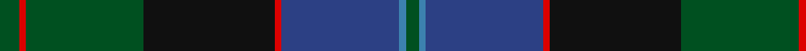

This page is one **sett** — a single exact thread-count. It belongs to the [tartan](/tartans/g3r1g18k20r1ba18b1g2/)
(the same proportion at any scale), whose colour order is pattern [GBBRKGRG](/stripes/gbbrkgrg/).

Sourced from register-of-tartans.  It is a [8 stripe tartan](/stripes/stripes8/).

Original link https://www.tartanregister.gov.uk/tartanDetails.aspx?ref=2160

## Register references

External register numbers recorded for this tartan.

- Scottish Register of Tartans: [2160](https://www.tartanregister.gov.uk/tartanDetails.aspx?ref=2160)
- Scottish Tartans World Register: 686

## Thread count
G/12 R4 G72 K80 R4 Ba72 B4 G/8

## Palette
Each colour and the base-6 reference it is a variant of.

| Colour | Shade | Base |
|---|---|---|
| B | <code style="background-color:#3C82AF;">#3C82AF</code> `oklch(58.1% 0.099 239.8)` <small>#3C82AF</small> | B <code style="background-color:#2A418A;">#2A418A</code> |
| Ba | <code style="background-color:#2C4084;">#2C4084</code> `oklch(39.4% 0.117 268.3)` <small>#2C4084</small> | B <code style="background-color:#2A418A;">#2A418A</code> |
| G | <code style="background-color:#005020;">#005020</code> `oklch(37.7% 0.105 149.6)` <small>#005020</small> | G <code style="background-color:#006100;">#006100</code> |
| K | <code style="background-color:#101010;">#101010</code> `oklch(17.3% 0.000 89.9)` <small>#101010</small> | K <code style="background-color:#000000;">#000000</code> |
| R | <code style="background-color:#DC0000;">#DC0000</code> `oklch(56.2% 0.230 29.2)` <small>#DC0000</small> | R <code style="background-color:#CC0000;">#CC0000</code> |

# Sample pattern

## Nearest tartans

The nearest existing variants by ΔTartan distance, with this tartan at the top so the swatches line up against it.

ΔTartan

Tartan

Sett

—

<a href="/ttd/edit/#slug=dg3r1dg18k20r1db18t1dg2~x4">Lochaber #2</a> <a class="nn-out" href="/setts/s8/dg3r1dg18k20r1db18t1dg2~x4/" title="open its dictionary page">↗</a>

0.83

<a href="/ttd/edit/#slug=r2dg13r2dg13k13dt30k1ly2~x2">Chan (Name?)</a> <a class="nn-out" href="/setts/s8/r2dg13r2dg13k13dt30k1ly2~x2/" title="open its dictionary page">↗</a>

0.92

<a href="/ttd/edit/#slug=db4k2db16w1k8dg24r4~x2">Colquhoun</a> <a class="nn-out" href="/setts/s7/db4k2db16w1k8dg24r4~x2/" title="open its dictionary page">↗</a>

0.99

<a href="/ttd/edit/#slug=k3r2dy4r1db25g12dy14db3r1~x2">Mann</a> <a class="nn-out" href="/setts/s9/k3r2dy4r1db25g12dy14db3r1~x2/" title="open its dictionary page">↗</a>

1.01

<a href="/ttd/edit/#slug=db4b4db1dg24db10r1db2r5b3r2~x2">Rikaco Classic (Fashion)</a> <a class="nn-out" href="/setts/s10/db4b4db1dg24db10r1db2r5b3r2~x2/" title="open its dictionary page">↗</a>

1.01

<a href="/ttd/edit/#slug=r2k4dt23k14dg16ly1k4ly2~x2">Thomas, baron of Craigie, Robert (Personal)</a> <a class="nn-out" href="/setts/s8/r2k4dt23k14dg16ly1k4ly2~x2/" title="open its dictionary page">↗</a>

1.02

<a href="/ttd/edit/#slug=dr4dg27o2db25lo5dg3o3~x2">Kilkenny, County (District)</a> <a class="nn-out" href="/setts/s7/dr4dg27o2db25lo5dg3o3~x2/" title="open its dictionary page">↗</a>

1.03

<a href="/ttd/edit/#slug=k2r1dg15k15db15ly1k2~x2">MacCaskill (Personal)</a> <a class="nn-out" href="/setts/s7/k2r1dg15k15db15ly1k2~x2/" title="open its dictionary page">↗</a>

1.04

<a href="/ttd/edit/#slug=r7dg3r2dg33k31db31k3db3">Baird</a> <a class="nn-out" href="/setts/s8/r7dg3r2dg33k31db31k3db3/" title="open its dictionary page">↗</a>

1.06

<a href="/ttd/edit/#slug=ly2k4ly1dg16k14db23k4r1~x2">Thomas of Craigie (Personal)</a> <a class="nn-out" href="/setts/s8/ly2k4ly1dg16k14db23k4r1~x2/" title="open its dictionary page">↗</a>

1.09

<a href="/ttd/edit/#slug=dp6o2dp1g25db16k2db4~x2">Lawrie Clan Tartan Tartan Number: 3202. Earliest known date: 2000 One of a set of three similar designs for Laurie, Lawrie and Lowry, designed by Peter MacDonald for Iain Laurie. See products available Copyright © Blair Urquhart, Comrie, 2015</a> <a class="nn-out" href="/setts/s7/dp6o2dp1g25db16k2db4~x2/" title="open its dictionary page">↗</a>

## Neighbour map

Every grey dot is one of 14299 variants placed by the first two principal components of the ΔTartan feature space (44% of its variance). Red is this tartan; blue dots are its nearest — click one to open its page.

<svg viewBox="0 0 640 380" role="img" style="max-width:100%;height:auto;border:1px solid #e0e0e0;border-radius:4px;display:block" xmlns="http://www.w3.org/2000/svg"><image href="/nn/cloud.v1.png" width="640" height="380"/><a href="/setts/s8/r2dg13r2dg13k13dt30k1ly2~x2/"><circle cx="284.4" cy="169.2" r="4" fill="#3465a4"><title>Chan (Name?)</title></circle></a><a href="/setts/s7/db4k2db16w1k8dg24r4~x2/"><circle cx="265.5" cy="175.1" r="4" fill="#3465a4"><title>Colquhoun</title></circle></a><a href="/setts/s9/k3r2dy4r1db25g12dy14db3r1~x2/"><circle cx="295.0" cy="159.8" r="4" fill="#3465a4"><title>Mann</title></circle></a><a href="/setts/s10/db4b4db1dg24db10r1db2r5b3r2~x2/"><circle cx="299.1" cy="153.9" r="4" fill="#3465a4"><title>Rikaco Classic (Fashion)</title></circle></a><a href="/setts/s8/r2k4dt23k14dg16ly1k4ly2~x2/"><circle cx="236.4" cy="172.9" r="4" fill="#3465a4"><title>Thomas, baron of Craigie, Robert (Personal)</title></circle></a><a href="/setts/s7/dr4dg27o2db25lo5dg3o3~x2/"><circle cx="282.8" cy="195.0" r="4" fill="#3465a4"><title>Kilkenny, County (District)</title></circle></a><a href="/setts/s7/k2r1dg15k15db15ly1k2~x2/"><circle cx="234.1" cy="192.7" r="4" fill="#3465a4"><title>MacCaskill (Personal)</title></circle></a><a href="/setts/s8/r7dg3r2dg33k31db31k3db3/"><circle cx="256.0" cy="208.5" r="4" fill="#3465a4"><title>Baird</title></circle></a><a href="/setts/s8/ly2k4ly1dg16k14db23k4r1~x2/"><circle cx="235.2" cy="165.9" r="4" fill="#3465a4"><title>Thomas of Craigie (Personal)</title></circle></a><a href="/setts/s7/dp6o2dp1g25db16k2db4~x2/"><circle cx="304.7" cy="169.9" r="4" fill="#3465a4"><title>Lawrie Clan Tartan Tartan Number: 3202. Earliest known date: 2000 One of a set of three similar designs for Laurie, Lawrie and Lowry, designed by Peter MacDonald for Iain Laurie. See products available Copyright © Blair Urquhart, Comrie, 2015</title></circle></a><circle cx="263.4" cy="180.3" r="5" fill="#c00000"/></svg>

ID: /setts/s8/dg3r1dg18k20r1db18t1dg2~x4/
