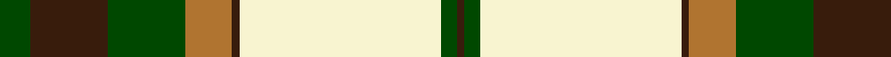
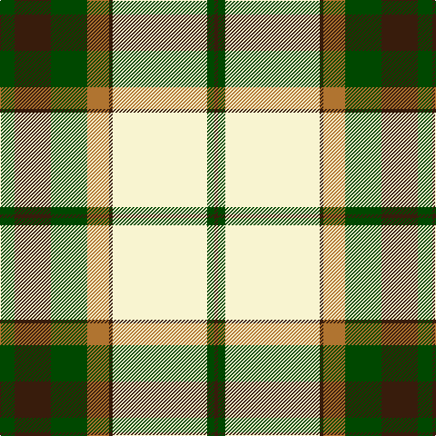

**Bands:** [BGWBRGBG](/stripes/bgwbrgbg/) · **Stripes:** [DO DG W DO O DG DO DG](/stripes/stripes8/) DO DG W DO O DG DO DG

This was sourced from register-of-tartans.  It is a [8 band tartan](/bands/bands8/).

Original link https://www.tartanregister.gov.uk/tartanDetails.aspx?ref=943

## Attestations

This cloth appears in 2 source records; the oldest owns this page.

- 01/01/1968 — Dogwood (register-of-tartans, [record](https://www.tartanregister.gov.uk/tartanDetails.aspx?ref=943))
- 1968 — Dogwood (Fashion) (tartans-authority, [record](http://www.tartansauthority.com/tartan-ferret/display/913/))

## Register references

External register numbers recorded for this tartan.

- Scottish Register of Tartans: [943](https://www.tartanregister.gov.uk/tartanDetails.aspx?ref=943)
- Scottish Tartans Authority (ITI): 913
- Scottish Tartans World Register: 913

## Thread count
G/16 K40 G40 LT24 K4 LY104 G8 K/4

## Palette
Each colour and its ΔE from the base-6 reference it is a variant of.

| Colour | Shade | Base | ΔE (OKLab) |
|---|---|---|---|
| G | <code style="background-color:#004800;">#004800</code> `#004800` | G <code style="background-color:#006100;">#006100</code> | 0.08 |
| K | <code style="background-color:#381C0C;">#381C0C</code> `#381C0C` | B <code style="background-color:#2A418A;">#2A418A</code> | 0.22 |
| LT | <code style="background-color:#B07430;">#B07430</code> `#B07430` | R <code style="background-color:#CC0000;">#CC0000</code> | 0.16 |
| LY | <code style="background-color:#F8F4D0;">#F8F4D0</code> `#F8F4D0` | W <code style="background-color:#F7F7F7;">#F7F7F7</code> | 0.05 |

# Sample pattern

## Nearest tartans

The nearest existing variants by ΔTartan distance.

1. [British Columbia #2](/setts/s8/dg4dr14dg14o6dr1w30dg2dr1~x2/) — ΔT 0.43
1. [Dogwood](/setts/s8/g3r12g12o5r1w25g2r1~x2/) — ΔT 0.68
1. [Dogwood Trade Tartan Tartan Number: 913. Earliest known date: 1968 The registered tartan of the Dinwiddie Clan. Dinwiddies are normally associated with the Maxwells, but Lord Lyon stated, in 1988, that Dinwiddies were a sept of no other clan. See products available Copyright © Blair Urquhart, Comrie, 2015](/setts/s8/g3r12g12lo5r1w25g2r1~x2/) — ΔT 0.74
1. [Prince Edward Island, Dress](/setts/s9/g22r2g4r2g4r18w24r1lo3~x2/) — ΔT 0.91
1. [Aviemore Check](/setts/s8/g2dy10g11ly4dy1w18g2dy1~x2/) — ΔT 1.07
1. [Crawford Arisaid (Dance)](/setts/s9/r6w1r2w25r3g12r3g12r3~x2/) — ΔT 1.08
1. [Scott, dress](/setts/s11/g4r2k1w30r10g14r4g5w2g5r4~x2/) — ΔT 1.09
1. [Fiander, Julian (Personal)](/setts/s9/r6g2w21ly2k8ly2g32w1k3~x2/) — ΔT 1.13
1. [Ben Ledi (Fashion)](/setts/s11/w60o3w3o8w3o3y24dt12o3dt16o4/) — ΔT 1.24
1. [Bannockbane Green](/setts/s8/dt3lo2dt30lo1w18lg30lo2lg3~x2/) — ΔT 1.24

## Neighbour map

Every grey dot is one of 14313 variants placed by the first two principal components of the ΔTartan feature space (44% of its variance). Red is this tartan; blue dots are its nearest — click one to open its page.

<svg viewBox="0 0 640 380" role="img" style="max-width:100%;height:auto;border:1px solid #e0e0e0;border-radius:4px;display:block" xmlns="http://www.w3.org/2000/svg"><image href="/nn/cloud.v1.png" width="640" height="380"/><a href="/setts/s8/dg4dr14dg14o6dr1w30dg2dr1~x2/"><circle cx="215.9" cy="111.1" r="4" fill="#3465a4"><title>British Columbia #2</title></circle></a><a href="/setts/s8/g3r12g12o5r1w25g2r1~x2/"><circle cx="223.3" cy="125.1" r="4" fill="#3465a4"><title>Dogwood</title></circle></a><a href="/setts/s8/g3r12g12lo5r1w25g2r1~x2/"><circle cx="223.5" cy="124.8" r="4" fill="#3465a4"><title>Dogwood Trade Tartan Tartan Number: 913. Earliest known date: 1968 The registered tartan of the Dinwiddie Clan. Dinwiddies are normally associated with the Maxwells, but Lord Lyon stated, in 1988, that Dinwiddies were a sept of no other clan. See products available Copyright © Blair Urquhart, Comrie, 2015</title></circle></a><a href="/setts/s9/g22r2g4r2g4r18w24r1lo3~x2/"><circle cx="214.6" cy="127.0" r="4" fill="#3465a4"><title>Prince Edward Island, Dress</title></circle></a><a href="/setts/s8/g2dy10g11ly4dy1w18g2dy1~x2/"><circle cx="188.2" cy="146.8" r="4" fill="#3465a4"><title>Aviemore Check</title></circle></a><a href="/setts/s9/r6w1r2w25r3g12r3g12r3~x2/"><circle cx="229.7" cy="133.7" r="4" fill="#3465a4"><title>Crawford Arisaid (Dance)</title></circle></a><a href="/setts/s11/g4r2k1w30r10g14r4g5w2g5r4~x2/"><circle cx="235.8" cy="101.2" r="4" fill="#3465a4"><title>Scott, dress</title></circle></a><a href="/setts/s9/r6g2w21ly2k8ly2g32w1k3~x2/"><circle cx="217.5" cy="86.7" r="4" fill="#3465a4"><title>Fiander, Julian (Personal)</title></circle></a><a href="/setts/s11/w60o3w3o8w3o3y24dt12o3dt16o4/"><circle cx="236.9" cy="96.5" r="4" fill="#3465a4"><title>Ben Ledi (Fashion)</title></circle></a><a href="/setts/s8/dt3lo2dt30lo1w18lg30lo2lg3~x2/"><circle cx="203.3" cy="104.9" r="4" fill="#3465a4"><title>Bannockbane Green</title></circle></a><circle cx="218.0" cy="118.3" r="5" fill="#c00000"/></svg>

ID: /setts/s8/dg4do10dg10o6do1w26dg2do1~x4/
