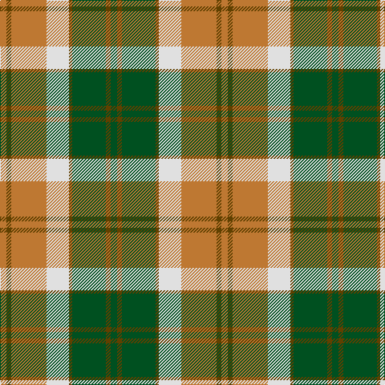

In pattern [GGGGWRGR](/stripes/ggggwrgr/).

This was sourced from register-of-tartans.  It is a [8 stripe tartan](/stripes/stripes8/).

Original link https://www.tartanregister.gov.uk/tartanDetails.aspx?ref=193

## Register references

External register numbers recorded for this tartan.

- Scottish Register of Tartans: [193](https://www.tartanregister.gov.uk/tartanDetails.aspx?ref=193)
- Scottish Tartans World Register: 2771

## Thread count
DO/8 T6 DO44 LN28 T4 G42 T6 G/8

## Palette
Each colour and the base-6 reference it is a variant of.

| Colour | Shade | Base |
|---|---|---|
| DO | <code style="background-color:#BE7832;">#BE7832</code> `oklch(63.5% 0.121 62.2)` <small>#BE7832</small> | R <code style="background-color:#CC0000;">#CC0000</code> |
| G | <code style="background-color:#005020;">#005020</code> `oklch(37.7% 0.105 149.6)` <small>#005020</small> | G <code style="background-color:#006100;">#006100</code> |
| LN | <code style="background-color:#E0E0E0;">#E0E0E0</code> `oklch(90.7% 0.000 89.9)` <small>#E0E0E0</small> | W <code style="background-color:#F7F7F7;">#F7F7F7</code> |
| T | <code style="background-color:#604000;">#604000</code> `oklch(39.8% 0.083 76.8)` <small>#604000</small> | G <code style="background-color:#006100;">#006100</code> |

# Sample pattern

## Nearest tartans

The nearest existing variants by ΔTartan distance.

1. [National Trust](/setts/s8/g2do8g8lo3do1w12g2do1~x2/) — ΔT 0.98
1. [Buccleuch (Fashion)](/setts/s8/lo15k1lo2k1lo2k10y14w2~x2/) — ΔT 1.07
1. [Wilson's No.179](/setts/s8/g6ly1r1t2r2~x4/) — ΔT 1.08
1. [Bannockbane Orange Stripes](/setts/s8/do2lo2do15lo1w10lo15lo2lo2~x2/) — ΔT 1.09
1. [Cercle de Fermieres de St-Elie . . .](/setts/s7/r2ly1b8r1g7ly1r2~x6/) — ΔT 1.13
1. [Bannock Bane M.405](/setts/s8/do4r3do21r2w14o22r3o4~x2/) — ΔT 1.15
1. [Logan](/setts/s7/db9r3ly1r3g9r3ly1~x2/) — ΔT 1.16
1. [Mostyn](/setts/s9/r20k2r2k2r2k8g24db2g3~x2/) — ΔT 1.18
1. [Cranston, dress](/setts/s8/r30db3r2db3r6db14g26g6/) — ΔT 1.19
1. [Stevenson Family Tartan Tartan Number: 1558. Earliest known date: 1980 Charles Stevenson of Glasgow emigrated to America in 1861. The Monitoring Committee of the Scottish Tartans Society operated until 1984 when the present system of accreditation was introduced for the 'Register of All Publicly Known Tartans'. The original count has been proportionately increased from the 1980 recording. See products available Copyright © Blair Urquhart, Comrie, 2015](/setts/s9/r1g8ly1r2ly1r2ly1db8ly1~x4/) — ΔT 1.20

## Neighbour map

Every grey dot is one of 14299 variants placed by the first two principal components of the ΔTartan feature space (44% of its variance). Red is this tartan; blue dots are its nearest — click one to open its page.

<svg viewBox="0 0 640 380" role="img" style="max-width:100%;height:auto;border:1px solid #e0e0e0;border-radius:4px;display:block" xmlns="http://www.w3.org/2000/svg"><image href="/nn/cloud.v1.png" width="640" height="380"/><a href="/setts/s8/g2do8g8lo3do1w12g2do1~x2/"><circle cx="145.1" cy="169.5" r="4" fill="#3465a4"><title>National Trust</title></circle></a><a href="/setts/s8/lo15k1lo2k1lo2k10y14w2~x2/"><circle cx="230.3" cy="168.9" r="4" fill="#3465a4"><title>Buccleuch (Fashion)</title></circle></a><a href="/setts/s8/g6ly1r1t2r2~x4/"><circle cx="162.1" cy="212.9" r="4" fill="#3465a4"><title>Wilson's No.179</title></circle></a><a href="/setts/s8/do2lo2do15lo1w10lo15lo2lo2~x2/"><circle cx="185.6" cy="151.1" r="4" fill="#3465a4"><title>Bannockbane Orange Stripes</title></circle></a><a href="/setts/s7/r2ly1b8r1g7ly1r2~x6/"><circle cx="185.4" cy="203.4" r="4" fill="#3465a4"><title>Cercle de Fermieres de St-Elie . . .</title></circle></a><a href="/setts/s8/do4r3do21r2w14o22r3o4~x2/"><circle cx="185.4" cy="171.2" r="4" fill="#3465a4"><title>Bannock Bane M.405</title></circle></a><a href="/setts/s7/db9r3ly1r3g9r3ly1~x2/"><circle cx="166.9" cy="207.0" r="4" fill="#3465a4"><title>Logan</title></circle></a><a href="/setts/s9/r20k2r2k2r2k8g24db2g3~x2/"><circle cx="223.8" cy="148.8" r="4" fill="#3465a4"><title>Mostyn</title></circle></a><a href="/setts/s8/r30db3r2db3r6db14g26g6/"><circle cx="242.7" cy="170.0" r="4" fill="#3465a4"><title>Cranston, dress</title></circle></a><a href="/setts/s9/r1g8ly1r2ly1r2ly1db8ly1~x4/"><circle cx="158.0" cy="176.1" r="4" fill="#3465a4"><title>Stevenson Family Tartan Tartan Number: 1558. Earliest known date: 1980 Charles Stevenson of Glasgow emigrated to America in 1861. The Monitoring Committee of the Scottish Tartans Society operated until 1984 when the present system of accreditation was introduced for the 'Register of All Publicly Known Tartans'. The original count has been proportionately increased from the 1980 recording. See products available Copyright © Blair Urquhart, Comrie, 2015</title></circle></a><circle cx="181.0" cy="178.6" r="5" fill="#c00000"/></svg>

ID: /setts/s8/dg4dy3dg21dy2w14o22dy3o4~x2/
