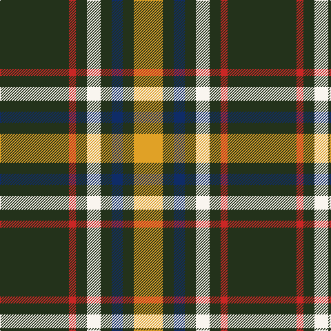

**Bands:** [YGBGWGRG](/stripes/ygbgwgrg/) · **Stripes:** [LO DG DB DG W DG R DG](/stripes/stripes8/) LO DG DB DG W DG R DG

This was sourced from register-of-tartans.  It is a [8 band tartan](/bands/bands8/).

Original link https://www.tartanregister.gov.uk/tartanDetails.aspx?ref=10548

## Also known as

This cloth is also recorded under:

- St. Patrick's Krewe

## Attestations

This cloth appears in 2 source records; the oldest owns this page.

- 21/08/2009 — St Patrick's Krewe (register-of-tartans, [record](https://www.tartanregister.gov.uk/tartanDetails.aspx?ref=10548))
- 21st Aug 2009 — St. Patrick's Krewe (Corporate) (tartans-authority, [record](http://www.tartansauthority.com/tartan-ferret/display/10548/))

## Register references

External register numbers recorded for this tartan.

- Scottish Register of Tartans: [10548](https://www.tartanregister.gov.uk/tartanDetails.aspx?ref=10548)

## Thread count
K/100 R10 K16 W20 K16 DB16 K16 Y/42

## Palette
Each colour and its ΔE from the base-6 reference it is a variant of.

| Colour | Shade | Base | ΔE (OKLab) |
|---|---|---|---|
| DB | <code style="background-color:#0F2C67;">#0F2C67</code> `#0F2C67` | B <code style="background-color:#2A418A;">#2A418A</code> | 0.09 |
| K | <code style="background-color:#23321B;">#23321B</code> `#23321B` | G <code style="background-color:#006100;">#006100</code> | 0.16 |
| R | <code style="background-color:#CA2625;">#CA2625</code> `#CA2625` | R <code style="background-color:#CC0000;">#CC0000</code> | 0.02 |
| W | <code style="background-color:#F9F5EF;">#F9F5EF</code> `#F9F5EF` | W <code style="background-color:#F7F7F7;">#F7F7F7</code> | 0.01 |
| Y | <code style="background-color:#E0A126;">#E0A126</code> `#E0A126` | Y <code style="background-color:#F2BF00;">#F2BF00</code> | 0.08 |

# Sample pattern

## Nearest tartans

The nearest existing variants by ΔTartan distance.

1. [Gary Personal Tartan Tartan Number: 564. Earliest known date: 1985 Restricted See products available Copyright © Blair Urquhart, Comrie, 2015](/setts/s11/dp2r1k4ly2k12ly8k12ly2k4ly1w2~x2/) — ΔT 1.17
1. [Arkansas](/setts/s7/dg3w1dg12r6dg3k3g2~x4/) — ΔT 1.24
1. [Holestone (Corporate)](/setts/s8/k4lo8k26o6g15o6k26w2~x2/) — ΔT 1.31
1. [Livingston Football Club](/setts/s11/ly11k4m2k3ly2k4ly15k32ly2k5w2~x2/) — ΔT 1.32
1. [Asheville Firefighters, The](/setts/s6/k17dg48ly4r10lb12dg4/) — ΔT 1.36
1. [Dundhuin Hunting (Personal)](/setts/s5/dg62g17ly12t8o8~x2/) — ΔT 1.37
1. [Coalfields Regeneration Trust, The](/setts/s7/k2r1ly1y8k15y2dp1~x4/) — ΔT 1.37
1. [Green Mountain](/setts/s8/dg26r2dg3ly2dg8w20db3w4~x2/) — ΔT 1.39
1. [Braemar or Blair Atholl Trade Tartan Tartan Number: 1741. Earliest known date: 1984 Nothing See products available Copyright © Blair Urquhart, Comrie, 2015](/setts/s10/dy1w2k5dy3k1lo5k1lo11k1lo1~x4/) — ΔT 1.41
1. [Dunfermline Athletic (2008) (Corp)](/setts/s7/k11w1k1w1k4o8r1~x8/) — ΔT 1.42

## Neighbour map

Every grey dot is one of 14299 variants placed by the first two principal components of the ΔTartan feature space (44% of its variance). Red is this tartan; blue dots are its nearest — click one to open its page.

<svg viewBox="0 0 640 380" role="img" style="max-width:100%;height:auto;border:1px solid #e0e0e0;border-radius:4px;display:block" xmlns="http://www.w3.org/2000/svg"><image href="/nn/cloud.v1.png" width="640" height="380"/><a href="/setts/s11/dp2r1k4ly2k12ly8k12ly2k4ly1w2~x2/"><circle cx="298.1" cy="147.3" r="4" fill="#3465a4"><title>Gary Personal Tartan Tartan Number: 564. Earliest known date: 1985 Restricted See products available Copyright © Blair Urquhart, Comrie, 2015</title></circle></a><a href="/setts/s7/dg3w1dg12r6dg3k3g2~x4/"><circle cx="295.0" cy="190.5" r="4" fill="#3465a4"><title>Arkansas</title></circle></a><a href="/setts/s8/k4lo8k26o6g15o6k26w2~x2/"><circle cx="287.6" cy="180.9" r="4" fill="#3465a4"><title>Holestone (Corporate)</title></circle></a><a href="/setts/s11/ly11k4m2k3ly2k4ly15k32ly2k5w2~x2/"><circle cx="304.3" cy="116.6" r="4" fill="#3465a4"><title>Livingston Football Club</title></circle></a><a href="/setts/s6/k17dg48ly4r10lb12dg4/"><circle cx="262.0" cy="178.0" r="4" fill="#3465a4"><title>Asheville Firefighters, The</title></circle></a><a href="/setts/s5/dg62g17ly12t8o8~x2/"><circle cx="269.4" cy="199.6" r="4" fill="#3465a4"><title>Dundhuin Hunting (Personal)</title></circle></a><a href="/setts/s7/k2r1ly1y8k15y2dp1~x4/"><circle cx="310.7" cy="149.4" r="4" fill="#3465a4"><title>Coalfields Regeneration Trust, The</title></circle></a><a href="/setts/s8/dg26r2dg3ly2dg8w20db3w4~x2/"><circle cx="256.4" cy="141.8" r="4" fill="#3465a4"><title>Green Mountain</title></circle></a><a href="/setts/s10/dy1w2k5dy3k1lo5k1lo11k1lo1~x4/"><circle cx="276.6" cy="162.1" r="4" fill="#3465a4"><title>Braemar or Blair Atholl Trade Tartan Tartan Number: 1741. Earliest known date: 1984 Nothing See products available Copyright © Blair Urquhart, Comrie, 2015</title></circle></a><a href="/setts/s7/k11w1k1w1k4o8r1~x8/"><circle cx="311.8" cy="182.6" r="4" fill="#3465a4"><title>Dunfermline Athletic (2008) (Corp)</title></circle></a><circle cx="294.4" cy="164.9" r="5" fill="#c00000"/></svg>

ID: /setts/s8/dg50r5dg8w10dg8db8dg8lo21~x2/
