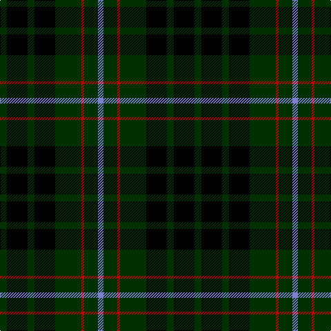

In pattern [BGRGKGKG](/stripes/bgrgkgkg/).

This was sourced from weddslist.  It is a [8 stripe tartan](/stripes/stripes8/).

Original link http://www.weddslist.com/cgi-bin/tartans/pg.pl?source=sts

## Thread count
DG/10 K30 DG10 K30 DG38 R4 DG20 B/8

## Palette
Each colour and the base-6 reference it is a variant of.

| Colour | Shade | Base |
|---|---|---|
| B | <code style="background-color:#8080D0;">#8080D0</code> `oklch(63.4% 0.119 282.5)` <small>#8080D0</small> | B <code style="background-color:#2A418A;">#2A418A</code> |
| DG | <code style="background-color:#003000;">#003000</code> `oklch(26.8% 0.091 142.5)` <small>#003000</small> | G <code style="background-color:#006100;">#006100</code> |
| K | <code style="background-color:#000000;">#000000</code> `oklch(0.0% 0.000 0.0)` <small>#000000</small> | K <code style="background-color:#000000;">#000000</code> |
| R | <code style="background-color:#C00000;">#C00000</code> `oklch(50.7% 0.208 29.2)` <small>#C00000</small> | R <code style="background-color:#CC0000;">#CC0000</code> |

# Sample pattern

## Nearest tartans

The nearest existing variants by ΔTartan distance.

1. [MacAulay Hunting](/setts/s8/dg6k16lr1k16dg8k4dg12r2~x2/) — ΔT 1.00
1. [MacAulay Hunting](/setts/s8/dg6k16lb1k16dg8k4dg12r2~x2/) — ΔT 1.12
1. [Granger Family Tartan Tartan Number: 2226. Earliest known date: 1994 Designed by Steve Granger as a private family tartan. See products available Copyright © Blair Urquhart, Comrie, 2015](/setts/s6/k40dt4k12dt21g17k4~x2/) — ΔT 1.29
1. [Laois Irish County Tartan Tartan Number: 2252. Earliest known date: 1996 One of a series of Irish District tartans designed by Polly Wittering of the House of Edgar, with colours reminiscent of the Country with soft warm colours dominating. See products available Copyright © Blair Urquhart, Comrie, 2015](/setts/s9/k15n2k5n5k18y5k5y2k15~x2/) — ΔT 1.36
1. [MacAulay Hunting](/setts/s8/g6k16w1k16g8k4g12r2~x2/) — ΔT 1.41
1. [Wilson's No.167](/setts/s10/k20t2k6g16dp4k9~x2/) — ΔT 1.43
1. [MacCallum](/setts/s7/dg8k2b1dg4k6db6k1~x2/) — ΔT 1.45
1. [MacCallum](/setts/s7/dg8k2lb1dg4k6db6k1~x2/) — ΔT 1.46
1. [MacArthur](/setts/s5/k32dg6k12dg30ly3~x2/) — ΔT 1.47
1. [Sinclair Hunting](/setts/s7/dg6r2dg13k6w2k16r3~x2/) — ΔT 1.49

## Neighbour map

Every grey dot is one of 14299 variants placed by the first two principal components of the ΔTartan feature space (44% of its variance). Red is this tartan; blue dots are its nearest — click one to open its page.

<svg viewBox="0 0 640 380" role="img" style="max-width:100%;height:auto;border:1px solid #e0e0e0;border-radius:4px;display:block" xmlns="http://www.w3.org/2000/svg"><image href="/nn/cloud.v1.png" width="640" height="380"/><a href="/setts/s8/dg6k16lr1k16dg8k4dg12r2~x2/"><circle cx="323.8" cy="218.6" r="4" fill="#3465a4"><title>MacAulay Hunting</title></circle></a><a href="/setts/s8/dg6k16lb1k16dg8k4dg12r2~x2/"><circle cx="313.4" cy="214.0" r="4" fill="#3465a4"><title>MacAulay Hunting</title></circle></a><a href="/setts/s6/k40dt4k12dt21g17k4~x2/"><circle cx="300.6" cy="251.2" r="4" fill="#3465a4"><title>Granger Family Tartan Tartan Number: 2226. Earliest known date: 1994 Designed by Steve Granger as a private family tartan. See products available Copyright © Blair Urquhart, Comrie, 2015</title></circle></a><a href="/setts/s9/k15n2k5n5k18y5k5y2k15~x2/"><circle cx="278.6" cy="231.2" r="4" fill="#3465a4"><title>Laois Irish County Tartan Tartan Number: 2252. Earliest known date: 1996 One of a series of Irish District tartans designed by Polly Wittering of the House of Edgar, with colours reminiscent of the Country with soft warm colours dominating. See products available Copyright © Blair Urquhart, Comrie, 2015</title></circle></a><a href="/setts/s8/g6k16w1k16g8k4g12r2~x2/"><circle cx="326.7" cy="216.4" r="4" fill="#3465a4"><title>MacAulay Hunting</title></circle></a><a href="/setts/s10/k20t2k6g16dp4k9~x2/"><circle cx="267.9" cy="223.4" r="4" fill="#3465a4"><title>Wilson's No.167</title></circle></a><a href="/setts/s7/dg8k2b1dg4k6db6k1~x2/"><circle cx="216.5" cy="256.2" r="4" fill="#3465a4"><title>MacCallum</title></circle></a><a href="/setts/s7/dg8k2lb1dg4k6db6k1~x2/"><circle cx="194.4" cy="245.0" r="4" fill="#3465a4"><title>MacCallum</title></circle></a><a href="/setts/s5/k32dg6k12dg30ly3~x2/"><circle cx="327.8" cy="261.9" r="4" fill="#3465a4"><title>MacArthur</title></circle></a><a href="/setts/s7/dg6r2dg13k6w2k16r3~x2/"><circle cx="254.0" cy="238.3" r="4" fill="#3465a4"><title>Sinclair Hunting</title></circle></a><circle cx="281.5" cy="245.1" r="5" fill="#c00000"/></svg>

ID: /setts/s8/dg5k15dg5k15dg19r2dg10b4~x2/
