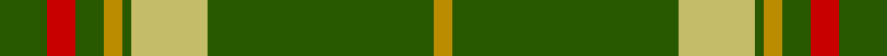

In pattern [GRGYGYGY](/stripes/grgygygy/).

This was sourced from tartans-authority.  It is a [8 stripe tartan](/stripes/stripes8/).

Original link http://www.tartansauthority.com/tartan-ferret/display/6778/

## Thread count
G/10 R6 G6 DY4 G2 LG16 G48 DY/4

## Palette
Each colour and the base-6 reference it is a variant of.

| Colour | Shade | Base |
|---|---|---|
| DY | <code style="background-color:#BC8C00;">#BC8C00</code> `oklch(66.8% 0.137 84.1)` <small>#BC8C00</small> | Y <code style="background-color:#F2BF00;">#F2BF00</code> |
| G | <code style="background-color:#285800;">#285800</code> `oklch(41.0% 0.122 135.8)` <small>#285800</small> | G <code style="background-color:#006100;">#006100</code> |
| LG | <code style="background-color:#C4BC68;">#C4BC68</code> `oklch(78.4% 0.107 103.7)` <small>#C4BC68</small> | Y <code style="background-color:#F2BF00;">#F2BF00</code> |
| R | <code style="background-color:#C80000;">#C80000</code> `oklch(52.3% 0.215 29.2)` <small>#C80000</small> | R <code style="background-color:#CC0000;">#CC0000</code> |

# Sample pattern

## Nearest tartans

The nearest existing variants by ΔTartan distance.

1. [Welsh Assembly (Fashion)](/setts/s8/g5o9g4w5g30r2g4r2~x2/) — ΔT 1.05
1. [St. Christopher](/setts/s14/dg24ly8dg1lo2dg3r3dg5r3dg3lo2dg1ly8dg24lo2~x2/) — ΔT 1.14
1. [Inman (2016)](/setts/s7/r2dg24k2dg12lo6k1r2~x2/) — ΔT 1.15
1. [Island Weavers (Corporate)](/setts/s10/g33db2g33r2db12r12g4r2g4w3~x2/) — ΔT 1.29
1. [Welsh Assembly](/setts/s8/g5y9g4w5g30r2g4r2~x2/) — ΔT 1.32
1. [Walterstrm (2014))](/setts/s8/g78db13ly6r3ly5g6db9ly6~x2/) — ΔT 1.33
1. [Glenlivet](/setts/s8/g18r6g75b6g13dy35g12b6/) — ΔT 1.41
1. [Crieff, and Strathearn](/setts/s7/g55p7r24g12db4ly3db4~x2/) — ΔT 1.43
1. [Glenfeshie (Personal)](/setts/s9/r4g3dp3g44dp16g10w2g2dp2~x2/) — ΔT 1.44
1. [Rothesay #2](/setts/s10/g4r16g4r2g3r2g32w1g1w2~x2/) — ΔT 1.44

## Neighbour map

Every grey dot is one of 14299 variants placed by the first two principal components of the ΔTartan feature space (44% of its variance). Red is this tartan; blue dots are its nearest — click one to open its page.

<svg viewBox="0 0 640 380" role="img" style="max-width:100%;height:auto;border:1px solid #e0e0e0;border-radius:4px;display:block" xmlns="http://www.w3.org/2000/svg"><image href="/nn/cloud.v1.png" width="640" height="380"/><a href="/setts/s8/g5o9g4w5g30r2g4r2~x2/"><circle cx="434.0" cy="181.9" r="4" fill="#3465a4"><title>Welsh Assembly (Fashion)</title></circle></a><a href="/setts/s14/dg24ly8dg1lo2dg3r3dg5r3dg3lo2dg1ly8dg24lo2~x2/"><circle cx="428.1" cy="134.2" r="4" fill="#3465a4"><title>St. Christopher</title></circle></a><a href="/setts/s7/r2dg24k2dg12lo6k1r2~x2/"><circle cx="472.7" cy="171.7" r="4" fill="#3465a4"><title>Inman (2016)</title></circle></a><a href="/setts/s10/g33db2g33r2db12r12g4r2g4w3~x2/"><circle cx="414.5" cy="167.7" r="4" fill="#3465a4"><title>Island Weavers (Corporate)</title></circle></a><a href="/setts/s8/g5y9g4w5g30r2g4r2~x2/"><circle cx="442.1" cy="186.8" r="4" fill="#3465a4"><title>Welsh Assembly</title></circle></a><a href="/setts/s8/g78db13ly6r3ly5g6db9ly6~x2/"><circle cx="424.7" cy="132.9" r="4" fill="#3465a4"><title>Walterstrm (2014))</title></circle></a><a href="/setts/s8/g18r6g75b6g13dy35g12b6/"><circle cx="419.4" cy="199.9" r="4" fill="#3465a4"><title>Glenlivet</title></circle></a><a href="/setts/s7/g55p7r24g12db4ly3db4~x2/"><circle cx="358.7" cy="154.8" r="4" fill="#3465a4"><title>Crieff, and Strathearn</title></circle></a><a href="/setts/s9/r4g3dp3g44dp16g10w2g2dp2~x2/"><circle cx="449.9" cy="147.7" r="4" fill="#3465a4"><title>Glenfeshie (Personal)</title></circle></a><a href="/setts/s10/g4r16g4r2g3r2g32w1g1w2~x2/"><circle cx="463.2" cy="133.5" r="4" fill="#3465a4"><title>Rothesay #2</title></circle></a><circle cx="442.4" cy="158.4" r="5" fill="#c00000"/></svg>

ID: /setts/s8/dg5r3dg3lo2dg1ly8dg24lo2~x2/
