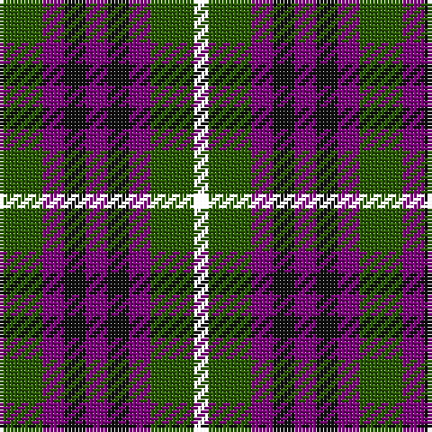

**Bands:** [GBKBKBGK](/stripes/gbkbkbgk/) · **Stripes:** [DG DP K DP K DP DG K](/stripes/stripes8/) DG DP K DP K DP DG K

This was sourced from register-of-tartans.  It is a [8 band tartan](/bands/bands8/).

Original link https://www.tartanregister.gov.uk/tartanDetails.aspx?ref=4712

## Register references

External register numbers recorded for this tartan.

- Scottish Register of Tartans: [4712](https://www.tartanregister.gov.uk/tartanDetails.aspx?ref=4712)
- Scottish Tartans Authority (ITI): 5594

## Thread count
G/12 P6 K6 P6 K6 P6 G12 YY/4

## Palette
Each colour and its ΔE from the base-6 reference it is a variant of.

| Colour | Shade | Base | ΔE (OKLab) |
|---|---|---|---|
| DG | <code style="background-color:#003820;">#003820</code> `#003820` | G <code style="background-color:#006100;">#006100</code> | 0.15 |
| DP | <code style="background-color:#440044;">#440044</code> `#440044` | B <code style="background-color:#2A418A;">#2A418A</code> | 0.18 |
| G | <code style="background-color:#285800;">#285800</code> `#285800` | G <code style="background-color:#006100;">#006100</code> | 0.03 |
| K | <code style="background-color:#101010;">#101010</code> `#101010` | K <code style="background-color:#000000;">#000000</code> | 0.17 |
| P | <code style="background-color:#780078;">#780078</code> `#780078` | B <code style="background-color:#2A418A;">#2A418A</code> | 0.17 |

# Sample pattern

## Nearest tartans

The nearest existing variants by ΔTartan distance.

1. [Wilson's No.137](/setts/s8/g6dp3k3dp3k3dp3g6r2~x2/) — ΔT 0.47
1. [Unidentified No 30](/setts/s9/k1db3k3dg3r1dg3k3dg1r1~x2/) — ΔT 1.03
1. [Gleneagles Group](/setts/s7/dr5g6y2g6dr5db6dr2~x2/) — ΔT 1.15
1. [Durham District Tartan Tartan Number: 1089. Earliest known date: 1819 It was Wilson's practice to give the names of towns to many of his new designs. Maybe because the order came from there or because it was the name of the purchaser. There was a family of Durhams associated with the Royal Court in Edinburgh prior to the Union of the Crowns. Wilson was also a collector of tartans, receiving samples from his agents in the Highlands and from purchase orders from around the world. See 'Denholme' and 'Urquhart'. See products available Copyright © Blair Urquhart, Comrie, 2015](/setts/s5/k1g3k3db3r1~x4/) — ΔT 1.25
1. [Montrose of Alabama](/setts/s8/k12dt12r4dt12k12dt11g12ly4~x2/) — ΔT 1.29
1. [MacKay Coat](/setts/s7/k4dg4ly1dg4k4db4k1~x2/) — ΔT 1.30
1. [Unidentified No 39](/setts/s7/k4dg4k1dg4k4db4ly1~x2/) — ΔT 1.30
1. [Scott, Sir Walter](/setts/s10/dp9k11t2g9k3g9t2k11dp9k3~x2/) — ΔT 1.30
1. [Wilson's No.113](/setts/s6/g3dp3w1dp3g3r1~x4/) — ΔT 1.32
1. [Austin (Wilson's No 137)](/setts/s5/dp3k3dp3dg6r2~x2/) — ΔT 1.32

## Neighbour map

Every grey dot is one of 14313 variants placed by the first two principal components of the ΔTartan feature space (44% of its variance). Red is this tartan; blue dots are its nearest — click one to open its page.

<svg viewBox="0 0 640 380" role="img" style="max-width:100%;height:auto;border:1px solid #e0e0e0;border-radius:4px;display:block" xmlns="http://www.w3.org/2000/svg"><image href="/nn/cloud.v1.png" width="640" height="380"/><a href="/setts/s8/g6dp3k3dp3k3dp3g6r2~x2/"><circle cx="131.8" cy="295.3" r="4" fill="#3465a4"><title>Wilson's No.137</title></circle></a><a href="/setts/s9/k1db3k3dg3r1dg3k3dg1r1~x2/"><circle cx="139.6" cy="295.6" r="4" fill="#3465a4"><title>Unidentified No 30</title></circle></a><a href="/setts/s7/dr5g6y2g6dr5db6dr2~x2/"><circle cx="131.5" cy="312.1" r="4" fill="#3465a4"><title>Gleneagles Group</title></circle></a><a href="/setts/s5/k1g3k3db3r1~x4/"><circle cx="129.9" cy="317.5" r="4" fill="#3465a4"><title>Durham District Tartan Tartan Number: 1089. Earliest known date: 1819 It was Wilson's practice to give the names of towns to many of his new designs. Maybe because the order came from there or because it was the name of the purchaser. There was a family of Durhams associated with the Royal Court in Edinburgh prior to the Union of the Crowns. Wilson was also a collector of tartans, receiving samples from his agents in the Highlands and from purchase orders from around the world. See 'Denholme' and 'Urquhart'. See products available Copyright © Blair Urquhart, Comrie, 2015</title></circle></a><a href="/setts/s8/k12dt12r4dt12k12dt11g12ly4~x2/"><circle cx="120.2" cy="298.9" r="4" fill="#3465a4"><title>Montrose of Alabama</title></circle></a><a href="/setts/s7/k4dg4ly1dg4k4db4k1~x2/"><circle cx="168.7" cy="305.0" r="4" fill="#3465a4"><title>MacKay Coat</title></circle></a><a href="/setts/s7/k4dg4k1dg4k4db4ly1~x2/"><circle cx="168.7" cy="305.0" r="4" fill="#3465a4"><title>Unidentified No 39</title></circle></a><a href="/setts/s10/dp9k11t2g9k3g9t2k11dp9k3~x2/"><circle cx="166.9" cy="250.4" r="4" fill="#3465a4"><title>Scott, Sir Walter</title></circle></a><a href="/setts/s6/g3dp3w1dp3g3r1~x4/"><circle cx="148.7" cy="296.8" r="4" fill="#3465a4"><title>Wilson's No.113</title></circle></a><a href="/setts/s5/dp3k3dp3dg6r2~x2/"><circle cx="122.3" cy="315.6" r="4" fill="#3465a4"><title>Austin (Wilson's No 137)</title></circle></a><circle cx="135.8" cy="300.3" r="5" fill="#c00000"/></svg>

ID: /setts/s8/dg6dp3k3dp3k3dp3dg6k2~x2/
