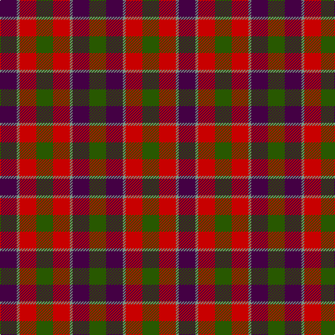

In pattern [BGRGRGBG](/stripes/bgrgrgbg/).

This was sourced from register-of-tartans.  It is a [8 stripe tartan](/stripes/stripes8/).

Original link https://www.tartanregister.gov.uk/tartanDetails.aspx?ref=4750

## Register references

External register numbers recorded for this tartan.

- Scottish Register of Tartans: [4750](https://www.tartanregister.gov.uk/tartanDetails.aspx?ref=4750)
- Scottish Tartans Authority (ITI): 5590

## Thread count
DP/24 LG4 Ra24 G24 Ra24 LG4 DP24 G/24

## Palette
Each colour and the base-6 reference it is a variant of.

| Colour | Shade | Base |
|---|---|---|
| DG | <code style="background-color:#003820;">#003820</code> `oklch(30.0% 0.070 158.3)` <small>#003820</small> | G <code style="background-color:#006100;">#006100</code> |
| DP | <code style="background-color:#440044;">#440044</code> `oklch(27.1% 0.125 328.4)` <small>#440044</small> | B <code style="background-color:#2A418A;">#2A418A</code> |
| G | <code style="background-color:#285800;">#285800</code> `oklch(41.0% 0.122 135.8)` <small>#285800</small> | G <code style="background-color:#006100;">#006100</code> |
| LG | <code style="background-color:#789484;">#789484</code> `oklch(64.0% 0.040 160.0)` <small>#789484</small> | G <code style="background-color:#006100;">#006100</code> |
| R | <code style="background-color:#C80000;">#C80000</code> `oklch(52.3% 0.215 29.2)` <small>#C80000</small> | R <code style="background-color:#CC0000;">#CC0000</code> |
| Ra | <code style="background-color:#C80000;">#C80000</code> `oklch(52.3% 0.215 29.2)` <small>#C80000</small> | R <code style="background-color:#CC0000;">#CC0000</code> |

# Sample pattern

## Nearest tartans

The nearest existing variants by ΔTartan distance.

1. [Gow (Portrait)](/setts/s8/r5dp5r1g5r5~x8/) — ΔT 1.23
1. [Stewart (Artefact)](/setts/s7/r2g4db8r9g9k2r2~x4/) — ΔT 1.26
1. [Carnegie #3](/setts/s8/r33dg17db50dg17r11dg17r9k7/) — ΔT 1.31
1. [Tulsa, City of](/setts/s6/dg14db8dg14r14k3r14~x2/) — ΔT 1.32
1. [Borthwick](/setts/s9/dg12k2r12k3o12k16o12k3r6~x2/) — ΔT 1.34
1. [Gow](/setts/s8/r4dg4r1db4r4~x12/) — ΔT 1.34
1. [Chaudhri (Name)](/setts/s8/dp13r8lb5dg24lb5r10lb5r10~x2/) — ΔT 1.36
1. [Borthwick Family Tartan Tartan Number: 816. Earliest known date: pre 2003 Borthwick is an ancient Scottish family of Celtic origin. William de Borthwick built Borthwick Castle in Midlothian in the 14th century. The present chief of the border family is Major John Henry Stuart Borthwick of Crookston, Midlothian. He was recognised by Lord Lyon as the 23rd Lord Borthwick in 1986. See products available Copyright © Blair Urquhart, Comrie, 2015](/setts/s9/g12k2m12k3o12k16o12k3m6~x2/) — ΔT 1.40
1. [Brough (Name)](/setts/s7/r18db12w2db12dg8r3dg10~x2/) — ΔT 1.45
1. [MacInroy Clan Tartan Tartan Number: 1081. Earliest known date: 1819 The pattern books of the old firm of weavers, Wilson's of Bannockburn, provide a reliable early source for this tartan. Wilson's were in business with a monopoly to supply tartan to the regiments in the second half of the 18th century before this pattern was recorded. See products available Copyright © Blair Urquhart, Comrie, 2015](/setts/s10/k1g3k3r1dp3r1dp1r3g1k1~x4/) — ΔT 1.46

## Neighbour map

Every grey dot is one of 14299 variants placed by the first two principal components of the ΔTartan feature space (44% of its variance). Red is this tartan; blue dots are its nearest — click one to open its page.

<svg viewBox="0 0 640 380" role="img" style="max-width:100%;height:auto;border:1px solid #e0e0e0;border-radius:4px;display:block" xmlns="http://www.w3.org/2000/svg"><image href="/nn/cloud.v1.png" width="640" height="380"/><a href="/setts/s8/r5dp5r1g5r5~x8/"><circle cx="188.0" cy="279.0" r="4" fill="#3465a4"><title>Gow (Portrait)</title></circle></a><a href="/setts/s7/r2g4db8r9g9k2r2~x4/"><circle cx="160.1" cy="252.5" r="4" fill="#3465a4"><title>Stewart (Artefact)</title></circle></a><a href="/setts/s8/r33dg17db50dg17r11dg17r9k7/"><circle cx="171.9" cy="226.0" r="4" fill="#3465a4"><title>Carnegie #3</title></circle></a><a href="/setts/s6/dg14db8dg14r14k3r14~x2/"><circle cx="182.4" cy="290.0" r="4" fill="#3465a4"><title>Tulsa, City of</title></circle></a><a href="/setts/s9/dg12k2r12k3o12k16o12k3r6~x2/"><circle cx="128.0" cy="225.1" r="4" fill="#3465a4"><title>Borthwick</title></circle></a><a href="/setts/s8/r4dg4r1db4r4~x12/"><circle cx="170.8" cy="295.3" r="4" fill="#3465a4"><title>Gow</title></circle></a><a href="/setts/s8/dp13r8lb5dg24lb5r10lb5r10~x2/"><circle cx="120.2" cy="230.9" r="4" fill="#3465a4"><title>Chaudhri (Name)</title></circle></a><a href="/setts/s9/g12k2m12k3o12k16o12k3m6~x2/"><circle cx="124.3" cy="222.6" r="4" fill="#3465a4"><title>Borthwick Family Tartan Tartan Number: 816. Earliest known date: pre 2003 Borthwick is an ancient Scottish family of Celtic origin. William de Borthwick built Borthwick Castle in Midlothian in the 14th century. The present chief of the border family is Major John Henry Stuart Borthwick of Crookston, Midlothian. He was recognised by Lord Lyon as the 23rd Lord Borthwick in 1986. See products available Copyright © Blair Urquhart, Comrie, 2015</title></circle></a><a href="/setts/s7/r18db12w2db12dg8r3dg10~x2/"><circle cx="195.1" cy="246.0" r="4" fill="#3465a4"><title>Brough (Name)</title></circle></a><a href="/setts/s10/k1g3k3r1dp3r1dp1r3g1k1~x4/"><circle cx="80.7" cy="253.7" r="4" fill="#3465a4"><title>MacInroy Clan Tartan Tartan Number: 1081. Earliest known date: 1819 The pattern books of the old firm of weavers, Wilson's of Bannockburn, provide a reliable early source for this tartan. Wilson's were in business with a monopoly to supply tartan to the regiments in the second half of the 18th century before this pattern was recorded. See products available Copyright © Blair Urquhart, Comrie, 2015</title></circle></a><circle cx="142.7" cy="255.5" r="5" fill="#c00000"/></svg>

ID: /setts/s8/dg6dp6y1r6dg6r6y1dp6~x4/
