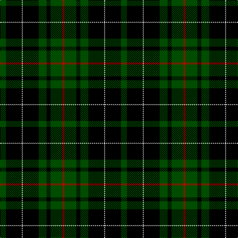

In pattern [GKWKGKGR](/stripes/gkwkgkgr/).

This was sourced from weddslist.  It is a [8 stripe tartan](/stripes/stripes8/).

Original link http://www.weddslist.com/cgi-bin/tartans/pg.pl?source=rb

## Thread count
G/12 K32 N2 K32 G16 K8 G24 R/4

## Palette
Each colour and the base-6 reference it is a variant of.

| Colour | Shade | Base |
|---|---|---|
| G | <code style="background-color:#004C00;">#004C00</code> `oklch(36.1% 0.123 142.5)` <small>#004C00</small> | G <code style="background-color:#006100;">#006100</code> |
| K | <code style="background-color:#000000;">#000000</code> `oklch(0.0% 0.000 0.0)` <small>#000000</small> | K <code style="background-color:#000000;">#000000</code> |
| N | <code style="background-color:#D0D0D0;">#D0D0D0</code> `oklch(85.8% 0.000 89.9)` <small>#D0D0D0</small> | W <code style="background-color:#F7F7F7;">#F7F7F7</code> |
| R | <code style="background-color:#C80000;">#C80000</code> `oklch(52.3% 0.215 29.2)` <small>#C80000</small> | R <code style="background-color:#CC0000;">#CC0000</code> |

# Sample pattern

## Nearest tartans

The nearest existing variants by ΔTartan distance.

1. [MacAulay Hunting](/setts/s8/dg6k16lr1k16dg8k4dg12r2~x2/) — ΔT 0.38
1. [Strath Halladale (Sutherland)](/setts/s8/dg5k15dg5k15dg19r2dg10b4~x2/) — ΔT 1.12
1. [Wilson's, No 167](/setts/s6/k20t2k6g16p4k9~x2/) — ΔT 1.25
1. [Forbes VS](/setts/s6/r1dg16k8dg3k4ly1~x2/) — ΔT 1.30
1. [MacAulay Hunting](/setts/s8/g6k16w1k16g8k4g12r2~x2/) — ΔT 1.33
1. [Forbes VS](/setts/s6/r1dg16k8dg3k4ly1/) — ΔT 1.39
1. [Gunn](/setts/s6/r2g12k12g1k12g2~x2/) — ΔT 1.43
1. [Gunn VS](/setts/s6/dg1k8dg1k8dg15r1~x2/) — ΔT 1.45
1. [MacArthur](/setts/s5/k32dg6k12dg30ly3~x2/) — ΔT 1.45
1. [Gunn VS](/setts/s6/dg1k8dg1k8dg15r1~x4/) — ΔT 1.50

## Neighbour map

Every grey dot is one of 14299 variants placed by the first two principal components of the ΔTartan feature space (44% of its variance). Red is this tartan; blue dots are its nearest — click one to open its page.

<svg viewBox="0 0 640 380" role="img" style="max-width:100%;height:auto;border:1px solid #e0e0e0;border-radius:4px;display:block" xmlns="http://www.w3.org/2000/svg"><image href="/nn/cloud.v1.png" width="640" height="380"/><a href="/setts/s8/dg6k16lr1k16dg8k4dg12r2~x2/"><circle cx="323.8" cy="218.6" r="4" fill="#3465a4"><title>MacAulay Hunting</title></circle></a><a href="/setts/s8/dg5k15dg5k15dg19r2dg10b4~x2/"><circle cx="281.5" cy="245.1" r="4" fill="#3465a4"><title>Strath Halladale (Sutherland)</title></circle></a><a href="/setts/s6/k20t2k6g16p4k9~x2/"><circle cx="299.2" cy="232.1" r="4" fill="#3465a4"><title>Wilson's, No 167</title></circle></a><a href="/setts/s6/r1dg16k8dg3k4ly1~x2/"><circle cx="353.3" cy="204.3" r="4" fill="#3465a4"><title>Forbes VS</title></circle></a><a href="/setts/s8/g6k16w1k16g8k4g12r2~x2/"><circle cx="326.7" cy="216.4" r="4" fill="#3465a4"><title>MacAulay Hunting</title></circle></a><a href="/setts/s6/r1dg16k8dg3k4ly1/"><circle cx="340.5" cy="198.4" r="4" fill="#3465a4"><title>Forbes VS</title></circle></a><a href="/setts/s6/r2g12k12g1k12g2~x2/"><circle cx="324.0" cy="233.3" r="4" fill="#3465a4"><title>Gunn</title></circle></a><a href="/setts/s6/dg1k8dg1k8dg15r1~x2/"><circle cx="343.8" cy="226.3" r="4" fill="#3465a4"><title>Gunn VS</title></circle></a><a href="/setts/s5/k32dg6k12dg30ly3~x2/"><circle cx="327.8" cy="261.9" r="4" fill="#3465a4"><title>MacArthur</title></circle></a><a href="/setts/s6/dg1k8dg1k8dg15r1~x4/"><circle cx="353.6" cy="230.5" r="4" fill="#3465a4"><title>Gunn VS</title></circle></a><circle cx="313.4" cy="214.0" r="5" fill="#c00000"/></svg>

ID: /setts/s8/dg6k16lb1k16dg8k4dg12r2~x2/
