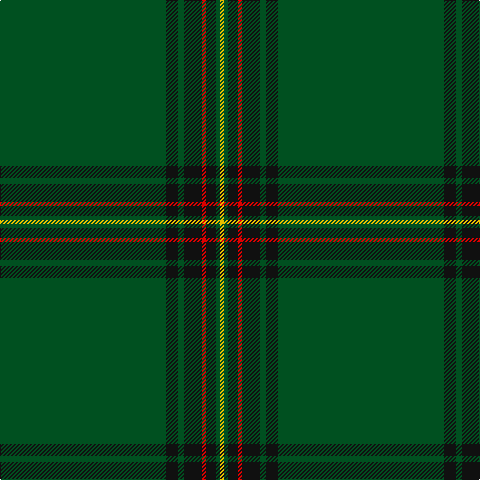

This page is one **sett** — a single exact thread-count. It belongs to the [tartan](/tartans/dg83k6dg3k9r2k5dg2ly2/)
(the same proportion at any scale), whose colour order is pattern [GKGKRKGY](/stripes/gkgkrkgy/).

Sourced from register-of-tartans.  It is a [8 stripe tartan](/stripes/stripes8/).

Original link https://www.tartanregister.gov.uk/tartanDetails.aspx?ref=5053

## Register references

External register numbers recorded for this tartan.

- Scottish Register of Tartans: [5053](https://www.tartanregister.gov.uk/tartanDetails.aspx?ref=5053)
- Scottish Tartans World Register: 3059

## Thread count
G/166 K12 G6 K18 R4 K10 G4 Y/4

## Palette

Palette: <strong>Tartan Register</strong>
<table><thead><tr><th>Colour</th><th>Threads</th><th>Shade</th><th>Base</th><th>OKLCh</th></tr></thead><tbody><tr><td>G/</td><td style="text-align:right;font-variant-numeric:tabular-nums">166</td><td><code style="background-color:#005020;">#005020</code> <small style="color:#888">#005020</small></td><td>G <code style="background-color:#006100;">#006100</code></td><td><small style="color:#888">oklch(37.7% 0.105 149.6)</small></td></tr><tr><td>K</td><td style="text-align:right;font-variant-numeric:tabular-nums">12</td><td><code style="background-color:#101010;">#101010</code> <small style="color:#888">#101010</small></td><td>K <code style="background-color:#000000;">#000000</code></td><td><small style="color:#888">oklch(17.3% 0.000 89.9)</small></td></tr><tr><td>G</td><td style="text-align:right;font-variant-numeric:tabular-nums">6</td><td><code style="background-color:#005020;">#005020</code> <small style="color:#888">#005020</small></td><td>G <code style="background-color:#006100;">#006100</code></td><td><small style="color:#888">oklch(37.7% 0.105 149.6)</small></td></tr><tr><td>K</td><td style="text-align:right;font-variant-numeric:tabular-nums">18</td><td><code style="background-color:#101010;">#101010</code> <small style="color:#888">#101010</small></td><td>K <code style="background-color:#000000;">#000000</code></td><td><small style="color:#888">oklch(17.3% 0.000 89.9)</small></td></tr><tr><td>R</td><td style="text-align:right;font-variant-numeric:tabular-nums">4</td><td><code style="background-color:#DC0000;">#DC0000</code> <small style="color:#888">#DC0000</small></td><td>R <code style="background-color:#CC0000;">#CC0000</code></td><td><small style="color:#888">oklch(56.2% 0.230 29.2)</small></td></tr><tr><td>K</td><td style="text-align:right;font-variant-numeric:tabular-nums">10</td><td><code style="background-color:#101010;">#101010</code> <small style="color:#888">#101010</small></td><td>K <code style="background-color:#000000;">#000000</code></td><td><small style="color:#888">oklch(17.3% 0.000 89.9)</small></td></tr><tr><td>G</td><td style="text-align:right;font-variant-numeric:tabular-nums">4</td><td><code style="background-color:#005020;">#005020</code> <small style="color:#888">#005020</small></td><td>G <code style="background-color:#006100;">#006100</code></td><td><small style="color:#888">oklch(37.7% 0.105 149.6)</small></td></tr><tr><td>Y/</td><td style="text-align:right;font-variant-numeric:tabular-nums">4</td><td><code style="background-color:#E8C000;">#E8C000</code> <small style="color:#888">#E8C000</small></td><td>Y <code style="background-color:#F2BF00;">#F2BF00</code></td><td><small style="color:#888">oklch(81.9% 0.168 93.7)</small></td></tr></tbody></table>

# Sample pattern

## Nearest tartans

The nearest existing variants by ΔTartan distance, with this tartan at the top so the swatches line up against it.

ΔTartan

Tartan

Sett

—

<a href="/ttd/edit/#slug=dg83k6dg3k9r2k5dg2ly2~x2">Stewart from Cairnie</a> <a class="nn-out" href="/setts/s8/dg83k6dg3k9r2k5dg2ly2~x2/" title="open its dictionary page">↗</a>

1.23

<a href="/ttd/edit/#slug=g82k6g3k9r2k5g2ly2~x2">Crane of Cluny (Personal)</a> <a class="nn-out" href="/setts/s8/g82k6g3k9r2k5g2ly2~x2/" title="open its dictionary page">↗</a>

1.53

<a href="/ttd/edit/#slug=t2k1dg36k1r2k1r2k1dg36k1ly2~x2">Unidentified #12</a> <a class="nn-out" href="/setts/s11/t2k1dg36k1r2k1r2k1dg36k1ly2~x2/" title="open its dictionary page">↗</a>

1.58

<a href="/ttd/edit/#slug=lr1r12dg2r1dg162r12ly1~x2">MacFie</a> <a class="nn-out" href="/setts/s7/lr1r12dg2r1dg162r12ly1~x2/" title="open its dictionary page">↗</a>

1.64

<a href="/ttd/edit/#slug=g61g1g1db2g1g1g16g1db4g2db6g1db4~x2">Coeur D'Alene Firefighters (Corporat</a> <a class="nn-out" href="/setts/s13/g61g1g1db2g1g1g16g1db4g2db6g1db4~x2/" title="open its dictionary page">↗</a>

1.74

<a href="/ttd/edit/#slug=g16dg1y4dg41y1dg6g2dg2~x2">Semper</a> <a class="nn-out" href="/setts/s8/g16dg1y4dg41y1dg6g2dg2~x2/" title="open its dictionary page">↗</a>

1.84

<a href="/ttd/edit/#slug=g16dg1lg4dg41lg1dg6g2dg2~x2">Semper</a> <a class="nn-out" href="/setts/s8/g16dg1lg4dg41lg1dg6g2dg2~x2/" title="open its dictionary page">↗</a>

1.87

<a href="/ttd/edit/#slug=dg25k1lr2k1dg4k1r2k1dg4k1ly2k1dg25~x4">Hilton Check</a> <a class="nn-out" href="/setts/s13/dg25k1lr2k1dg4k1r2k1dg4k1ly2k1dg25~x4/" title="open its dictionary page">↗</a>

1.88

<a href="/ttd/edit/#slug=g3db2g40db1g2db1g9r4g3r2~x4">Braveheart Htg (Fashion)</a> <a class="nn-out" href="/setts/s10/g3db2g40db1g2db1g9r4g3r2~x4/" title="open its dictionary page">↗</a>

1.91

<a href="/ttd/edit/#slug=g3dt1g2r1g3db3g2db2g18dt2~x2">Owen Welsh Name Tartan Tartan Number: 5750. Earliest known date: 2002 The tartan for this Welsh surname and its variations, Bowen, Ifan, is actually woven in Wales at the Cambrian Woollen Mill, weaving on the same site since 1830. This tartan differs from many traditional patterns in that the warp and weft differ, giving the finished worsted wool cloth more of a predominant stripe, vertically noticeable in the finished Kilt, or Cilt in Wales. See products available Copyright © Blair Urquhart, Comrie, 2015</a> <a class="nn-out" href="/setts/s10/g3dt1g2r1g3db3g2db2g18dt2~x2/" title="open its dictionary page">↗</a>

1.96

<a href="/ttd/edit/#slug=r2k4g45k3ly2~x2">Mar, Tribe of (Clan)</a> <a class="nn-out" href="/setts/s5/r2k4g45k3ly2~x2/" title="open its dictionary page">↗</a>

## Neighbour map

Every grey dot is one of 14299 variants placed by the first two principal components of the ΔTartan feature space (44% of its variance). Red is this tartan; blue dots are its nearest — click one to open its page.

<svg viewBox="0 0 640 380" role="img" style="max-width:100%;height:auto;border:1px solid #e0e0e0;border-radius:4px;display:block" xmlns="http://www.w3.org/2000/svg"><image href="/nn/cloud.v1.png" width="640" height="380"/><a href="/setts/s8/g82k6g3k9r2k5g2ly2~x2/"><circle cx="589.7" cy="132.9" r="4" fill="#3465a4"><title>Crane of Cluny (Personal)</title></circle></a><a href="/setts/s11/t2k1dg36k1r2k1r2k1dg36k1ly2~x2/"><circle cx="626.0" cy="124.3" r="4" fill="#3465a4"><title>Unidentified #12</title></circle></a><a href="/setts/s7/lr1r12dg2r1dg162r12ly1~x2/"><circle cx="626.0" cy="149.2" r="4" fill="#3465a4"><title>MacFie</title></circle></a><a href="/setts/s13/g61g1g1db2g1g1g16g1db4g2db6g1db4~x2/"><circle cx="626.0" cy="129.1" r="4" fill="#3465a4"><title>Coeur D'Alene Firefighters (Corporat</title></circle></a><a href="/setts/s8/g16dg1y4dg41y1dg6g2dg2~x2/"><circle cx="512.8" cy="157.9" r="4" fill="#3465a4"><title>Semper</title></circle></a><a href="/setts/s8/g16dg1lg4dg41lg1dg6g2dg2~x2/"><circle cx="503.7" cy="153.1" r="4" fill="#3465a4"><title>Semper</title></circle></a><a href="/setts/s13/dg25k1lr2k1dg4k1r2k1dg4k1ly2k1dg25~x4/"><circle cx="583.0" cy="136.0" r="4" fill="#3465a4"><title>Hilton Check</title></circle></a><a href="/setts/s10/g3db2g40db1g2db1g9r4g3r2~x4/"><circle cx="626.0" cy="171.3" r="4" fill="#3465a4"><title>Braveheart Htg (Fashion)</title></circle></a><a href="/setts/s10/g3dt1g2r1g3db3g2db2g18dt2~x2/"><circle cx="536.7" cy="193.3" r="4" fill="#3465a4"><title>Owen Welsh Name Tartan Tartan Number: 5750. Earliest known date: 2002 The tartan for this Welsh surname and its variations, Bowen, Ifan, is actually woven in Wales at the Cambrian Woollen Mill, weaving on the same site since 1830. This tartan differs from many traditional patterns in that the warp and weft differ, giving the finished worsted wool cloth more of a predominant stripe, vertically noticeable in the finished Kilt, or Cilt in Wales. See products available Copyright © Blair Urquhart, Comrie, 2015</title></circle></a><a href="/setts/s5/r2k4g45k3ly2~x2/"><circle cx="577.2" cy="187.3" r="4" fill="#3465a4"><title>Mar, Tribe of (Clan)</title></circle></a><circle cx="622.7" cy="148.5" r="5" fill="#c00000"/></svg>

ID: /setts/s8/dg83k6dg3k9r2k5dg2ly2~x2/
