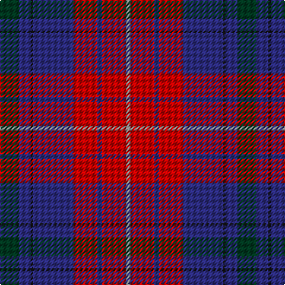

This page is one **sett** — a single exact thread-count. It belongs to the [tartan](/tartans/dg8db5k1db17r10db2r10n2/)
(the same proportion at any scale), whose colour order is pattern [GBKBRBRR](/stripes/gbkbrbrr/).

Sourced from tartans-authority.  It is a [8 stripe tartan](/stripes/stripes8/).

Original link http://www.tartansauthority.com/tartan-ferret/display/11205/

## Thread count
DG/16 DB10 K2 DB34 R20 DB4 R20 N/4

## Palette
Each colour and the base-6 reference it is a variant of.

| Colour | Shade | Base |
|---|---|---|
| DB | <code style="background-color:#2C2C80;">#2C2C80</code> `oklch(35.0% 0.138 276.6)` <small>#2C2C80</small> | B <code style="background-color:#2A418A;">#2A418A</code> |
| DG | <code style="background-color:#003820;">#003820</code> `oklch(30.0% 0.070 158.3)` <small>#003820</small> | G <code style="background-color:#006100;">#006100</code> |
| K | <code style="background-color:#101010;">#101010</code> `oklch(17.3% 0.000 89.9)` <small>#101010</small> | K <code style="background-color:#000000;">#000000</code> |
| N | <code style="background-color:#888888;">#888888</code> `oklch(62.7% 0.000 89.9)` <small>#888888</small> | R <code style="background-color:#CC0000;">#CC0000</code> |
| R | <code style="background-color:#C80000;">#C80000</code> `oklch(52.3% 0.215 29.2)` <small>#C80000</small> | R <code style="background-color:#CC0000;">#CC0000</code> |

# Sample pattern

## Nearest tartans

The nearest existing variants by ΔTartan distance, with this tartan at the top so the swatches line up against it.

ΔTartan

Tartan

Sett

—

<a href="/ttd/edit/#slug=dg8db5k1db17r10db2r10o2~x2">Harrower, John Anthony (Personal)</a> <a class="nn-out" href="/setts/s8/dg8db5k1db17r10db2r10o2~x2/" title="open its dictionary page">↗</a>

0.96

<a href="/ttd/edit/#slug=db4dg2r18r10dg10db29b4~x2">Ross Dempster (Personal)</a> <a class="nn-out" href="/setts/s7/db4dg2r18r10dg10db29b4~x2/" title="open its dictionary page">↗</a>

1.12

<a href="/ttd/edit/#slug=k4r37db37r2db37g37r37k4~x2">Skene of Cromar - 1950 (Clan)</a> <a class="nn-out" href="/setts/s8/k4r37db37r2db37g37r37k4~x2/" title="open its dictionary page">↗</a>

1.20

<a href="/ttd/edit/#slug=r15r98db72t25db8w15">Afternoon Tea / Assam</a> <a class="nn-out" href="/setts/s6/r15r98db72t25db8w15/" title="open its dictionary page">↗</a>

1.25

<a href="/ttd/edit/#slug=dp30o20dg8ly3dg8o20dp30ly2~x2">Wicks (Personal)</a> <a class="nn-out" href="/setts/s8/dp30o20dg8ly3dg8o20dp30ly2~x2/" title="open its dictionary page">↗</a>

1.25

<a href="/ttd/edit/#slug=dt3dg1r24dt16db28w3~x2">Diaspora</a> <a class="nn-out" href="/setts/s6/dt3dg1r24dt16db28w3~x2/" title="open its dictionary page">↗</a>

1.30

<a href="/ttd/edit/#slug=r25k2n4k2r8k31db32k8">Black and Red</a> <a class="nn-out" href="/setts/s8/r25k2n4k2r8k31db32k8/" title="open its dictionary page">↗</a>

1.33

<a href="/ttd/edit/#slug=r25g10db30w4db30g10r25w2~x2">Highland Spring Dress (2004)</a> <a class="nn-out" href="/setts/s8/r25g10db30w4db30g10r25w2~x2/" title="open its dictionary page">↗</a>

1.34

<a href="/ttd/edit/#slug=db26dg11r8k2r2w2r4w1r15~x2">Royal Scottish Assurance</a> <a class="nn-out" href="/setts/s9/db26dg11r8k2r2w2r4w1r15~x2/" title="open its dictionary page">↗</a>

1.34

<a href="/ttd/edit/#slug=r15r98dp72t25dp8w15">Afternoon Tea / Assam</a> <a class="nn-out" href="/setts/s6/r15r98dp72t25dp8w15/" title="open its dictionary page">↗</a>

1.35

<a href="/ttd/edit/#slug=r16db2r2db2r2db16dg16ly1r16db16r2lr2~x2">Army Medical Services</a> <a class="nn-out" href="/setts/s12/r16db2r2db2r2db16dg16ly1r16db16r2lr2~x2/" title="open its dictionary page">↗</a>

## Neighbour map

Every grey dot is one of 14299 variants placed by the first two principal components of the ΔTartan feature space (44% of its variance). Red is this tartan; blue dots are its nearest — click one to open its page.

<svg viewBox="0 0 640 380" role="img" style="max-width:100%;height:auto;border:1px solid #e0e0e0;border-radius:4px;display:block" xmlns="http://www.w3.org/2000/svg"><image href="/nn/cloud.v1.png" width="640" height="380"/><a href="/setts/s7/db4dg2r18r10dg10db29b4~x2/"><circle cx="224.9" cy="183.7" r="4" fill="#3465a4"><title>Ross Dempster (Personal)</title></circle></a><a href="/setts/s8/k4r37db37r2db37g37r37k4~x2/"><circle cx="234.9" cy="190.2" r="4" fill="#3465a4"><title>Skene of Cromar - 1950 (Clan)</title></circle></a><a href="/setts/s6/r15r98db72t25db8w15/"><circle cx="216.9" cy="174.2" r="4" fill="#3465a4"><title>Afternoon Tea / Assam</title></circle></a><a href="/setts/s8/dp30o20dg8ly3dg8o20dp30ly2~x2/"><circle cx="282.7" cy="194.4" r="4" fill="#3465a4"><title>Wicks (Personal)</title></circle></a><a href="/setts/s6/dt3dg1r24dt16db28w3~x2/"><circle cx="243.4" cy="158.4" r="4" fill="#3465a4"><title>Diaspora</title></circle></a><a href="/setts/s8/r25k2n4k2r8k31db32k8/"><circle cx="240.4" cy="181.1" r="4" fill="#3465a4"><title>Black and Red</title></circle></a><a href="/setts/s8/r25g10db30w4db30g10r25w2~x2/"><circle cx="231.5" cy="197.0" r="4" fill="#3465a4"><title>Highland Spring Dress (2004)</title></circle></a><a href="/setts/s9/db26dg11r8k2r2w2r4w1r15~x2/"><circle cx="252.3" cy="125.7" r="4" fill="#3465a4"><title>Royal Scottish Assurance</title></circle></a><a href="/setts/s6/r15r98dp72t25dp8w15/"><circle cx="237.2" cy="178.4" r="4" fill="#3465a4"><title>Afternoon Tea / Assam</title></circle></a><a href="/setts/s12/r16db2r2db2r2db16dg16ly1r16db16r2lr2~x2/"><circle cx="229.7" cy="146.7" r="4" fill="#3465a4"><title>Army Medical Services</title></circle></a><circle cx="247.8" cy="174.9" r="5" fill="#c00000"/></svg>

ID: /setts/s8/dg8db5k1db17r10db2r10o2~x2/
