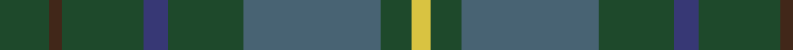

**Bands:** [GBGBGBGY](/stripes/gbgbgbgy/) · **Stripes:** [DG DO DG DB DG N DG LY](/stripes/stripes8/) DG DO DG DB DG N DG LY

This was sourced from register-of-tartans.  It is a [8 band tartan](/bands/bands8/).

Original link https://www.tartanregister.gov.uk/tartanDetails.aspx?ref=10231

## Register references

External register numbers recorded for this tartan.

- Scottish Register of Tartans: [10231](https://www.tartanregister.gov.uk/tartanDetails.aspx?ref=10231)

## Thread count
DG/16 T4 DG26 DB8 DG24 N44 DG10 Y/6

## Palette
Each colour and its ΔE from the base-6 reference it is a variant of.

| Colour | Shade | Base | ΔE (OKLab) |
|---|---|---|---|
| DB | <code style="background-color:#373875;">#373875</code> `#373875` | B <code style="background-color:#2A418A;">#2A418A</code> | 0.04 |
| DG | <code style="background-color:#1E492B;">#1E492B</code> `#1E492B` | G <code style="background-color:#006100;">#006100</code> | 0.10 |
| N | <code style="background-color:#486373;">#486373</code> `#486373` | B <code style="background-color:#2A418A;">#2A418A</code> | 0.13 |
| T | <code style="background-color:#412719;">#412719</code> `#412719` | B <code style="background-color:#2A418A;">#2A418A</code> | 0.19 |
| Y | <code style="background-color:#D9C341;">#D9C341</code> `#D9C341` | Y <code style="background-color:#F2BF00;">#F2BF00</code> | 0.04 |

# Sample pattern

## Nearest tartans

The nearest existing variants by ΔTartan distance.

1. [Kildare](/setts/s8/g8dr2g13r4g12t22g5y3~x2/) — ΔT 1.02
1. [Armagh, County](/setts/s9/dg4ly2dg17dg2r4dg2dg3dg11dg2~x2/) — ΔT 1.30
1. [Taylor](/setts/s8/g8k2g13lr4g12n22g5lo3~x2/) — ΔT 1.32
1. [Lawrence of Broughty Ferry](/setts/s6/dg20k2dg20dp25w2n3~x2/) — ΔT 1.41
1. [Duchess of York](/setts/s9/db1dy9dg5dy1k5dy1dg5dy9w1~x2/) — ΔT 1.53
1. [Hesco](/setts/s7/dp3n24n10n2g11n8w3~x2/) — ΔT 1.59
1. [Daks (Loden)](/setts/s8/db3dy7g2y2g14dy2g2db3~x2/) — ΔT 1.64
1. [de Vere-Austin (Clan)](/setts/s11/dg14k8dg21k2lo5k2dg21k11db18k2r5~x2/) — ΔT 1.64
1. [Harkness Htg (Name)](/setts/s10/g10n2w2n16g6ly2g4r2g3n6~x4/) — ΔT 1.67
1. [Pendleton Hunting](/setts/s11/db2db16dg14lo3dg14k3dg14r3dg14db16db2~x2/) — ΔT 1.70

## Neighbour map

Every grey dot is one of 14313 variants placed by the first two principal components of the ΔTartan feature space (44% of its variance). Red is this tartan; blue dots are its nearest — click one to open its page.

<svg viewBox="0 0 640 380" role="img" style="max-width:100%;height:auto;border:1px solid #e0e0e0;border-radius:4px;display:block" xmlns="http://www.w3.org/2000/svg"><image href="/nn/cloud.v1.png" width="640" height="380"/><a href="/setts/s8/g8dr2g13r4g12t22g5y3~x2/"><circle cx="349.7" cy="238.7" r="4" fill="#3465a4"><title>Kildare</title></circle></a><a href="/setts/s9/dg4ly2dg17dg2r4dg2dg3dg11dg2~x2/"><circle cx="386.0" cy="256.1" r="4" fill="#3465a4"><title>Armagh, County</title></circle></a><a href="/setts/s8/g8k2g13lr4g12n22g5lo3~x2/"><circle cx="336.2" cy="237.1" r="4" fill="#3465a4"><title>Taylor</title></circle></a><a href="/setts/s6/dg20k2dg20dp25w2n3~x2/"><circle cx="360.6" cy="237.2" r="4" fill="#3465a4"><title>Lawrence of Broughty Ferry</title></circle></a><a href="/setts/s9/db1dy9dg5dy1k5dy1dg5dy9w1~x2/"><circle cx="327.8" cy="239.0" r="4" fill="#3465a4"><title>Duchess of York</title></circle></a><a href="/setts/s7/dp3n24n10n2g11n8w3~x2/"><circle cx="324.3" cy="217.5" r="4" fill="#3465a4"><title>Hesco</title></circle></a><a href="/setts/s8/db3dy7g2y2g14dy2g2db3~x2/"><circle cx="329.5" cy="256.0" r="4" fill="#3465a4"><title>Daks (Loden)</title></circle></a><a href="/setts/s11/dg14k8dg21k2lo5k2dg21k11db18k2r5~x2/"><circle cx="302.8" cy="233.1" r="4" fill="#3465a4"><title>de Vere-Austin (Clan)</title></circle></a><a href="/setts/s10/g10n2w2n16g6ly2g4r2g3n6~x4/"><circle cx="283.7" cy="231.2" r="4" fill="#3465a4"><title>Harkness Htg (Name)</title></circle></a><a href="/setts/s11/db2db16dg14lo3dg14k3dg14r3dg14db16db2~x2/"><circle cx="320.2" cy="243.5" r="4" fill="#3465a4"><title>Pendleton Hunting</title></circle></a><circle cx="358.2" cy="250.1" r="5" fill="#c00000"/></svg>

ID: /setts/s8/dg8do2dg13db4dg12n22dg5ly3~x2/
