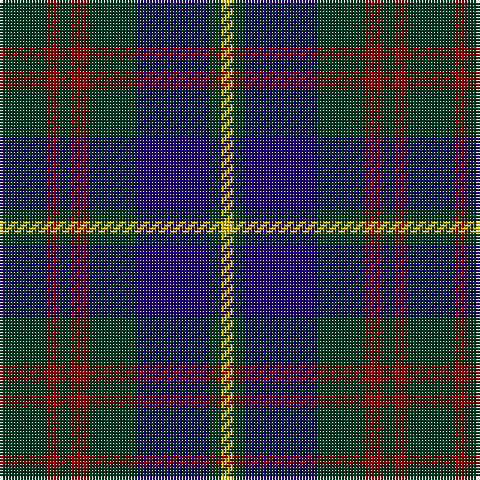

In pattern [GRGRGBGY](/stripes/grgrgbgy/).

This was sourced from tartans-authority.  It is a [8 stripe tartan](/stripes/stripes8/).

Original link http://www.tartansauthority.com/tartan-ferret/display/5017/

## Thread count
DG/16 DR4 DG4 DR6 DG16 DB24 DG4 Y/4

## Palette
Each colour and the base-6 reference it is a variant of.

| Colour | Shade | Base |
|---|---|---|
| DB | <code style="background-color:#1C0070;">#1C0070</code> `oklch(26.3% 0.162 277.1)` <small>#1C0070</small> | B <code style="background-color:#2A418A;">#2A418A</code> |
| DG | <code style="background-color:#003820;">#003820</code> `oklch(30.0% 0.070 158.3)` <small>#003820</small> | G <code style="background-color:#006100;">#006100</code> |
| DR | <code style="background-color:#880000;">#880000</code> `oklch(39.4% 0.162 29.2)` <small>#880000</small> | R <code style="background-color:#CC0000;">#CC0000</code> |
| Y | <code style="background-color:#E8C000;">#E8C000</code> `oklch(81.9% 0.168 93.7)` <small>#E8C000</small> | Y <code style="background-color:#F2BF00;">#F2BF00</code> |

# Sample pattern

## Nearest tartans

The nearest existing variants by ΔTartan distance.

1. [Glen Nevis #1](/setts/s8/dg8r2dg2r3dg8db12dg2lo2~x2/) — ΔT 0.55
1. [Cameron Hunting](/setts/s7/r3dg10r3dg14db16dg3ly2~x2/) — ΔT 0.89
1. [Forbes - 1947 (Lyon Court)](/setts/s7/db1k6db6k6g6k1w1~x6/) — ΔT 0.95
1. [Bean Hunting Clan Tartan Tartan Number: 106. Earliest known date: 1987 The weaving and wearing of this tartan is 'Restricted'. This is not a legal definition and is applied by the Scottish Tartans Society irrespective of Design Patent or Copyright, in the spirit of a gentlemans agreement. Interested parties should contact the person listed under 'Source:' in this document. See products available Copyright © Blair Urquhart, Comrie, 2015](/setts/s7/db6dg41db20r15dg41r15db6/) — ΔT 1.01
1. [MacArthur of Milton (Clan)](/setts/s6/g7db1g1k4dp4k1~x4/) — ΔT 1.02
1. [MacHardy](/setts/s8/dg1r1db6ly1db6dg6r1db1~x2/) — ΔT 1.14
1. [Bean of Freeport (Personal)](/setts/s7/dt6r15dg41r15dt20dg41db6/) — ΔT 1.15
1. [Brabender](/setts/s8/k1g4r1k4db1k1db7g1~x6/) — ΔT 1.18
1. [MacArthur of Milton Hunting Clan Tartan Tartan Number: 700. Earliest known date: 1823 This is the older of the two MacArthur setts, which links the clan with the Campbells. See products available Copyright © Blair Urquhart, Comrie, 2015](/setts/s6/g14db2g2k8dp9k2~x2/) — ΔT 1.18
1. [Murray](/setts/s6/t3k16dg16k16db3t3~x2/) — ΔT 1.18

## Neighbour map

Every grey dot is one of 14299 variants placed by the first two principal components of the ΔTartan feature space (44% of its variance). Red is this tartan; blue dots are its nearest — click one to open its page.

<svg viewBox="0 0 640 380" role="img" style="max-width:100%;height:auto;border:1px solid #e0e0e0;border-radius:4px;display:block" xmlns="http://www.w3.org/2000/svg"><image href="/nn/cloud.v1.png" width="640" height="380"/><a href="/setts/s8/dg8r2dg2r3dg8db12dg2lo2~x2/"><circle cx="276.0" cy="255.2" r="4" fill="#3465a4"><title>Glen Nevis #1</title></circle></a><a href="/setts/s7/r3dg10r3dg14db16dg3ly2~x2/"><circle cx="285.4" cy="241.4" r="4" fill="#3465a4"><title>Cameron Hunting</title></circle></a><a href="/setts/s7/db1k6db6k6g6k1w1~x6/"><circle cx="216.3" cy="253.9" r="4" fill="#3465a4"><title>Forbes - 1947 (Lyon Court)</title></circle></a><a href="/setts/s7/db6dg41db20r15dg41r15db6/"><circle cx="306.4" cy="258.4" r="4" fill="#3465a4"><title>Bean Hunting Clan Tartan Tartan Number: 106. Earliest known date: 1987 The weaving and wearing of this tartan is 'Restricted'. This is not a legal definition and is applied by the Scottish Tartans Society irrespective of Design Patent or Copyright, in the spirit of a gentlemans agreement. Interested parties should contact the person listed under 'Source:' in this document. See products available Copyright © Blair Urquhart, Comrie, 2015</title></circle></a><a href="/setts/s6/g7db1g1k4dp4k1~x4/"><circle cx="233.3" cy="248.6" r="4" fill="#3465a4"><title>MacArthur of Milton (Clan)</title></circle></a><a href="/setts/s8/dg1r1db6ly1db6dg6r1db1~x2/"><circle cx="310.0" cy="238.9" r="4" fill="#3465a4"><title>MacHardy</title></circle></a><a href="/setts/s7/dt6r15dg41r15dt20dg41db6/"><circle cx="311.2" cy="262.4" r="4" fill="#3465a4"><title>Bean of Freeport (Personal)</title></circle></a><a href="/setts/s8/k1g4r1k4db1k1db7g1~x6/"><circle cx="223.5" cy="233.1" r="4" fill="#3465a4"><title>Brabender</title></circle></a><a href="/setts/s6/g14db2g2k8dp9k2~x2/"><circle cx="221.3" cy="245.2" r="4" fill="#3465a4"><title>MacArthur of Milton Hunting Clan Tartan Tartan Number: 700. Earliest known date: 1823 This is the older of the two MacArthur setts, which links the clan with the Campbells. See products available Copyright © Blair Urquhart, Comrie, 2015</title></circle></a><a href="/setts/s6/t3k16dg16k16db3t3~x2/"><circle cx="300.9" cy="281.4" r="4" fill="#3465a4"><title>Murray</title></circle></a><circle cx="264.0" cy="246.1" r="5" fill="#c00000"/></svg>

ID: /setts/s8/dg8r2dg2r3dg8db12dg2ly2~x2/
