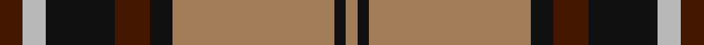
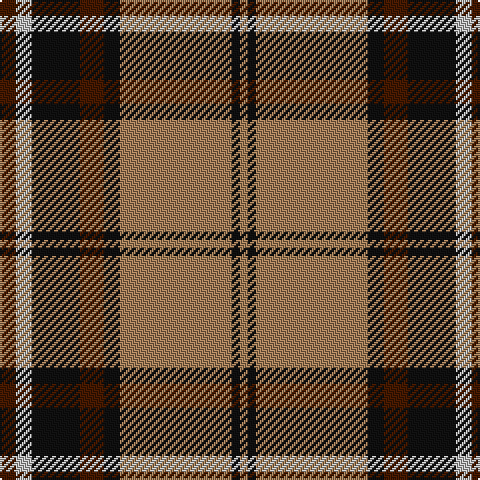

In pattern [BYKBKRKR](/stripes/bykbkrkr/).

This was sourced from tartans-authority.  It is a [8 stripe tartan](/stripes/stripes8/).

Original link http://www.tartansauthority.com/tartan-ferret/display/1741/

## Thread count
DR/8 N8 K24 DR12 K8 LT56 K4 LT/4

## Palette
Each colour and the base-6 reference it is a variant of.

| Colour | Shade | Base |
|---|---|---|
| DR | <code style="background-color:#441800;">#441800</code> `oklch(27.3% 0.076 46.3)` <small>#441800</small> | B <code style="background-color:#2A418A;">#2A418A</code> |
| K | <code style="background-color:#101010;">#101010</code> `oklch(17.3% 0.000 89.9)` <small>#101010</small> | K <code style="background-color:#000000;">#000000</code> |
| LT | <code style="background-color:#A07C58;">#A07C58</code> `oklch(61.2% 0.067 66.0)` <small>#A07C58</small> | R <code style="background-color:#CC0000;">#CC0000</code> |
| N | <code style="background-color:#B8B8B8;">#B8B8B8</code> `oklch(78.3% 0.000 89.9)` <small>#B8B8B8</small> | Y <code style="background-color:#F2BF00;">#F2BF00</code> |

# Sample pattern

## Nearest tartans

The nearest existing variants by ΔTartan distance.

1. [Braemar or Blair Atholl](/setts/s8/do2w2k6do3k2o14k1o1~x4/) — ΔT 0.40
1. [Merric Dark Camel.. Trade Tartan Tartan Number: 1688. Earliest known date: 1985 School colours. See products available Copyright © Blair Urquhart, Comrie, 2015](/setts/s7/r2w8k14dy25w2k2w2~x2/) — ΔT 0.75
1. [Annan](/setts/s10/o15y1o2lo2o2y1o3k8y10o3~x4/) — ΔT 0.82
1. [Thomson Camel (Jedburgh Mill)](/setts/s6/r4k2lb10k10y28k3~x2/) — ΔT 0.87
1. [Private SA Club](/setts/s8/k3r8k3r8lo19r7dt36r3~x2/) — ΔT 0.90
1. [Bro-Leon](/setts/s9/k4lo17k2lo2g7k2lo2k22db4~x2/) — ΔT 0.90
1. [Hermitage Academy (Corporate)](/setts/s8/k2lr6r3lr6r3k20y30r2~x2/) — ΔT 0.91
1. [Unidentified Specimen #2](/setts/s10/w1dg1r1dg14r1db6r11dg1r1w1~x4/) — ΔT 0.95
1. [Wilson's No.005](/setts/s10/dg5r4dg17lt5r32lt5dg17r4dg5w2~x2/) — ΔT 0.96
1. [Loch Ness](/setts/s6/r10w2k10w10dy35k5~x2/) — ΔT 0.97

## Neighbour map

Every grey dot is one of 14299 variants placed by the first two principal components of the ΔTartan feature space (44% of its variance). Red is this tartan; blue dots are its nearest — click one to open its page.

<svg viewBox="0 0 640 380" role="img" style="max-width:100%;height:auto;border:1px solid #e0e0e0;border-radius:4px;display:block" xmlns="http://www.w3.org/2000/svg"><image href="/nn/cloud.v1.png" width="640" height="380"/><a href="/setts/s8/do2w2k6do3k2o14k1o1~x4/"><circle cx="256.5" cy="154.6" r="4" fill="#3465a4"><title>Braemar or Blair Atholl</title></circle></a><a href="/setts/s7/r2w8k14dy25w2k2w2~x2/"><circle cx="234.2" cy="162.9" r="4" fill="#3465a4"><title>Merric Dark Camel.. Trade Tartan Tartan Number: 1688. Earliest known date: 1985 School colours. See products available Copyright © Blair Urquhart, Comrie, 2015</title></circle></a><a href="/setts/s10/o15y1o2lo2o2y1o3k8y10o3~x4/"><circle cx="286.8" cy="157.2" r="4" fill="#3465a4"><title>Annan</title></circle></a><a href="/setts/s6/r4k2lb10k10y28k3~x2/"><circle cx="261.2" cy="176.9" r="4" fill="#3465a4"><title>Thomson Camel (Jedburgh Mill)</title></circle></a><a href="/setts/s8/k3r8k3r8lo19r7dt36r3~x2/"><circle cx="229.6" cy="173.0" r="4" fill="#3465a4"><title>Private SA Club</title></circle></a><a href="/setts/s9/k4lo17k2lo2g7k2lo2k22db4~x2/"><circle cx="249.0" cy="168.6" r="4" fill="#3465a4"><title>Bro-Leon</title></circle></a><a href="/setts/s8/k2lr6r3lr6r3k20y30r2~x2/"><circle cx="237.1" cy="158.1" r="4" fill="#3465a4"><title>Hermitage Academy (Corporate)</title></circle></a><a href="/setts/s10/w1dg1r1dg14r1db6r11dg1r1w1~x4/"><circle cx="260.0" cy="141.9" r="4" fill="#3465a4"><title>Unidentified Specimen #2</title></circle></a><a href="/setts/s10/dg5r4dg17lt5r32lt5dg17r4dg5w2~x2/"><circle cx="261.7" cy="148.5" r="4" fill="#3465a4"><title>Wilson's No.005</title></circle></a><a href="/setts/s6/r10w2k10w10dy35k5~x2/"><circle cx="253.1" cy="169.2" r="4" fill="#3465a4"><title>Loch Ness</title></circle></a><circle cx="268.1" cy="161.1" r="5" fill="#c00000"/></svg>

ID: /setts/s8/do2lr2k6do3k2o14k1o1~x4/
