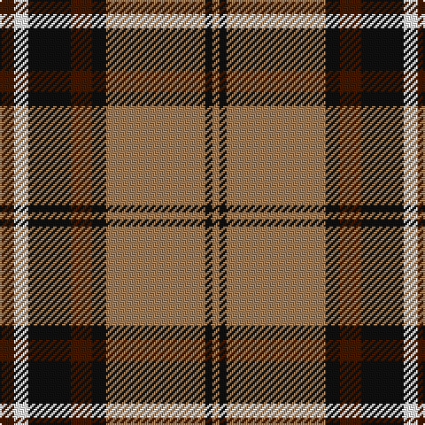

In pattern [BWKBKRKR](/stripes/bwkbkrkr/).

This was sourced from register-of-tartans.  It is a [8 stripe tartan](/stripes/stripes8/).

Original link https://www.tartanregister.gov.uk/tartanDetails.aspx?ref=335

## Register references

External register numbers recorded for this tartan.

- Scottish Register of Tartans: [335](https://www.tartanregister.gov.uk/tartanDetails.aspx?ref=335)
- Scottish Tartans Authority (ITI): 1741
- Scottish Tartans World Register: 1741

## Thread count
DR/8 W8 K24 DR12 K8 LT56 K4 LT/4

## Palette
Each colour and the base-6 reference it is a variant of.

| Colour | Shade | Base |
|---|---|---|
| DR | <code style="background-color:#441800;">#441800</code> `oklch(27.3% 0.076 46.3)` <small>#441800</small> | B <code style="background-color:#2A418A;">#2A418A</code> |
| K | <code style="background-color:#101010;">#101010</code> `oklch(17.3% 0.000 89.9)` <small>#101010</small> | K <code style="background-color:#000000;">#000000</code> |
| LT | <code style="background-color:#A07C58;">#A07C58</code> `oklch(61.2% 0.067 66.0)` <small>#A07C58</small> | R <code style="background-color:#CC0000;">#CC0000</code> |
| W | <code style="background-color:#FFFFFF;">#FFFFFF</code> `oklch(100.0% 0.000 89.9)` <small>#FFFFFF</small> | W <code style="background-color:#F7F7F7;">#F7F7F7</code> |

# Sample pattern

## Nearest tartans

The nearest existing variants by ΔTartan distance.

1. [Blair Atholl (Fashion)](/setts/s8/do2lr2k6do3k2o14k1o1~x4/) — ΔT 0.40
1. [Merric Dark Camel.. Trade Tartan Tartan Number: 1688. Earliest known date: 1985 School colours. See products available Copyright © Blair Urquhart, Comrie, 2015](/setts/s7/r2w8k14dy25w2k2w2~x2/) — ΔT 0.49
1. [Distripress Annual Congress 2012](/setts/s8/r12k2w8k4n16r2k31n2/) — ΔT 0.81
1. [Thomson Camel (Jedburgh Mill)](/setts/s6/r4k2lb10k10y28k3~x2/) — ΔT 0.86
1. [Merric, Dark Camel..](/setts/s7/r2w8k14o25w2k2w2~x2/) — ΔT 0.87
1. [Wilson's No.005](/setts/s10/dg5r4dg17lt5r32lt5dg17r4dg5w2~x2/) — ΔT 0.88
1. [Bro-Leon](/setts/s9/k4lo17k2lo2g7k2lo2k22db4~x2/) — ΔT 0.89
1. [Loch Ness](/setts/s6/r10w2k10w10dy35k5~x2/) — ΔT 0.90
1. [Annan](/setts/s10/o15y1o2lo2o2y1o3k8y10o3~x4/) — ΔT 0.91
1. [Southdown (Fashion)](/setts/s9/k3r1k3w5k5w3k5dy23r3~x2/) — ΔT 0.92

## Neighbour map

Every grey dot is one of 14299 variants placed by the first two principal components of the ΔTartan feature space (44% of its variance). Red is this tartan; blue dots are its nearest — click one to open its page.

<svg viewBox="0 0 640 380" role="img" style="max-width:100%;height:auto;border:1px solid #e0e0e0;border-radius:4px;display:block" xmlns="http://www.w3.org/2000/svg"><image href="/nn/cloud.v1.png" width="640" height="380"/><a href="/setts/s8/do2lr2k6do3k2o14k1o1~x4/"><circle cx="268.1" cy="161.1" r="4" fill="#3465a4"><title>Blair Atholl (Fashion)</title></circle></a><a href="/setts/s7/r2w8k14dy25w2k2w2~x2/"><circle cx="234.2" cy="162.9" r="4" fill="#3465a4"><title>Merric Dark Camel.. Trade Tartan Tartan Number: 1688. Earliest known date: 1985 School colours. See products available Copyright © Blair Urquhart, Comrie, 2015</title></circle></a><a href="/setts/s8/r12k2w8k4n16r2k31n2/"><circle cx="237.8" cy="150.1" r="4" fill="#3465a4"><title>Distripress Annual Congress 2012</title></circle></a><a href="/setts/s6/r4k2lb10k10y28k3~x2/"><circle cx="261.2" cy="176.9" r="4" fill="#3465a4"><title>Thomson Camel (Jedburgh Mill)</title></circle></a><a href="/setts/s7/r2w8k14o25w2k2w2~x2/"><circle cx="221.6" cy="156.4" r="4" fill="#3465a4"><title>Merric, Dark Camel..</title></circle></a><a href="/setts/s10/dg5r4dg17lt5r32lt5dg17r4dg5w2~x2/"><circle cx="261.7" cy="148.5" r="4" fill="#3465a4"><title>Wilson's No.005</title></circle></a><a href="/setts/s9/k4lo17k2lo2g7k2lo2k22db4~x2/"><circle cx="249.0" cy="168.6" r="4" fill="#3465a4"><title>Bro-Leon</title></circle></a><a href="/setts/s6/r10w2k10w10dy35k5~x2/"><circle cx="253.1" cy="169.2" r="4" fill="#3465a4"><title>Loch Ness</title></circle></a><a href="/setts/s10/o15y1o2lo2o2y1o3k8y10o3~x4/"><circle cx="286.8" cy="157.2" r="4" fill="#3465a4"><title>Annan</title></circle></a><a href="/setts/s9/k3r1k3w5k5w3k5dy23r3~x2/"><circle cx="253.5" cy="127.2" r="4" fill="#3465a4"><title>Southdown (Fashion)</title></circle></a><circle cx="256.5" cy="154.6" r="5" fill="#c00000"/></svg>

ID: /setts/s8/do2w2k6do3k2o14k1o1~x4/
