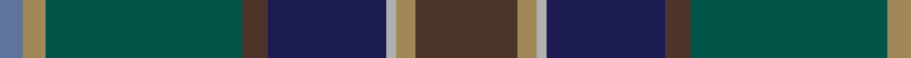
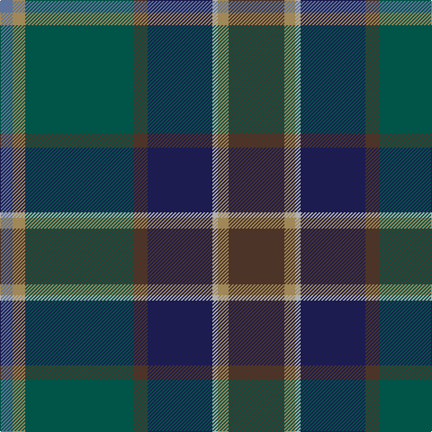

**Bands:** [BYGBBYYB](/stripes/bygbbyyb/) · **Stripes:** [T LO DG DO DB LR LO DO](/stripes/stripes8/) T LO DG DO DB LR LO DO

This was sourced from register-of-tartans.  It is a [8 band tartan](/bands/bands8/).

Original link https://www.tartanregister.gov.uk/tartanDetails.aspx?ref=11075

## Register references

External register numbers recorded for this tartan.

- Scottish Register of Tartans: [11075](https://www.tartanregister.gov.uk/tartanDetails.aspx?ref=11075)

## Thread count
B/14 LT14 G120 T16 DB72 N6 LT12 T/62

## Palette
Each colour and its ΔE from the base-6 reference it is a variant of.

| Colour | Shade | Base | ΔE (OKLab) |
|---|---|---|---|
| B | <code style="background-color:#5F749C;">#5F749C</code> `#5F749C` | B <code style="background-color:#2A418A;">#2A418A</code> | 0.17 |
| DB | <code style="background-color:#1C1C50;">#1C1C50</code> `#1C1C50` | B <code style="background-color:#2A418A;">#2A418A</code> | 0.14 |
| G | <code style="background-color:#005448;">#005448</code> `#005448` | G <code style="background-color:#006100;">#006100</code> | 0.10 |
| LT | <code style="background-color:#A08858;">#A08858</code> `#A08858` | Y <code style="background-color:#F2BF00;">#F2BF00</code> | 0.21 |
| N | <code style="background-color:#B0B0B0;">#B0B0B0</code> `#B0B0B0` | Y <code style="background-color:#F2BF00;">#F2BF00</code> | 0.18 |
| T | <code style="background-color:#4C3428;">#4C3428</code> `#4C3428` | B <code style="background-color:#2A418A;">#2A418A</code> | 0.17 |

# Sample pattern

## Nearest tartans

The nearest existing variants by ΔTartan distance.

1. [McMeeken](/setts/s10/o7dg20y2dg4k5db4k2db20k3w1~x2/) — ΔT 0.64
1. [Batten of Argyll (Baddenach)](/setts/s8/dp10k2dg10dp30dg30dg55k4r8/) — ΔT 0.99
1. [Little-Dowse Wedding](/setts/s8/dy31y6o3db31dy8y60y7b7~x2/) — ΔT 1.01
1. [Heartlands (Fashion)](/setts/s11/db4b1dt20db2dt2db18dg2db2dg22m2dp4~x2/) — ΔT 1.15
1. [Bowhunter](/setts/s12/n3dg10n2dt25do3lr4do3dg10dt3n2lr3n1~x2/) — ΔT 1.27
1. [Chesters, Eric (Personal)](/setts/s7/k12g8ly1dg13t1db31k8~x2/) — ΔT 1.31
1. [Telfer, Jamie of the Fair Dodhead](/setts/s11/b1db5dp6dg2dp1dg12r1dg2dp1r5lo1~x4/) — ΔT 1.36
1. [Isle of Skye District Tartan Tartan Number: 2155. Earliest known date: 1993 The tartan was instigated and registered by Mrs Rosemary Nicolson Samios in 1992, an Australian of Skye descent, now living in Skye. It was selected through a worldwide competition won by Angus MacLeod from Lewis. Angus, a weaver by trade, produced the first commercial quantities in the traditional kilt weight in 1993 at Lochcarron Weavers in North Strome. The colours of the tartan depict those of the island, often called the 'Misty Isle'. Worn by the Torphican and Bathgate pipe band. (A patented design No. 0600930) See products available Copyright © Blair Urquhart, Comrie, 2015](/setts/s11/dy20dp2dy2dp2dy3dp8dg9g8y8dg1lr2~x2/) — ΔT 1.36
1. [Bennett, John Paul (Personal)](/setts/s7/r4n38k4n6k41dg62y4/) — ΔT 1.36
1. [Muir-Hill (Personal)](/setts/s7/w2k2r1dt20k15dg30ly1~x2/) — ΔT 1.39

## Neighbour map

Every grey dot is one of 14313 variants placed by the first two principal components of the ΔTartan feature space (44% of its variance). Red is this tartan; blue dots are its nearest — click one to open its page.

<svg viewBox="0 0 640 380" role="img" style="max-width:100%;height:auto;border:1px solid #e0e0e0;border-radius:4px;display:block" xmlns="http://www.w3.org/2000/svg"><image href="/nn/cloud.v1.png" width="640" height="380"/><a href="/setts/s10/o7dg20y2dg4k5db4k2db20k3w1~x2/"><circle cx="252.9" cy="169.5" r="4" fill="#3465a4"><title>McMeeken</title></circle></a><a href="/setts/s8/dp10k2dg10dp30dg30dg55k4r8/"><circle cx="255.8" cy="167.7" r="4" fill="#3465a4"><title>Batten of Argyll (Baddenach)</title></circle></a><a href="/setts/s8/dy31y6o3db31dy8y60y7b7~x2/"><circle cx="285.7" cy="185.1" r="4" fill="#3465a4"><title>Little-Dowse Wedding</title></circle></a><a href="/setts/s11/db4b1dt20db2dt2db18dg2db2dg22m2dp4~x2/"><circle cx="246.7" cy="150.4" r="4" fill="#3465a4"><title>Heartlands (Fashion)</title></circle></a><a href="/setts/s12/n3dg10n2dt25do3lr4do3dg10dt3n2lr3n1~x2/"><circle cx="252.2" cy="132.6" r="4" fill="#3465a4"><title>Bowhunter</title></circle></a><a href="/setts/s7/k12g8ly1dg13t1db31k8~x2/"><circle cx="285.2" cy="177.2" r="4" fill="#3465a4"><title>Chesters, Eric (Personal)</title></circle></a><a href="/setts/s11/b1db5dp6dg2dp1dg12r1dg2dp1r5lo1~x4/"><circle cx="248.0" cy="174.6" r="4" fill="#3465a4"><title>Telfer, Jamie of the Fair Dodhead</title></circle></a><a href="/setts/s11/dy20dp2dy2dp2dy3dp8dg9g8y8dg1lr2~x2/"><circle cx="227.8" cy="154.6" r="4" fill="#3465a4"><title>Isle of Skye District Tartan Tartan Number: 2155. Earliest known date: 1993 The tartan was instigated and registered by Mrs Rosemary Nicolson Samios in 1992, an Australian of Skye descent, now living in Skye. It was selected through a worldwide competition won by Angus MacLeod from Lewis. Angus, a weaver by trade, produced the first commercial quantities in the traditional kilt weight in 1993 at Lochcarron Weavers in North Strome. The colours of the tartan depict those of the island, often called the 'Misty Isle'. Worn by the Torphican and Bathgate pipe band. (A patented design No. 0600930) See products available Copyright © Blair Urquhart, Comrie, 2015</title></circle></a><a href="/setts/s7/r4n38k4n6k41dg62y4/"><circle cx="291.4" cy="211.4" r="4" fill="#3465a4"><title>Bennett, John Paul (Personal)</title></circle></a><a href="/setts/s7/w2k2r1dt20k15dg30ly1~x2/"><circle cx="291.2" cy="160.8" r="4" fill="#3465a4"><title>Muir-Hill (Personal)</title></circle></a><circle cx="254.0" cy="176.6" r="5" fill="#c00000"/></svg>

ID: /setts/s8/do31lo6lr3db36do8dg60lo7t7~x2/
