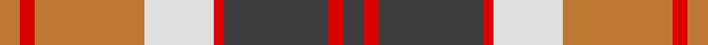
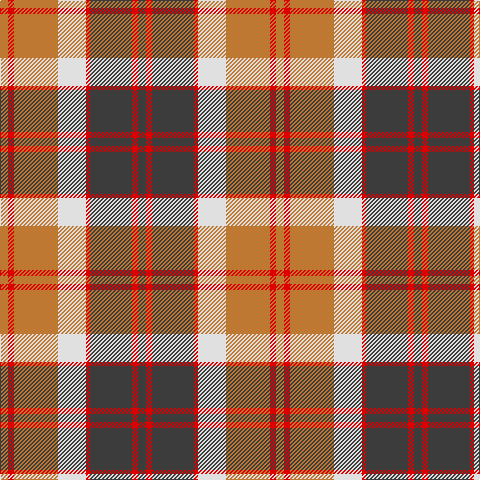

In pattern [BRBRWRRR](/stripes/brbrwrrr/).

This was sourced from register-of-tartans.  It is a [8 stripe tartan](/stripes/stripes8/).

Original link https://www.tartanregister.gov.uk/tartanDetails.aspx?ref=192

## Register references

External register numbers recorded for this tartan.

- Scottish Register of Tartans: [192](https://www.tartanregister.gov.uk/tartanDetails.aspx?ref=192)
- Scottish Tartans World Register: 2770

## Thread count
DO/8 R6 DO44 LN28 R4 N42 R6 N/8

## Palette
Each colour and the base-6 reference it is a variant of.

| Colour | Shade | Base |
|---|---|---|
| DO | <code style="background-color:#BE7832;">#BE7832</code> `oklch(63.5% 0.121 62.2)` <small>#BE7832</small> | R <code style="background-color:#CC0000;">#CC0000</code> |
| LN | <code style="background-color:#E0E0E0;">#E0E0E0</code> `oklch(90.7% 0.000 89.9)` <small>#E0E0E0</small> | W <code style="background-color:#F7F7F7;">#F7F7F7</code> |
| N | <code style="background-color:#3C3C3C;">#3C3C3C</code> `oklch(35.6% 0.000 89.9)` <small>#3C3C3C</small> | B <code style="background-color:#2A418A;">#2A418A</code> |
| R | <code style="background-color:#DC0000;">#DC0000</code> `oklch(56.2% 0.230 29.2)` <small>#DC0000</small> | R <code style="background-color:#CC0000;">#CC0000</code> |

# Sample pattern

## Nearest tartans

The nearest existing variants by ΔTartan distance.

1. [Logan, Light](/setts/s7/p9r4p1r4g15r4p1~x2/) — ΔT 0.76
1. [Bannockbane Orange Stripes](/setts/s8/do2lo2do15lo1w10lo15lo2lo2~x2/) — ΔT 0.76
1. [Bannockbane](/setts/s8/dr2lo2dr15lo1w10o15lo2o2~x2/) — ΔT 0.90
1. [Logan Light](/setts/s7/dp9r4dp1r4g15r4dp1~x2/) — ΔT 0.92
1. [Karibu](/setts/s9/g12w1r1w4r1w1r8ly2r1~x4/) — ΔT 0.98
1. [Bannockbane](/setts/s8/dr2r2dr15r1w10o15r2o2~x2/) — ΔT 0.99
1. [Cranston Dress](/setts/s8/r15db2r1db2r3db7g13g3~x2/) — ΔT 1.01
1. [Logan, with Yellow](/setts/s7/p8r3ly1r3g14r3ly1~x4/) — ΔT 1.05
1. [Princess Marina (Fashion)](/setts/s12/w2g2r3g2r3g2r3g2r2g3lb13r1~x4/) — ΔT 1.08
1. [Ballater Trade or 'Fancy' Tartan Tartan Number: 1708. Earliest known date: Modern Many new designs have been given district names to promote their Scottish connections. However, these names should not be confused with the District tartans which have earned their title through 'use and wont' and not a little history. See products available Copyright © Blair Urquhart, Comrie, 2015](/setts/s9/r12w2lo3w2r3k5r2lo18w2~x2/) — ΔT 1.08

## Neighbour map

Every grey dot is one of 14299 variants placed by the first two principal components of the ΔTartan feature space (44% of its variance). Red is this tartan; blue dots are its nearest — click one to open its page.

<svg viewBox="0 0 640 380" role="img" style="max-width:100%;height:auto;border:1px solid #e0e0e0;border-radius:4px;display:block" xmlns="http://www.w3.org/2000/svg"><image href="/nn/cloud.v1.png" width="640" height="380"/><a href="/setts/s7/p9r4p1r4g15r4p1~x2/"><circle cx="218.8" cy="173.5" r="4" fill="#3465a4"><title>Logan, Light</title></circle></a><a href="/setts/s8/do2lo2do15lo1w10lo15lo2lo2~x2/"><circle cx="185.6" cy="151.1" r="4" fill="#3465a4"><title>Bannockbane Orange Stripes</title></circle></a><a href="/setts/s8/dr2lo2dr15lo1w10o15lo2o2~x2/"><circle cx="186.2" cy="149.5" r="4" fill="#3465a4"><title>Bannockbane</title></circle></a><a href="/setts/s7/dp9r4dp1r4g15r4dp1~x2/"><circle cx="210.7" cy="172.9" r="4" fill="#3465a4"><title>Logan Light</title></circle></a><a href="/setts/s9/g12w1r1w4r1w1r8ly2r1~x4/"><circle cx="203.8" cy="140.1" r="4" fill="#3465a4"><title>Karibu</title></circle></a><a href="/setts/s8/dr2r2dr15r1w10o15r2o2~x2/"><circle cx="191.4" cy="153.4" r="4" fill="#3465a4"><title>Bannockbane</title></circle></a><a href="/setts/s8/r15db2r1db2r3db7g13g3~x2/"><circle cx="229.4" cy="169.2" r="4" fill="#3465a4"><title>Cranston Dress</title></circle></a><a href="/setts/s7/p8r3ly1r3g14r3ly1~x4/"><circle cx="239.8" cy="174.0" r="4" fill="#3465a4"><title>Logan, with Yellow</title></circle></a><a href="/setts/s12/w2g2r3g2r3g2r3g2r2g3lb13r1~x4/"><circle cx="183.0" cy="141.6" r="4" fill="#3465a4"><title>Princess Marina (Fashion)</title></circle></a><a href="/setts/s9/r12w2lo3w2r3k5r2lo18w2~x2/"><circle cx="230.0" cy="165.0" r="4" fill="#3465a4"><title>Ballater Trade or 'Fancy' Tartan Tartan Number: 1708. Earliest known date: Modern Many new designs have been given district names to promote their Scottish connections. However, these names should not be confused with the District tartans which have earned their title through 'use and wont' and not a little history. See products available Copyright © Blair Urquhart, Comrie, 2015</title></circle></a><circle cx="185.4" cy="171.2" r="5" fill="#c00000"/></svg>

ID: /setts/s8/do4r3do21r2w14o22r3o4~x2/
