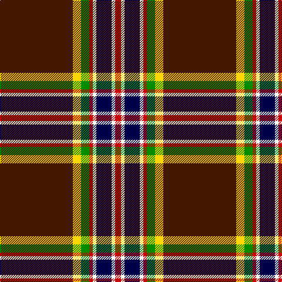

In pattern [BYGRWBWR](/stripes/bygrwbwr/).

This was sourced from register-of-tartans.  It is a [8 stripe tartan](/stripes/stripes8/).

Original link https://www.tartanregister.gov.uk/tartanDetails.aspx?ref=11168

## Register references

External register numbers recorded for this tartan.

- Scottish Register of Tartans: [11168](https://www.tartanregister.gov.uk/tartanDetails.aspx?ref=11168)

## Thread count
DR/124 Y14 G14 R6 W6 DB26 W6 R/10

## Palette
Each colour and the base-6 reference it is a variant of.

| Colour | Shade | Base |
|---|---|---|
| DB | <code style="background-color:#000048;">#000048</code> `oklch(18.2% 0.126 264.1)` <small>#000048</small> | B <code style="background-color:#2A418A;">#2A418A</code> |
| DR | <code style="background-color:#441800;">#441800</code> `oklch(27.3% 0.076 46.3)` <small>#441800</small> | B <code style="background-color:#2A418A;">#2A418A</code> |
| G | <code style="background-color:#008B00;">#008B00</code> `oklch(55.2% 0.188 142.5)` <small>#008B00</small> | G <code style="background-color:#006100;">#006100</code> |
| R | <code style="background-color:#C80000;">#C80000</code> `oklch(52.3% 0.215 29.2)` <small>#C80000</small> | R <code style="background-color:#CC0000;">#CC0000</code> |
| W | <code style="background-color:#FFFFFF;">#FFFFFF</code> `oklch(100.0% 0.000 89.9)` <small>#FFFFFF</small> | W <code style="background-color:#F7F7F7;">#F7F7F7</code> |
| Y | <code style="background-color:#FFD700;">#FFD700</code> `oklch(88.7% 0.182 95.3)` <small>#FFD700</small> | Y <code style="background-color:#F2BF00;">#F2BF00</code> |

# Sample pattern

## Nearest tartans

The nearest existing variants by ΔTartan distance, with this tartan at the top so the swatches line up against it.

ΔTartan

Tartan

Sett

—

<a href="/ttd/edit/#slug=do62ly7g7r3w3db13w3r5~x2">Legion of Frontiersmen</a> <a class="nn-out" href="/setts/s8/do62ly7g7r3w3db13w3r5~x2/" title="open its dictionary page">↗</a>

0.56

<a href="/ttd/edit/#slug=dr62ly7g7r3w3db13w3r5~x2">Legion of Frontiersmen</a> <a class="nn-out" href="/setts/s8/dr62ly7g7r3w3db13w3r5~x2/" title="open its dictionary page">↗</a>

0.71

<a href="/ttd/edit/#slug=o2k37r10db3r5ly4r3w2~x2">Westin Kierland</a> <a class="nn-out" href="/setts/s8/o2k37r10db3r5ly4r3w2~x2/" title="open its dictionary page">↗</a>

0.84

<a href="/ttd/edit/#slug=lo2k38r10db3r5ly4r3lb2~x2">Westin Kierland (Corporate)</a> <a class="nn-out" href="/setts/s8/lo2k38r10db3r5ly4r3lb2~x2/" title="open its dictionary page">↗</a>

0.87

<a href="/ttd/edit/#slug=o2k37r10db3r5lo4r3w2~x2">Westin Kierland</a> <a class="nn-out" href="/setts/s8/o2k37r10db3r5lo4r3w2~x2/" title="open its dictionary page">↗</a>

1.12

<a href="/ttd/edit/#slug=lo24k7db1k1w1k1dy4r3k1r2lo1~x4">U.S. Customs &amp; Border Protection (C</a> <a class="nn-out" href="/setts/s11/lo24k7db1k1w1k1dy4r3k1r2lo1~x4/" title="open its dictionary page">↗</a>

1.23

<a href="/ttd/edit/#slug=db6w3r14k3lo2k2w2k38w2k2lo2~x2">Norwegian Night</a> <a class="nn-out" href="/setts/s11/db6w3r14k3lo2k2w2k38w2k2lo2~x2/" title="open its dictionary page">↗</a>

1.24

<a href="/ttd/edit/#slug=k60w2r10dg6w4r15ly10~x2">Iberia Dress, Black (Fashion)</a> <a class="nn-out" href="/setts/s7/k60w2r10dg6w4r15ly10~x2/" title="open its dictionary page">↗</a>

1.31

<a href="/ttd/edit/#slug=k58db5w5k10ly3k3w3k3dg14r11k3r4w3~x2">Stuart/Stewart Black #2</a> <a class="nn-out" href="/setts/s13/k58db5w5k10ly3k3w3k3dg14r11k3r4w3~x2/" title="open its dictionary page">↗</a>

1.38

<a href="/ttd/edit/#slug=ly3g6dg32r4ly2r2dp7dg2w2~x2">Pienaar (Personal)</a> <a class="nn-out" href="/setts/s9/ly3g6dg32r4ly2r2dp7dg2w2~x2/" title="open its dictionary page">↗</a>

1.41

<a href="/ttd/edit/#slug=k2r3k36n2k5n7ly3lt5lg2~x2">Victory</a> <a class="nn-out" href="/setts/s9/k2r3k36n2k5n7ly3lt5lg2~x2/" title="open its dictionary page">↗</a>

## Neighbour map

Every grey dot is one of 14299 variants placed by the first two principal components of the ΔTartan feature space (44% of its variance). Red is this tartan; blue dots are its nearest — click one to open its page.

<svg viewBox="0 0 640 380" role="img" style="max-width:100%;height:auto;border:1px solid #e0e0e0;border-radius:4px;display:block" xmlns="http://www.w3.org/2000/svg"><image href="/nn/cloud.v1.png" width="640" height="380"/><a href="/setts/s8/dr62ly7g7r3w3db13w3r5~x2/"><circle cx="326.8" cy="92.1" r="4" fill="#3465a4"><title>Legion of Frontiersmen</title></circle></a><a href="/setts/s8/o2k37r10db3r5ly4r3w2~x2/"><circle cx="297.4" cy="100.3" r="4" fill="#3465a4"><title>Westin Kierland</title></circle></a><a href="/setts/s8/lo2k38r10db3r5ly4r3lb2~x2/"><circle cx="313.3" cy="108.5" r="4" fill="#3465a4"><title>Westin Kierland (Corporate)</title></circle></a><a href="/setts/s8/o2k37r10db3r5lo4r3w2~x2/"><circle cx="300.3" cy="102.1" r="4" fill="#3465a4"><title>Westin Kierland</title></circle></a><a href="/setts/s11/lo24k7db1k1w1k1dy4r3k1r2lo1~x4/"><circle cx="279.0" cy="61.7" r="4" fill="#3465a4"><title>U.S. Customs &amp; Border Protection (C</title></circle></a><a href="/setts/s11/db6w3r14k3lo2k2w2k38w2k2lo2~x2/"><circle cx="317.5" cy="90.7" r="4" fill="#3465a4"><title>Norwegian Night</title></circle></a><a href="/setts/s7/k60w2r10dg6w4r15ly10~x2/"><circle cx="316.5" cy="109.3" r="4" fill="#3465a4"><title>Iberia Dress, Black (Fashion)</title></circle></a><a href="/setts/s13/k58db5w5k10ly3k3w3k3dg14r11k3r4w3~x2/"><circle cx="315.8" cy="79.0" r="4" fill="#3465a4"><title>Stuart/Stewart Black #2</title></circle></a><a href="/setts/s9/ly3g6dg32r4ly2r2dp7dg2w2~x2/"><circle cx="286.7" cy="112.0" r="4" fill="#3465a4"><title>Pienaar (Personal)</title></circle></a><a href="/setts/s9/k2r3k36n2k5n7ly3lt5lg2~x2/"><circle cx="346.0" cy="101.7" r="4" fill="#3465a4"><title>Victory</title></circle></a><circle cx="316.0" cy="91.1" r="5" fill="#c00000"/></svg>

ID: /setts/s8/do62ly7g7r3w3db13w3r5~x2/
