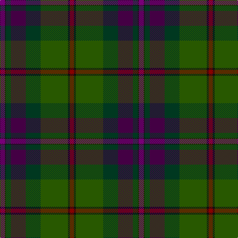

In pattern [BKGBGGKR](/stripes/bkgbggkr/).

This was sourced from register-of-tartans.  It is a [8 stripe tartan](/stripes/stripes8/).

Original link https://www.tartanregister.gov.uk/tartanDetails.aspx?ref=229

## Attestations

This cloth appears in 2 source records; the oldest owns this page.

- 01/01/2003 — Batten of Argyll (Baddenach) (register-of-tartans, [record](https://www.tartanregister.gov.uk/tartanDetails.aspx?ref=229))
- 2003 — Batten of Argyll (Name) (tartans-authority, [record](http://www.tartansauthority.com/tartan-ferret/display/5768/))

## Register references

External register numbers recorded for this tartan.

- Scottish Register of Tartans: [229](https://www.tartanregister.gov.uk/tartanDetails.aspx?ref=229)
- Scottish Tartans Authority (ITI): 5768

## Thread count
P/10 K2 DG10 DP30 DG30 G55 K4 DR/8

## Palette
Each colour and the base-6 reference it is a variant of.

| Colour | Shade | Base |
|---|---|---|
| DG | <code style="background-color:#003820;">#003820</code> `oklch(30.0% 0.070 158.3)` <small>#003820</small> | G <code style="background-color:#006100;">#006100</code> |
| DP | <code style="background-color:#440044;">#440044</code> `oklch(27.1% 0.125 328.4)` <small>#440044</small> | B <code style="background-color:#2A418A;">#2A418A</code> |
| DR | <code style="background-color:#880000;">#880000</code> `oklch(39.4% 0.162 29.2)` <small>#880000</small> | R <code style="background-color:#CC0000;">#CC0000</code> |
| G | <code style="background-color:#285800;">#285800</code> `oklch(41.0% 0.122 135.8)` <small>#285800</small> | G <code style="background-color:#006100;">#006100</code> |
| K | <code style="background-color:#101010;">#101010</code> `oklch(17.3% 0.000 89.9)` <small>#101010</small> | K <code style="background-color:#000000;">#000000</code> |
| LP | <code style="background-color:#9C68A4;">#9C68A4</code> `oklch(59.4% 0.107 322.0)` <small>#9C68A4</small> | R <code style="background-color:#CC0000;">#CC0000</code> |
| P | <code style="background-color:#780078;">#780078</code> `oklch(40.2% 0.185 328.4)` <small>#780078</small> | B <code style="background-color:#2A418A;">#2A418A</code> |
| Pa | <code style="background-color:#9058D8;">#9058D8</code> `oklch(58.4% 0.190 300.8)` <small>#9058D8</small> | B <code style="background-color:#2A418A;">#2A418A</code> |
| R | <code style="background-color:#C80000;">#C80000</code> `oklch(52.3% 0.215 29.2)` <small>#C80000</small> | R <code style="background-color:#CC0000;">#CC0000</code> |

# Sample pattern

## Nearest tartans

The nearest existing variants by ΔTartan distance.

1. [Little-Dowse Wedding](/setts/s8/do31lo6lr3db36do8dg60lo7t7~x2/) — ΔT 0.99
1. [Aberuchill District Tartan Tartan Number: 6814. Earliest known date: 2005 Aberuchill lends it name to the area south of Comrie where the river Ruchil meets the river Earn. The two rivers form the boundaries of the Aberuchill Estate for which this tartan was created. See products available Copyright © Blair Urquhart, Comrie, 2015](/setts/s8/m8k2y10dp30y30g55k4o6/) — ΔT 1.02
1. [McMeeken](/setts/s10/o7dg20y2dg4k5db4k2db20k3w1~x2/) — ΔT 1.12
1. [Redgate Htg #1 (Name)](/setts/s9/db1r4db12r1k7y12k7dy21lb1~x2/) — ΔT 1.18
1. [Isle of Skye District Tartan Tartan Number: 2155. Earliest known date: 1993 The tartan was instigated and registered by Mrs Rosemary Nicolson Samios in 1992, an Australian of Skye descent, now living in Skye. It was selected through a worldwide competition won by Angus MacLeod from Lewis. Angus, a weaver by trade, produced the first commercial quantities in the traditional kilt weight in 1993 at Lochcarron Weavers in North Strome. The colours of the tartan depict those of the island, often called the 'Misty Isle'. Worn by the Torphican and Bathgate pipe band. (A patented design No. 0600930) See products available Copyright © Blair Urquhart, Comrie, 2015](/setts/s11/dy20dp2dy2dp2dy3dp8dg9g8y8dg1lr2~x2/) — ΔT 1.22
1. [Waterford, County](/setts/s6/dg42lo2y16db7do16r5~x2/) — ΔT 1.22
1. [Heartlands (Fashion)](/setts/s11/db4b1dt20db2dt2db18dg2db2dg22m2dp4~x2/) — ΔT 1.31
1. [Telfer Green](/setts/s8/g7lo2g5dg37db6r16db5b2~x2/) — ΔT 1.31
1. [Hard Rock Café](/setts/s10/r4do4r4do12k32dy15r1dy7ly1r1~x2/) — ΔT 1.34
1. [Chesters, Eric (Personal)](/setts/s7/k12g8ly1dg13t1db31k8~x2/) — ΔT 1.36

## Neighbour map

Every grey dot is one of 14299 variants placed by the first two principal components of the ΔTartan feature space (44% of its variance). Red is this tartan; blue dots are its nearest — click one to open its page.

<svg viewBox="0 0 640 380" role="img" style="max-width:100%;height:auto;border:1px solid #e0e0e0;border-radius:4px;display:block" xmlns="http://www.w3.org/2000/svg"><image href="/nn/cloud.v1.png" width="640" height="380"/><a href="/setts/s8/do31lo6lr3db36do8dg60lo7t7~x2/"><circle cx="254.0" cy="176.9" r="4" fill="#3465a4"><title>Little-Dowse Wedding</title></circle></a><a href="/setts/s8/m8k2y10dp30y30g55k4o6/"><circle cx="243.5" cy="151.0" r="4" fill="#3465a4"><title>Aberuchill District Tartan Tartan Number: 6814. Earliest known date: 2005 Aberuchill lends it name to the area south of Comrie where the river Ruchil meets the river Earn. The two rivers form the boundaries of the Aberuchill Estate for which this tartan was created. See products available Copyright © Blair Urquhart, Comrie, 2015</title></circle></a><a href="/setts/s10/o7dg20y2dg4k5db4k2db20k3w1~x2/"><circle cx="253.0" cy="169.8" r="4" fill="#3465a4"><title>McMeeken</title></circle></a><a href="/setts/s9/db1r4db12r1k7y12k7dy21lb1~x2/"><circle cx="191.0" cy="159.6" r="4" fill="#3465a4"><title>Redgate Htg #1 (Name)</title></circle></a><a href="/setts/s11/dy20dp2dy2dp2dy3dp8dg9g8y8dg1lr2~x2/"><circle cx="227.8" cy="154.9" r="4" fill="#3465a4"><title>Isle of Skye District Tartan Tartan Number: 2155. Earliest known date: 1993 The tartan was instigated and registered by Mrs Rosemary Nicolson Samios in 1992, an Australian of Skye descent, now living in Skye. It was selected through a worldwide competition won by Angus MacLeod from Lewis. Angus, a weaver by trade, produced the first commercial quantities in the traditional kilt weight in 1993 at Lochcarron Weavers in North Strome. The colours of the tartan depict those of the island, often called the 'Misty Isle'. Worn by the Torphican and Bathgate pipe band. (A patented design No. 0600930) See products available Copyright © Blair Urquhart, Comrie, 2015</title></circle></a><a href="/setts/s6/dg42lo2y16db7do16r5~x2/"><circle cx="302.4" cy="191.5" r="4" fill="#3465a4"><title>Waterford, County</title></circle></a><a href="/setts/s11/db4b1dt20db2dt2db18dg2db2dg22m2dp4~x2/"><circle cx="246.8" cy="150.7" r="4" fill="#3465a4"><title>Heartlands (Fashion)</title></circle></a><a href="/setts/s8/g7lo2g5dg37db6r16db5b2~x2/"><circle cx="285.3" cy="163.1" r="4" fill="#3465a4"><title>Telfer Green</title></circle></a><a href="/setts/s10/r4do4r4do12k32dy15r1dy7ly1r1~x2/"><circle cx="294.5" cy="136.6" r="4" fill="#3465a4"><title>Hard Rock Café</title></circle></a><a href="/setts/s7/k12g8ly1dg13t1db31k8~x2/"><circle cx="285.4" cy="177.4" r="4" fill="#3465a4"><title>Chesters, Eric (Personal)</title></circle></a><circle cx="255.9" cy="168.0" r="5" fill="#c00000"/></svg>

ID: /setts/s8/dp10k2dg10dp30dg30dg55k4r8/
