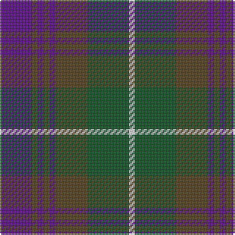

This page is one **sett** — a single exact thread-count. It belongs to the [tartan](/tartans/dp11dy2dp2dy2dp2dy11dg14w2/)
(the same proportion at any scale), whose colour order is pattern [BGBGBGGW](/stripes/bgbgbggw/).

Sourced from register-of-tartans.  It is a [8 stripe tartan](/stripes/stripes8/).

Original link https://www.tartanregister.gov.uk/tartanDetails.aspx?ref=2034

## Register references

External register numbers recorded for this tartan.

- Scottish Register of Tartans: [2034](https://www.tartanregister.gov.uk/tartanDetails.aspx?ref=2034)
- Scottish Tartans World Register: 602

## Thread count
P/22 T4 P4 T4 P4 T22 G28 LN/4

## Palette

Palette: <strong>Tartan Register</strong>
<table><thead><tr><th>Colour</th><th>Threads</th><th>Shade</th><th>Base</th><th>OKLCh</th></tr></thead><tbody><tr><td>P/</td><td style="text-align:right;font-variant-numeric:tabular-nums">22</td><td><code style="background-color:#5A008C;">#5A008C</code> <small style="color:#888">#5A008C</small></td><td>B <code style="background-color:#2A418A;">#2A418A</code></td><td><small style="color:#888">oklch(37.0% 0.191 306.3)</small></td></tr><tr><td>T</td><td style="text-align:right;font-variant-numeric:tabular-nums">4</td><td><code style="background-color:#503C14;">#503C14</code> <small style="color:#888">#503C14</small></td><td>G <code style="background-color:#006100;">#006100</code></td><td><small style="color:#888">oklch(37.0% 0.062 81.8)</small></td></tr><tr><td>P</td><td style="text-align:right;font-variant-numeric:tabular-nums">4</td><td><code style="background-color:#5A008C;">#5A008C</code> <small style="color:#888">#5A008C</small></td><td>B <code style="background-color:#2A418A;">#2A418A</code></td><td><small style="color:#888">oklch(37.0% 0.191 306.3)</small></td></tr><tr><td>T</td><td style="text-align:right;font-variant-numeric:tabular-nums">4</td><td><code style="background-color:#503C14;">#503C14</code> <small style="color:#888">#503C14</small></td><td>G <code style="background-color:#006100;">#006100</code></td><td><small style="color:#888">oklch(37.0% 0.062 81.8)</small></td></tr><tr><td>P</td><td style="text-align:right;font-variant-numeric:tabular-nums">4</td><td><code style="background-color:#5A008C;">#5A008C</code> <small style="color:#888">#5A008C</small></td><td>B <code style="background-color:#2A418A;">#2A418A</code></td><td><small style="color:#888">oklch(37.0% 0.191 306.3)</small></td></tr><tr><td>T</td><td style="text-align:right;font-variant-numeric:tabular-nums">22</td><td><code style="background-color:#503C14;">#503C14</code> <small style="color:#888">#503C14</small></td><td>G <code style="background-color:#006100;">#006100</code></td><td><small style="color:#888">oklch(37.0% 0.062 81.8)</small></td></tr><tr><td>G</td><td style="text-align:right;font-variant-numeric:tabular-nums">28</td><td><code style="background-color:#005020;">#005020</code> <small style="color:#888">#005020</small></td><td>G <code style="background-color:#006100;">#006100</code></td><td><small style="color:#888">oklch(37.7% 0.105 149.6)</small></td></tr><tr><td>LN/</td><td style="text-align:right;font-variant-numeric:tabular-nums">4</td><td><code style="background-color:#E0E0E0;">#E0E0E0</code> <small style="color:#888">#E0E0E0</small></td><td>W <code style="background-color:#F7F7F7;">#F7F7F7</code></td><td><small style="color:#888">oklch(90.7% 0.000 89.9)</small></td></tr></tbody></table>

# Sample pattern

## Nearest tartans

The nearest existing variants by ΔTartan distance, with this tartan at the top so the swatches line up against it.

ΔTartan

Tartan

Sett

—

<a href="/ttd/edit/#slug=dp11dy2dp2dy2dp2dy11dg14w2~x2">Lamont #2</a> <a class="nn-out" href="/setts/s8/dp11dy2dp2dy2dp2dy11dg14w2~x2/" title="open its dictionary page">↗</a>

0.88

<a href="/ttd/edit/#slug=k4m14b2y16m3k3m3b12y4~x2">Crook</a> <a class="nn-out" href="/setts/s9/k4m14b2y16m3k3m3b12y4~x2/" title="open its dictionary page">↗</a>

0.99

<a href="/ttd/edit/#slug=db28k3db6k3db6k20dy28k3w6~x2">Forbes #5</a> <a class="nn-out" href="/setts/s9/db28k3db6k3db6k20dy28k3w6~x2/" title="open its dictionary page">↗</a>

1.00

<a href="/ttd/edit/#slug=db1n8w1db4m8w1~x6">Little's Chauffeur Drive</a> <a class="nn-out" href="/setts/s6/db1n8w1db4m8w1~x6/" title="open its dictionary page">↗</a>

1.07

<a href="/ttd/edit/#slug=k5b3k3b23n4k25n23lb3n5~x2">Cahonas Scotland</a> <a class="nn-out" href="/setts/s9/k5b3k3b23n4k25n23lb3n5~x2/" title="open its dictionary page">↗</a>

1.07

<a href="/ttd/edit/#slug=dg11r2dg2r4dg15k15r2db15r4db2r2db11~x2">MacDonald #2</a> <a class="nn-out" href="/setts/s12/dg11r2dg2r4dg15k15r2db15r4db2r2db11~x2/" title="open its dictionary page">↗</a>

1.07

<a href="/ttd/edit/#slug=db3k2db8k8g8dp1g1dp3~x4">Baird (Modern)</a> <a class="nn-out" href="/setts/s8/db3k2db8k8g8dp1g1dp3~x4/" title="open its dictionary page">↗</a>

1.07

<a href="/ttd/edit/#slug=db3k2db8k8g8dp1g1dp3~x2">Baird Clan Tartan Tartan Number: 104. Earliest known date: 1906 This tartan is first recorded in Johnston's work of 1906, and the sample from the Highland Society of London probably dates from the same period. In both these early references the triple stripes are rendered in red. Today, however, they are generally woven in purple. The name originates from 'bard' meaning poet. The Bairds owned estates in Aberdeenshire which were later purchased by the Gordons. See products available Copyright © Blair Urquhart, Comrie, 2015</a> <a class="nn-out" href="/setts/s8/db3k2db8k8g8dp1g1dp3~x2/" title="open its dictionary page">↗</a>

1.07

<a href="/ttd/edit/#slug=db12r2db4r4k15db4g4db2g12~x2">Alexander Hunting (Name)</a> <a class="nn-out" href="/setts/s9/db12r2db4r4k15db4g4db2g12~x2/" title="open its dictionary page">↗</a>

1.08

<a href="/ttd/edit/#slug=n9db1n1db1n1db7k7r2~x4">Caledonian Hotel (Corporate)</a> <a class="nn-out" href="/setts/s8/n9db1n1db1n1db7k7r2~x4/" title="open its dictionary page">↗</a>

1.09

<a href="/ttd/edit/#slug=g8t1g1k6dp6k1dp3~x4">Unnamed 19th Century Plaid</a> <a class="nn-out" href="/setts/s7/g8t1g1k6dp6k1dp3~x4/" title="open its dictionary page">↗</a>

## Neighbour map

Every grey dot is one of 14359 variants placed by the first two principal components of the ΔTartan feature space (44% of its variance). Red is this tartan; blue dots are its nearest — click one to open its page.

<svg viewBox="0 0 640 380" role="img" style="max-width:100%;height:auto;border:1px solid #e0e0e0;border-radius:4px;display:block" xmlns="http://www.w3.org/2000/svg"><image href="/nn/cloud.v1.png" width="640" height="380"/><a href="/setts/s9/k4m14b2y16m3k3m3b12y4~x2/"><circle cx="201.3" cy="226.0" r="4" fill="#3465a4"><title>Crook</title></circle></a><a href="/setts/s9/db28k3db6k3db6k20dy28k3w6~x2/"><circle cx="219.0" cy="208.6" r="4" fill="#3465a4"><title>Forbes #5</title></circle></a><a href="/setts/s6/db1n8w1db4m8w1~x6/"><circle cx="208.2" cy="229.9" r="4" fill="#3465a4"><title>Little's Chauffeur Drive</title></circle></a><a href="/setts/s9/k5b3k3b23n4k25n23lb3n5~x2/"><circle cx="198.6" cy="207.5" r="4" fill="#3465a4"><title>Cahonas Scotland</title></circle></a><a href="/setts/s12/dg11r2dg2r4dg15k15r2db15r4db2r2db11~x2/"><circle cx="170.2" cy="211.1" r="4" fill="#3465a4"><title>MacDonald #2</title></circle></a><a href="/setts/s8/db3k2db8k8g8dp1g1dp3~x4/"><circle cx="181.4" cy="243.2" r="4" fill="#3465a4"><title>Baird (Modern)</title></circle></a><a href="/setts/s8/db3k2db8k8g8dp1g1dp3~x2/"><circle cx="181.4" cy="243.2" r="4" fill="#3465a4"><title>Baird Clan Tartan Tartan Number: 104. Earliest known date: 1906 This tartan is first recorded in Johnston's work of 1906, and the sample from the Highland Society of London probably dates from the same period. In both these early references the triple stripes are rendered in red. Today, however, they are generally woven in purple. The name originates from 'bard' meaning poet. The Bairds owned estates in Aberdeenshire which were later purchased by the Gordons. See products available Copyright © Blair Urquhart, Comrie, 2015</title></circle></a><a href="/setts/s9/db12r2db4r4k15db4g4db2g12~x2/"><circle cx="184.9" cy="230.9" r="4" fill="#3465a4"><title>Alexander Hunting (Name)</title></circle></a><a href="/setts/s8/n9db1n1db1n1db7k7r2~x4/"><circle cx="239.9" cy="225.7" r="4" fill="#3465a4"><title>Caledonian Hotel (Corporate)</title></circle></a><a href="/setts/s7/g8t1g1k6dp6k1dp3~x4/"><circle cx="203.2" cy="243.0" r="4" fill="#3465a4"><title>Unnamed 19th Century Plaid</title></circle></a><circle cx="202.0" cy="228.7" r="5" fill="#c00000"/></svg>

ID: /setts/s8/dp11dy2dp2dy2dp2dy11dg14w2~x2/
