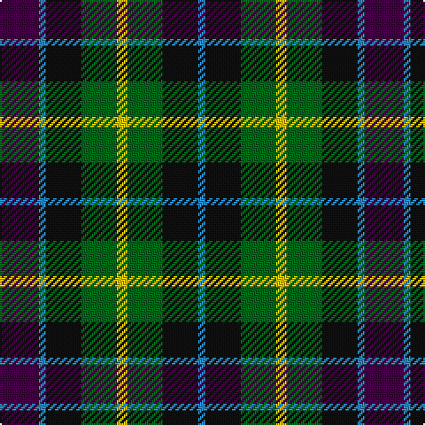

In pattern [BBKGYGKB](/stripes/bbkgygkb/).

This was sourced from register-of-tartans.  It is a [8 stripe tartan](/stripes/stripes8/).

Original link https://www.tartanregister.gov.uk/tartanDetails.aspx?ref=4746

## Register references

External register numbers recorded for this tartan.

- Scottish Register of Tartans: [4746](https://www.tartanregister.gov.uk/tartanDetails.aspx?ref=4746)
- Scottish Tartans Authority (ITI): 64
- Scottish Tartans World Register: 64

## Thread count
DP/22 B4 K20 G20 Y6 G20 K20 B/4

## Palette
Each colour and the base-6 reference it is a variant of.

| Colour | Shade | Base |
|---|---|---|
| B | <code style="background-color:#2888C4;">#2888C4</code> `oklch(60.1% 0.125 241.5)` <small>#2888C4</small> | B <code style="background-color:#2A418A;">#2A418A</code> |
| DG | <code style="background-color:#003820;">#003820</code> `oklch(30.0% 0.070 158.3)` <small>#003820</small> | G <code style="background-color:#006100;">#006100</code> |
| DP | <code style="background-color:#440044;">#440044</code> `oklch(27.1% 0.125 328.4)` <small>#440044</small> | B <code style="background-color:#2A418A;">#2A418A</code> |
| G | <code style="background-color:#006818;">#006818</code> `oklch(45.0% 0.142 145.0)` <small>#006818</small> | G <code style="background-color:#006100;">#006100</code> |
| K | <code style="background-color:#101010;">#101010</code> `oklch(17.3% 0.000 89.9)` <small>#101010</small> | K <code style="background-color:#000000;">#000000</code> |
| Y | <code style="background-color:#E8C000;">#E8C000</code> `oklch(81.9% 0.168 93.7)` <small>#E8C000</small> | Y <code style="background-color:#F2BF00;">#F2BF00</code> |

# Sample pattern

## Nearest tartans

The nearest existing variants by ΔTartan distance.

1. [Selkirk (Personal) Original](/setts/s8/dp11y2k10g10lo2~x2/) — ΔT 0.37
1. [Cunningham / Wilson's No 120](/setts/s7/k11g12w2g12k12dp12r3~x2/) — ΔT 0.66
1. [MacKean Dress (Personal)](/setts/s9/r1k2g4k1g1k2db3k1w1~x6/) — ΔT 0.72
1. [Wilson's No.176](/setts/s8/k8t3g13dp12ly2~x2/) — ΔT 0.73
1. [Casely Family Tartan Tartan Number: 2146. Earliest known date: 1992 The chiefly sett of a family tartan designed by Harry Lindley for the Scottish Tartans Society, to whom Mr Gordon Casely petitioned for the design in 1990. Formal accreditation was granted in 1993. See products available Copyright © Blair Urquhart, Comrie, 2015](/setts/s10/k19g3db19lo5db19g3k19g19r7g19~x2/) — ΔT 0.80
1. [Vosko](/setts/s9/db8k4lo2k3r2k3lo2k4g8~x4/) — ΔT 0.81
1. [Wilson's No.194](/setts/s10/k3r1g5k3w1dp3~x2/) — ΔT 0.85
1. [Scottish Odyssey Commemorative Tartan Tartan Number: 4071. Earliest known date: 01/01/2002 The Scottish Odyssey tartan from Lochcarron is a 'celebration of the wonderful experiences to be gained' from a visit to Scotland and some of the most spectacularly contrasting landscapes to be seen in Europe. See products available Copyright © Blair Urquhart, Comrie, 2015](/setts/s7/k7db11k3db11dy11g22db3~x2/) — ΔT 0.86
1. [Scottish Parliament (unofficial)](/setts/s7/db14g18k3g18r20k14lo3~x2/) — ΔT 0.89
1. [Dyce #3](/setts/s6/k2ly1dg6k6db6w1~x4/) — ΔT 0.98

## Neighbour map

Every grey dot is one of 14299 variants placed by the first two principal components of the ΔTartan feature space (44% of its variance). Red is this tartan; blue dots are its nearest — click one to open its page.

<svg viewBox="0 0 640 380" role="img" style="max-width:100%;height:auto;border:1px solid #e0e0e0;border-radius:4px;display:block" xmlns="http://www.w3.org/2000/svg"><image href="/nn/cloud.v1.png" width="640" height="380"/><a href="/setts/s8/dp11y2k10g10lo2~x2/"><circle cx="119.0" cy="236.2" r="4" fill="#3465a4"><title>Selkirk (Personal) Original</title></circle></a><a href="/setts/s7/k11g12w2g12k12dp12r3~x2/"><circle cx="131.2" cy="255.0" r="4" fill="#3465a4"><title>Cunningham / Wilson's No 120</title></circle></a><a href="/setts/s9/r1k2g4k1g1k2db3k1w1~x6/"><circle cx="100.2" cy="236.6" r="4" fill="#3465a4"><title>MacKean Dress (Personal)</title></circle></a><a href="/setts/s8/k8t3g13dp12ly2~x2/"><circle cx="150.4" cy="233.5" r="4" fill="#3465a4"><title>Wilson's No.176</title></circle></a><a href="/setts/s10/k19g3db19lo5db19g3k19g19r7g19~x2/"><circle cx="116.6" cy="231.2" r="4" fill="#3465a4"><title>Casely Family Tartan Tartan Number: 2146. Earliest known date: 1992 The chiefly sett of a family tartan designed by Harry Lindley for the Scottish Tartans Society, to whom Mr Gordon Casely petitioned for the design in 1990. Formal accreditation was granted in 1993. See products available Copyright © Blair Urquhart, Comrie, 2015</title></circle></a><a href="/setts/s9/db8k4lo2k3r2k3lo2k4g8~x4/"><circle cx="104.6" cy="241.3" r="4" fill="#3465a4"><title>Vosko</title></circle></a><a href="/setts/s10/k3r1g5k3w1dp3~x2/"><circle cx="109.1" cy="220.6" r="4" fill="#3465a4"><title>Wilson's No.194</title></circle></a><a href="/setts/s7/k7db11k3db11dy11g22db3~x2/"><circle cx="127.9" cy="223.8" r="4" fill="#3465a4"><title>Scottish Odyssey Commemorative Tartan Tartan Number: 4071. Earliest known date: 01/01/2002 The Scottish Odyssey tartan from Lochcarron is a 'celebration of the wonderful experiences to be gained' from a visit to Scotland and some of the most spectacularly contrasting landscapes to be seen in Europe. See products available Copyright © Blair Urquhart, Comrie, 2015</title></circle></a><a href="/setts/s7/db14g18k3g18r20k14lo3~x2/"><circle cx="143.3" cy="245.8" r="4" fill="#3465a4"><title>Scottish Parliament (unofficial)</title></circle></a><a href="/setts/s6/k2ly1dg6k6db6w1~x4/"><circle cx="135.4" cy="239.1" r="4" fill="#3465a4"><title>Dyce #3</title></circle></a><circle cx="106.5" cy="240.9" r="5" fill="#c00000"/></svg>

ID: /setts/s8/dp11t2k10g10ly3~x2/
