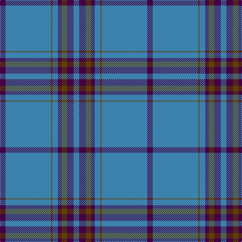

In pattern [BBGBBGBB](/stripes/bbgbbgbb/).

This was sourced from register-of-tartans.  It is a [8 stripe tartan](/stripes/stripes8/).

Original link https://www.tartanregister.gov.uk/tartanDetails.aspx?ref=11650

## Register references

External register numbers recorded for this tartan.

- Scottish Register of Tartans: [11650](https://www.tartanregister.gov.uk/tartanDetails.aspx?ref=11650)

## Thread count
DP/11 B90 T3 B11 DP7 T11 DP13 B/11

## Palette
Each colour and the base-6 reference it is a variant of.

| Colour | Shade | Base |
|---|---|---|
| B | <code style="background-color:#3C82AF;">#3C82AF</code> `oklch(58.1% 0.099 239.8)` <small>#3C82AF</small> | B <code style="background-color:#2A418A;">#2A418A</code> |
| DP | <code style="background-color:#440044;">#440044</code> `oklch(27.1% 0.125 328.4)` <small>#440044</small> | B <code style="background-color:#2A418A;">#2A418A</code> |
| T | <code style="background-color:#604000;">#604000</code> `oklch(39.8% 0.083 76.8)` <small>#604000</small> | G <code style="background-color:#006100;">#006100</code> |

# Sample pattern

## Nearest tartans

The nearest existing variants by ΔTartan distance.

1. [Wilson](/setts/s6/db48g14r3g2r3g2~x2/) — ΔT 1.23
1. [Pride of the Clyde](/setts/s8/db8w4dt6db2dt6o10dt63w3/) — ΔT 1.30
1. [RAAF #5](/setts/s9/t66w2t10w2t10w2t12r3db24~x2/) — ΔT 1.32
1. [Wilson](/setts/s6/db64g20r4g3r4g3/) — ΔT 1.38
1. [Salvation Army, Hunting](/setts/s7/db40g8k1ly2k1g8db5~x4/) — ΔT 1.45
1. [Dominion (Fashion)](/setts/s7/lg6r1lg17db3lg3db8lg1~x2/) — ΔT 1.55
1. [Munster Ancestry](/setts/s8/do4t48do21t14lo3t6do1ly3~x2/) — ΔT 1.56
1. [Danzas](/setts/s7/ly4b3ly1b17db40b2db3~x2/) — ΔT 1.60
1. [United French Freemasons (Corporate](/setts/s6/db144r9t44db4t4db4/) — ΔT 1.60
1. [Norsemen, The](/setts/s6/n65k2n4k2n10r24~x2/) — ΔT 1.63

## Neighbour map

Every grey dot is one of 14299 variants placed by the first two principal components of the ΔTartan feature space (44% of its variance). Red is this tartan; blue dots are its nearest — click one to open its page.

<svg viewBox="0 0 640 380" role="img" style="max-width:100%;height:auto;border:1px solid #e0e0e0;border-radius:4px;display:block" xmlns="http://www.w3.org/2000/svg"><image href="/nn/cloud.v1.png" width="640" height="380"/><a href="/setts/s6/db48g14r3g2r3g2~x2/"><circle cx="490.3" cy="188.3" r="4" fill="#3465a4"><title>Wilson</title></circle></a><a href="/setts/s8/db8w4dt6db2dt6o10dt63w3/"><circle cx="510.5" cy="146.2" r="4" fill="#3465a4"><title>Pride of the Clyde</title></circle></a><a href="/setts/s9/t66w2t10w2t10w2t12r3db24~x2/"><circle cx="501.0" cy="131.2" r="4" fill="#3465a4"><title>RAAF #5</title></circle></a><a href="/setts/s6/db64g20r4g3r4g3/"><circle cx="474.8" cy="193.1" r="4" fill="#3465a4"><title>Wilson</title></circle></a><a href="/setts/s7/db40g8k1ly2k1g8db5~x4/"><circle cx="487.3" cy="143.1" r="4" fill="#3465a4"><title>Salvation Army, Hunting</title></circle></a><a href="/setts/s7/lg6r1lg17db3lg3db8lg1~x2/"><circle cx="453.7" cy="207.7" r="4" fill="#3465a4"><title>Dominion (Fashion)</title></circle></a><a href="/setts/s8/do4t48do21t14lo3t6do1ly3~x2/"><circle cx="504.3" cy="156.7" r="4" fill="#3465a4"><title>Munster Ancestry</title></circle></a><a href="/setts/s7/ly4b3ly1b17db40b2db3~x2/"><circle cx="469.9" cy="166.8" r="4" fill="#3465a4"><title>Danzas</title></circle></a><a href="/setts/s6/db144r9t44db4t4db4/"><circle cx="558.0" cy="176.5" r="4" fill="#3465a4"><title>United French Freemasons (Corporate</title></circle></a><a href="/setts/s6/n65k2n4k2n10r24~x2/"><circle cx="552.5" cy="177.1" r="4" fill="#3465a4"><title>Norsemen, The</title></circle></a><circle cx="514.4" cy="164.1" r="5" fill="#c00000"/></svg>

ID: /setts/s8/dp11t90dy3t11dp7dy11dp13t11/
