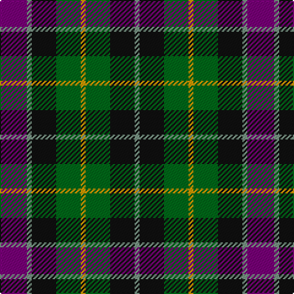

This page is one **sett** — a single exact thread-count. It belongs to the [tartan](/tartans/dp11y2k10g10lo2/)
(the same proportion at any scale), whose colour order is pattern [BGKGYGKG](/stripes/bgkgygkg/).

Sourced from register-of-tartans.  It is a [8 stripe tartan](/stripes/stripes8/).

Original link https://www.tartanregister.gov.uk/tartanDetails.aspx?ref=4856

## Also known as

This cloth is also recorded under:

- Selkirk Original

## Register references

External register numbers recorded for this tartan.

- Scottish Register of Tartans: [4856](https://www.tartanregister.gov.uk/tartanDetails.aspx?ref=4856)
- Scottish Tartans Authority (ITI): 3196

## Thread count
P/22 LG4 K20 G20 DY4 G20 K20 LG/4

## Palette

Palette: <strong>Tartan Register</strong> <small style="color:#888">(6 of 7 colours)</small>
<table><thead><tr><th>Colour</th><th>Threads</th><th>Shade</th><th>Base</th><th>OKLCh</th></tr></thead><tbody><tr><td>P/</td><td style="text-align:right;font-variant-numeric:tabular-nums">22</td><td><code style="background-color:#780078;">#780078</code> <small style="color:#888">#780078</small></td><td>B <code style="background-color:#2A418A;">#2A418A</code></td><td><small style="color:#888">oklch(40.2% 0.185 328.4)</small></td></tr><tr><td>LG</td><td style="text-align:right;font-variant-numeric:tabular-nums">4</td><td><code style="background-color:#789484;">#789484</code> <small style="color:#888">#789484</small></td><td>G <code style="background-color:#006100;">#006100</code></td><td><small style="color:#888">oklch(64.0% 0.040 160.0)</small></td></tr><tr><td>K</td><td style="text-align:right;font-variant-numeric:tabular-nums">20</td><td><code style="background-color:#101010;">#101010</code> <small style="color:#888">#101010</small></td><td>K <code style="background-color:#000000;">#000000</code></td><td><small style="color:#888">oklch(17.3% 0.000 89.9)</small></td></tr><tr><td>G</td><td style="text-align:right;font-variant-numeric:tabular-nums">20</td><td><code style="background-color:#006818;">#006818</code> <small style="color:#888">#006818</small></td><td>G <code style="background-color:#006100;">#006100</code></td><td><small style="color:#888">oklch(45.0% 0.142 145.0)</small></td></tr><tr><td>DY</td><td style="text-align:right;font-variant-numeric:tabular-nums">4</td><td><code style="background-color:#D09800;">#D09800</code> <small style="color:#888">#D09800</small></td><td>Y <code style="background-color:#F2BF00;">#F2BF00</code></td><td><small style="color:#888">oklch(71.4% 0.147 82.1)</small></td></tr><tr><td>G</td><td style="text-align:right;font-variant-numeric:tabular-nums">20</td><td><code style="background-color:#006818;">#006818</code> <small style="color:#888">#006818</small></td><td>G <code style="background-color:#006100;">#006100</code></td><td><small style="color:#888">oklch(45.0% 0.142 145.0)</small></td></tr><tr><td>K</td><td style="text-align:right;font-variant-numeric:tabular-nums">20</td><td><code style="background-color:#101010;">#101010</code> <small style="color:#888">#101010</small></td><td>K <code style="background-color:#000000;">#000000</code></td><td><small style="color:#888">oklch(17.3% 0.000 89.9)</small></td></tr><tr><td>LG/</td><td style="text-align:right;font-variant-numeric:tabular-nums">4</td><td><code style="background-color:#789484;">#789484</code> <small style="color:#888">#789484</small></td><td>G <code style="background-color:#006100;">#006100</code></td><td><small style="color:#888">oklch(64.0% 0.040 160.0)</small></td></tr></tbody></table>

# Sample pattern

## Nearest tartans

The nearest existing variants by ΔTartan distance, with this tartan at the top so the swatches line up against it.

ΔTartan

Tartan

Sett

—

<a href="/ttd/edit/#slug=dp11y2k10g10lo2~x2">Selkirk (Personal) Original</a> <a class="nn-out" href="/setts/s8/dp11y2k10g10lo2~x2/" title="open its dictionary page">↗</a>

0.37

<a href="/setts/s8/dp11t2k10g10ly3~x2/">Wilson's No.217</a>

0.53

<a href="/setts/s8/k8t3g13dp12ly2~x2/">Wilson's No.176</a>

0.71

<a href="/ttd/edit/#slug=k11g12w2g12k12dp12r3~x2">Cunningham / Wilson's No 120</a> <a class="nn-out" href="/setts/s7/k11g12w2g12k12dp12r3~x2/" title="open its dictionary page">↗</a>

0.73

<a href="/ttd/edit/#slug=r1k2g4k1g1k2db3k1w1~x6">MacKean Dress (Personal)</a> <a class="nn-out" href="/setts/s9/r1k2g4k1g1k2db3k1w1~x6/" title="open its dictionary page">↗</a>

0.80

<a href="/ttd/edit/#slug=k19g3db19lo5db19g3k19g19r7g19~x2">Casely Family Tartan Tartan Number: 2146. Earliest known date: 1992 The chiefly sett of a family tartan designed by Harry Lindley for the Scottish Tartans Society, to whom Mr Gordon Casely petitioned for the design in 1990. Formal accreditation was granted in 1993. See products available Copyright © Blair Urquhart, Comrie, 2015</a> <a class="nn-out" href="/setts/s10/k19g3db19lo5db19g3k19g19r7g19~x2/" title="open its dictionary page">↗</a>

0.80

<a href="/ttd/edit/#slug=db8k4lo2k3r2k3lo2k4g8~x4">Vosko</a> <a class="nn-out" href="/setts/s9/db8k4lo2k3r2k3lo2k4g8~x4/" title="open its dictionary page">↗</a>

0.81

<a href="/ttd/edit/#slug=db14g18k3g18r20k14lo3~x2">Scottish Parliament (unofficial)</a> <a class="nn-out" href="/setts/s7/db14g18k3g18r20k14lo3~x2/" title="open its dictionary page">↗</a>

0.83

<a href="/setts/s10/k3r1g5k3w1dp3~x2/">Wilson's No.194</a>

0.93

<a href="/setts/s7/k7db11ki3db11dy11g22db3~x2/">Scottish Odyssey Commemorative Tartan Tartan Number: 4071. Earliest known date: 01/01/2002 The Scottish Odyssey tartan from Lochcarron is a 'celebration of the wonderful experiences to be gained' from a visit to Scotland and some of the most spectacularly contrasting landscapes to be seen in Europe. See products available Copyright © Blair Urquhart, Comrie, 2015</a>

0.95

<a href="/ttd/edit/#slug=db8k3db18g6k8g6o12r5o12r3~x2">Longford</a> <a class="nn-out" href="/setts/s10/db8k3db18g6k8g6o12r5o12r3~x2/" title="open its dictionary page">↗</a>

## Neighbour map

Every grey dot is one of 14359 variants placed by the first two principal components of the ΔTartan feature space (44% of its variance). Red is this tartan; blue dots are its nearest — click one to open its page.

<svg viewBox="0 0 640 380" role="img" style="max-width:100%;height:auto;border:1px solid #e0e0e0;border-radius:4px;display:block" xmlns="http://www.w3.org/2000/svg"><image href="/nn/cloud.v1.png" width="640" height="380"/><a href="/setts/s8/dp11t2k10g10ly3~x2/"><circle cx="106.5" cy="242.3" r="4" fill="#3465a4"><title>Wilson's No.217</title></circle></a><a href="/setts/s8/k8t3g13dp12ly2~x2/"><circle cx="150.3" cy="234.7" r="4" fill="#3465a4"><title>Wilson's No.176</title></circle></a><a href="/setts/s7/k11g12w2g12k12dp12r3~x2/"><circle cx="131.2" cy="256.4" r="4" fill="#3465a4"><title>Cunningham / Wilson's No 120</title></circle></a><a href="/setts/s9/r1k2g4k1g1k2db3k1w1~x6/"><circle cx="100.2" cy="238.1" r="4" fill="#3465a4"><title>MacKean Dress (Personal)</title></circle></a><a href="/setts/s10/k19g3db19lo5db19g3k19g19r7g19~x2/"><circle cx="116.6" cy="232.5" r="4" fill="#3465a4"><title>Casely Family Tartan Tartan Number: 2146. Earliest known date: 1992 The chiefly sett of a family tartan designed by Harry Lindley for the Scottish Tartans Society, to whom Mr Gordon Casely petitioned for the design in 1990. Formal accreditation was granted in 1993. See products available Copyright © Blair Urquhart, Comrie, 2015</title></circle></a><a href="/setts/s9/db8k4lo2k3r2k3lo2k4g8~x4/"><circle cx="104.7" cy="242.8" r="4" fill="#3465a4"><title>Vosko</title></circle></a><a href="/setts/s7/db14g18k3g18r20k14lo3~x2/"><circle cx="143.2" cy="247.1" r="4" fill="#3465a4"><title>Scottish Parliament (unofficial)</title></circle></a><a href="/setts/s10/k3r1g5k3w1dp3~x2/"><circle cx="108.9" cy="221.9" r="4" fill="#3465a4"><title>Wilson's No.194</title></circle></a><a href="/setts/s7/k7db11ki3db11dy11g22db3~x2/"><circle cx="127.8" cy="225.1" r="4" fill="#3465a4"><title>Scottish Odyssey Commemorative Tartan Tartan Number: 4071. Earliest known date: 01/01/2002 The Scottish Odyssey tartan from Lochcarron is a 'celebration of the wonderful experiences to be gained' from a visit to Scotland and some of the most spectacularly contrasting landscapes to be seen in Europe. See products available Copyright © Blair Urquhart, Comrie, 2015</title></circle></a><a href="/setts/s10/db8k3db18g6k8g6o12r5o12r3~x2/"><circle cx="88.1" cy="220.3" r="4" fill="#3465a4"><title>Longford</title></circle></a><circle cx="118.9" cy="237.6" r="5" fill="#c00000"/></svg>

ID: /setts/s8/dp11y2k10g10lo2~x2/
