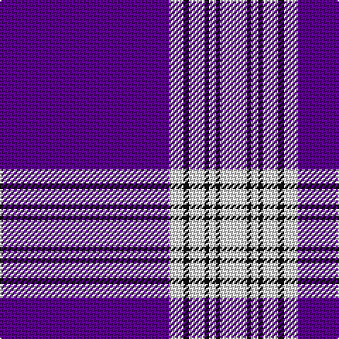

This page is one **sett** — a single exact thread-count. It belongs to the [tartan](/tartans/p120ln10k4ln11k3ln5k3ln19/)
(the same proportion at any scale), whose colour order is pattern [BWKWKWKW](/stripes/bwkwkwkw/).

Sourced from register-of-tartans.  It is a [8 stripe tartan](/stripes/stripes8/).

Original link https://www.tartanregister.gov.uk/tartanDetails.aspx?ref=2930

## Also known as

This cloth is also recorded under:

- Menzies Mauve and White
- Menzies, Mauve and White

2 attestations — the source records this cloth was collapsed from (oldest owns this page)

<ul>
<li>undated — Menzies Mauve and White (register-of-tartans, <a href="https://www.tartanregister.gov.uk/tartanDetails.aspx?ref=2930">record</a>)</li>
<li>undated — Menzies Mauve Dress Clan Tartan Tartan Number: 648. Earliest known date: c.1870 STS collection. See products available Copyright © Blair Urquhart, Comrie, 2015 (house-of-tartan, <a href="http://www.house-of-tartan.scotland.net/house/TartanViewjs.asp?colr=Def&tnam=648">record</a>)</li>
</ul>

## Register references

External register numbers recorded for this tartan.

- Scottish Register of Tartans: [2930](https://www.tartanregister.gov.uk/tartanDetails.aspx?ref=2930)
- Scottish Tartans World Register: 648

## Thread count
P/120 LN10 K4 LN11 K3 LN5 K3 LN/19

## Palette
Each colour and the base-6 reference it is a variant of.

| Colour | Shade | Base |
|---|---|---|
| K | <code style="background-color:#101010;">#101010</code> `oklch(17.3% 0.000 89.9)` <small>#101010</small> | K <code style="background-color:#000000;">#000000</code> |
| LN | <code style="background-color:#E0E0E0;">#E0E0E0</code> `oklch(90.7% 0.000 89.9)` <small>#E0E0E0</small> | W <code style="background-color:#F7F7F7;">#F7F7F7</code> |
| P | <code style="background-color:#5A008C;">#5A008C</code> `oklch(37.0% 0.191 306.3)` <small>#5A008C</small> | B <code style="background-color:#2A418A;">#2A418A</code> |

# Sample pattern

## Nearest tartans

The nearest existing variants by ΔTartan distance, with this tartan at the top so the swatches line up against it.

ΔTartan

Tartan

Sett

—

<a href="/ttd/edit/#slug=dp120w10k4w11k3w5k3w19">Menzies Mauve and White</a> <a class="nn-out" href="/setts/s8/dp120w10k4w11k3w5k3w19/" title="open its dictionary page">↗</a>

1.09

<a href="/ttd/edit/#slug=p120w10k4w11k3w5k3w19">Menzies, Mauve and White</a> <a class="nn-out" href="/setts/s8/p120w10k4w11k3w5k3w19/" title="open its dictionary page">↗</a>

1.78

<a href="/ttd/edit/#slug=db28dr3w1dr3db4w2dp1w5~x4">Baker Family Tartan Tartan Number: 613. Earliest known date: pre 2003 STS notes 'Sample in trade specimens file.' See products available Copyright © Blair Urquhart, Comrie, 2015</a> <a class="nn-out" href="/setts/s8/db28dr3w1dr3db4w2dp1w5~x4/" title="open its dictionary page">↗</a>

1.91

<a href="/ttd/edit/#slug=ly6db1ly1db1ly1db5ly2db5ly4db2r1db40r1~x2">Angotta</a> <a class="nn-out" href="/setts/s13/ly6db1ly1db1ly1db5ly2db5ly4db2r1db40r1~x2/" title="open its dictionary page">↗</a>

1.95

<a href="/ttd/edit/#slug=db28ly3w1ly3db4w2r1w5~x4">Baker Dress Family Tartan Tartan Number: 2180. Earliest known date: 1999 STS notes 'Sample in trade specimens file.' See products available Copyright © Blair Urquhart, Comrie, 2015</a> <a class="nn-out" href="/setts/s8/db28ly3w1ly3db4w2r1w5~x4/" title="open its dictionary page">↗</a>

1.95

<a href="/ttd/edit/#slug=p72w12p2ly2p2r12p1w9~x2">Tennessee Pioneer Blanket</a> <a class="nn-out" href="/setts/s8/p72w12p2ly2p2r12p1w9~x2/" title="open its dictionary page">↗</a>

1.99

<a href="/ttd/edit/#slug=db62w2db4w5db6ly2r8ly3w4~x2">George, Stuart (Personal)</a> <a class="nn-out" href="/setts/s9/db62w2db4w5db6ly2r8ly3w4~x2/" title="open its dictionary page">↗</a>

2.03

<a href="/ttd/edit/#slug=t4db1t4db24w6db4w1db2~x4">Antigonish</a> <a class="nn-out" href="/setts/s8/t4db1t4db24w6db4w1db2~x4/" title="open its dictionary page">↗</a>

2.05

<a href="/ttd/edit/#slug=db28o3w1o3db4w2dp1w5~x4">Baker</a> <a class="nn-out" href="/setts/s8/db28o3w1o3db4w2dp1w5~x4/" title="open its dictionary page">↗</a>

2.09

<a href="/ttd/edit/#slug=db80r8w1r8ly20db15~x2">Auchtermuchty Tartan Army</a> <a class="nn-out" href="/setts/s6/db80r8w1r8ly20db15~x2/" title="open its dictionary page">↗</a>

2.09

<a href="/ttd/edit/#slug=w2db49r5ly2r5ly2~x2">Balmer (Personal)</a> <a class="nn-out" href="/setts/s6/w2db49r5ly2r5ly2~x2/" title="open its dictionary page">↗</a>

## Neighbour map

Every grey dot is one of 14299 variants placed by the first two principal components of the ΔTartan feature space (44% of its variance). Red is this tartan; blue dots are its nearest — click one to open its page.

<svg viewBox="0 0 640 380" role="img" style="max-width:100%;height:auto;border:1px solid #e0e0e0;border-radius:4px;display:block" xmlns="http://www.w3.org/2000/svg"><image href="/nn/cloud.v1.png" width="640" height="380"/><a href="/setts/s8/p120w10k4w11k3w5k3w19/"><circle cx="479.9" cy="91.6" r="4" fill="#3465a4"><title>Menzies, Mauve and White</title></circle></a><a href="/setts/s8/db28dr3w1dr3db4w2dp1w5~x4/"><circle cx="428.3" cy="122.3" r="4" fill="#3465a4"><title>Baker Family Tartan Tartan Number: 613. Earliest known date: pre 2003 STS notes 'Sample in trade specimens file.' See products available Copyright © Blair Urquhart, Comrie, 2015</title></circle></a><a href="/setts/s13/ly6db1ly1db1ly1db5ly2db5ly4db2r1db40r1~x2/"><circle cx="547.8" cy="89.0" r="4" fill="#3465a4"><title>Angotta</title></circle></a><a href="/setts/s8/db28ly3w1ly3db4w2r1w5~x4/"><circle cx="412.8" cy="112.5" r="4" fill="#3465a4"><title>Baker Dress Family Tartan Tartan Number: 2180. Earliest known date: 1999 STS notes 'Sample in trade specimens file.' See products available Copyright © Blair Urquhart, Comrie, 2015</title></circle></a><a href="/setts/s8/p72w12p2ly2p2r12p1w9~x2/"><circle cx="476.3" cy="81.4" r="4" fill="#3465a4"><title>Tennessee Pioneer Blanket</title></circle></a><a href="/setts/s9/db62w2db4w5db6ly2r8ly3w4~x2/"><circle cx="482.6" cy="100.9" r="4" fill="#3465a4"><title>George, Stuart (Personal)</title></circle></a><a href="/setts/s8/t4db1t4db24w6db4w1db2~x4/"><circle cx="416.7" cy="150.8" r="4" fill="#3465a4"><title>Antigonish</title></circle></a><a href="/setts/s8/db28o3w1o3db4w2dp1w5~x4/"><circle cx="414.7" cy="115.6" r="4" fill="#3465a4"><title>Baker</title></circle></a><a href="/setts/s6/db80r8w1r8ly20db15~x2/"><circle cx="476.5" cy="125.3" r="4" fill="#3465a4"><title>Auchtermuchty Tartan Army</title></circle></a><a href="/setts/s6/w2db49r5ly2r5ly2~x2/"><circle cx="508.7" cy="140.4" r="4" fill="#3465a4"><title>Balmer (Personal)</title></circle></a><circle cx="475.7" cy="99.1" r="5" fill="#c00000"/></svg>

ID: /setts/s8/dp120w10k4w11k3w5k3w19/
