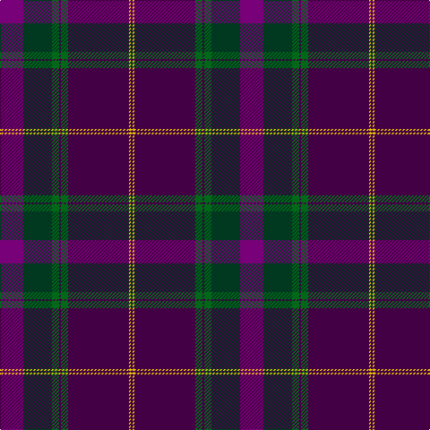

This page is one **sett** — a single exact thread-count. It belongs to the [tartan](/tartans/p13dg16g4dp1g4dp34y1dp1/)
(the same proportion at any scale), whose colour order is pattern [BGGBGBYB](/stripes/bggbgbyb/).

Sourced from tartans-authority.  It is a [8 stripe tartan](/stripes/stripes8/).

Original link http://www.tartansauthority.com/tartan-ferret/display/10967/

## Thread count
P/26 DG32 G8 DP2 G8 DP68 Y2 DP/2

## Palette
Each colour and the base-6 reference it is a variant of.

| Colour | Shade | Base |
|---|---|---|
| DG | <code style="background-color:#003820;">#003820</code> `oklch(30.0% 0.070 158.3)` <small>#003820</small> | G <code style="background-color:#006100;">#006100</code> |
| DP | <code style="background-color:#440044;">#440044</code> `oklch(27.1% 0.125 328.4)` <small>#440044</small> | B <code style="background-color:#2A418A;">#2A418A</code> |
| G | <code style="background-color:#006818;">#006818</code> `oklch(45.0% 0.142 145.0)` <small>#006818</small> | G <code style="background-color:#006100;">#006100</code> |
| P | <code style="background-color:#780078;">#780078</code> `oklch(40.2% 0.185 328.4)` <small>#780078</small> | B <code style="background-color:#2A418A;">#2A418A</code> |
| Y | <code style="background-color:#E8C000;">#E8C000</code> `oklch(81.9% 0.168 93.7)` <small>#E8C000</small> | Y <code style="background-color:#F2BF00;">#F2BF00</code> |

# Sample pattern

## Nearest tartans

The nearest existing variants by ΔTartan distance, with this tartan at the top so the swatches line up against it.

ΔTartan

Tartan

Sett

—

<a href="/ttd/edit/#slug=dp13dg16g4dp1g4dp34ly1dp1~x2">Heather Mead (Personal)</a> <a class="nn-out" href="/setts/s8/dp13dg16g4dp1g4dp34ly1dp1~x2/" title="open its dictionary page">↗</a>

0.69

<a href="/ttd/edit/#slug=m13dg16dg4dp4dg4dp34lo1dp1~x2">Heather Mead (Personal)</a> <a class="nn-out" href="/setts/s8/m13dg16dg4dp4dg4dp34lo1dp1~x2/" title="open its dictionary page">↗</a>

1.22

<a href="/ttd/edit/#slug=r4db10dg2db2dg24dp2dg2dp16dg2w1~x2">Kinfauns Castle</a> <a class="nn-out" href="/setts/s10/r4db10dg2db2dg24dp2dg2dp16dg2w1~x2/" title="open its dictionary page">↗</a>

1.29

<a href="/ttd/edit/#slug=r3g10k12db3k2db2k2db30r4w1~x2">McClafferty</a> <a class="nn-out" href="/setts/s10/r3g10k12db3k2db2k2db30r4w1~x2/" title="open its dictionary page">↗</a>

1.33

<a href="/ttd/edit/#slug=w2dp5m34k5n9k12dp1~x2">Thomson, Reona Ellen (Personal)</a> <a class="nn-out" href="/setts/s7/w2dp5m34k5n9k12dp1~x2/" title="open its dictionary page">↗</a>

1.47

<a href="/ttd/edit/#slug=r2k3dt30k2dt4k2dt30k36r30k2t2">Evans (Welsh Name)</a> <a class="nn-out" href="/setts/s11/r2k3dt30k2dt4k2dt30k36r30k2t2/" title="open its dictionary page">↗</a>

1.48

<a href="/ttd/edit/#slug=k2dr1dt17dr17db1ly2~x4">Murdoch (Geoffrey)</a> <a class="nn-out" href="/setts/s6/k2dr1dt17dr17db1ly2~x4/" title="open its dictionary page">↗</a>

1.50

<a href="/ttd/edit/#slug=k3r2dy4r1db25g12dy14db3r1~x2">Mann</a> <a class="nn-out" href="/setts/s9/k3r2dy4r1db25g12dy14db3r1~x2/" title="open its dictionary page">↗</a>

1.53

<a href="/ttd/edit/#slug=r32r2g2db30r1db2ly1~x2">Highland Prince (Fashion)</a> <a class="nn-out" href="/setts/s7/r32r2g2db30r1db2ly1~x2/" title="open its dictionary page">↗</a>

1.55

<a href="/ttd/edit/#slug=dg5r1r4db2r20dg12db16r4r1~x2">Diana Princess of Wales</a> <a class="nn-out" href="/setts/s9/dg5r1r4db2r20dg12db16r4r1~x2/" title="open its dictionary page">↗</a>

1.55

<a href="/ttd/edit/#slug=dt36r3dt1r2dt3r6db1r2db35w1db1lo2~x2">Kirkcaldy Tartan Army (Corporate)</a> <a class="nn-out" href="/setts/s12/dt36r3dt1r2dt3r6db1r2db35w1db1lo2~x2/" title="open its dictionary page">↗</a>

## Neighbour map

Every grey dot is one of 14299 variants placed by the first two principal components of the ΔTartan feature space (44% of its variance). Red is this tartan; blue dots are its nearest — click one to open its page.

<svg viewBox="0 0 640 380" role="img" style="max-width:100%;height:auto;border:1px solid #e0e0e0;border-radius:4px;display:block" xmlns="http://www.w3.org/2000/svg"><image href="/nn/cloud.v1.png" width="640" height="380"/><a href="/setts/s8/m13dg16dg4dp4dg4dp34lo1dp1~x2/"><circle cx="342.6" cy="143.2" r="4" fill="#3465a4"><title>Heather Mead (Personal)</title></circle></a><a href="/setts/s10/r4db10dg2db2dg24dp2dg2dp16dg2w1~x2/"><circle cx="319.9" cy="153.7" r="4" fill="#3465a4"><title>Kinfauns Castle</title></circle></a><a href="/setts/s10/r3g10k12db3k2db2k2db30r4w1~x2/"><circle cx="341.0" cy="140.1" r="4" fill="#3465a4"><title>McClafferty</title></circle></a><a href="/setts/s7/w2dp5m34k5n9k12dp1~x2/"><circle cx="332.1" cy="137.3" r="4" fill="#3465a4"><title>Thomson, Reona Ellen (Personal)</title></circle></a><a href="/setts/s11/r2k3dt30k2dt4k2dt30k36r30k2t2/"><circle cx="308.9" cy="167.3" r="4" fill="#3465a4"><title>Evans (Welsh Name)</title></circle></a><a href="/setts/s6/k2dr1dt17dr17db1ly2~x4/"><circle cx="327.8" cy="183.4" r="4" fill="#3465a4"><title>Murdoch (Geoffrey)</title></circle></a><a href="/setts/s9/k3r2dy4r1db25g12dy14db3r1~x2/"><circle cx="295.0" cy="159.8" r="4" fill="#3465a4"><title>Mann</title></circle></a><a href="/setts/s7/r32r2g2db30r1db2ly1~x2/"><circle cx="387.2" cy="136.0" r="4" fill="#3465a4"><title>Highland Prince (Fashion)</title></circle></a><a href="/setts/s9/dg5r1r4db2r20dg12db16r4r1~x2/"><circle cx="309.5" cy="191.1" r="4" fill="#3465a4"><title>Diana Princess of Wales</title></circle></a><a href="/setts/s12/dt36r3dt1r2dt3r6db1r2db35w1db1lo2~x2/"><circle cx="355.9" cy="111.3" r="4" fill="#3465a4"><title>Kirkcaldy Tartan Army (Corporate)</title></circle></a><circle cx="351.4" cy="147.1" r="5" fill="#c00000"/></svg>

ID: /setts/s8/dp13dg16g4dp1g4dp34ly1dp1~x2/
