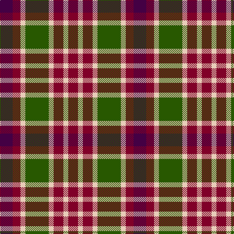

**Bands:** [BRWGWRWR](/stripes/brwgwrwr/) · **Stripes:** [DP R LB DG LB R LB R](/stripes/stripes8/) DP R LB DG LB R LB R

This was sourced from tartans-authority.  It is a [8 band tartan](/bands/bands8/).

Original link http://www.tartansauthority.com/tartan-ferret/display/10803/

## Thread count
DP/26 DR16 LR10 G48 LR10 DR20 LR10 DR/20

## Palette
Each colour and its ΔE from the base-6 reference it is a variant of.

| Colour | Shade | Base | ΔE (OKLab) |
|---|---|---|---|
| DP | <code style="background-color:#440044;">#440044</code> `#440044` | B <code style="background-color:#2A418A;">#2A418A</code> | 0.18 |
| DR | <code style="background-color:#800028;">#800028</code> `#800028` | R <code style="background-color:#CC0000;">#CC0000</code> | 0.17 |
| G | <code style="background-color:#285800;">#285800</code> `#285800` | G <code style="background-color:#006100;">#006100</code> | 0.03 |
| LR | <code style="background-color:#E8CCB8;">#E8CCB8</code> `#E8CCB8` | W <code style="background-color:#F7F7F7;">#F7F7F7</code> | 0.12 |

# Sample pattern

## Nearest tartans

The nearest existing variants by ΔTartan distance.

1. [Wilson's No.214](/setts/s8/t3k1t1r3g4r3t1k1~x4/) — ΔT 0.82
1. [Chaudhri, Zafar Iqbal](/setts/s8/dp13n8w5dg24w5n10w5n10~x2/) — ΔT 0.84
1. [Stewart (Artefact)](/setts/s7/r2g4db8r9g9k2r2~x4/) — ΔT 0.96
1. [Stewart, Plaid](/setts/s7/r2g4db8r9g9k2r2~x2/) — ΔT 0.97
1. [Holden Monaro Corporate Tartan Tartan Number: 8700. Earliest known date: 1831 Holden Monaro GTS 1978 car seats. Reproduction colours. Warp 162 threads Weft 202 threads. Last weaving went through with slight difference. Sett size = 4 3/8th - 4 3/4 inch (112mm - 120mm) See products available Copyright © Blair Urquhart, Comrie, 2015](/setts/s8/lr10dt3lr3dt3lr3dt11dy11o3~x2/) — ΔT 1.06
1. [Stewart /Stuart- Fragment Cf 1452 & 1445](/setts/s7/r3t4k11r11g11do3r3~x4/) — ΔT 1.07
1. [Al Suwaidi of Abu Dhabi (Personal)](/setts/s8/w2r7dg7k7r2dg2k2w1~x5/) — ΔT 1.10
1. [Carnegie](/setts/s8/r33g17db50g17r11g17r9k7/) — ΔT 1.12
1. [Strathblane](/setts/s8/o6w2k4dy12k4w2o6r3~x2/) — ΔT 1.18
1. [Borthwick Family Tartan Tartan Number: 816. Earliest known date: pre 2003 Borthwick is an ancient Scottish family of Celtic origin. William de Borthwick built Borthwick Castle in Midlothian in the 14th century. The present chief of the border family is Major John Henry Stuart Borthwick of Crookston, Midlothian. He was recognised by Lord Lyon as the 23rd Lord Borthwick in 1986. See products available Copyright © Blair Urquhart, Comrie, 2015](/setts/s9/g12k2m12k3o12k16o12k3m6~x2/) — ΔT 1.19

## Neighbour map

Every grey dot is one of 14313 variants placed by the first two principal components of the ΔTartan feature space (44% of its variance). Red is this tartan; blue dots are its nearest — click one to open its page.

<svg viewBox="0 0 640 380" role="img" style="max-width:100%;height:auto;border:1px solid #e0e0e0;border-radius:4px;display:block" xmlns="http://www.w3.org/2000/svg"><image href="/nn/cloud.v1.png" width="640" height="380"/><a href="/setts/s8/t3k1t1r3g4r3t1k1~x4/"><circle cx="117.4" cy="249.9" r="4" fill="#3465a4"><title>Wilson's No.214</title></circle></a><a href="/setts/s8/dp13n8w5dg24w5n10w5n10~x2/"><circle cx="108.6" cy="231.1" r="4" fill="#3465a4"><title>Chaudhri, Zafar Iqbal</title></circle></a><a href="/setts/s7/r2g4db8r9g9k2r2~x4/"><circle cx="160.1" cy="252.5" r="4" fill="#3465a4"><title>Stewart (Artefact)</title></circle></a><a href="/setts/s7/r2g4db8r9g9k2r2~x2/"><circle cx="146.0" cy="246.5" r="4" fill="#3465a4"><title>Stewart, Plaid</title></circle></a><a href="/setts/s8/lr10dt3lr3dt3lr3dt11dy11o3~x2/"><circle cx="141.5" cy="250.1" r="4" fill="#3465a4"><title>Holden Monaro Corporate Tartan Tartan Number: 8700. Earliest known date: 1831 Holden Monaro GTS 1978 car seats. Reproduction colours. Warp 162 threads Weft 202 threads. Last weaving went through with slight difference. Sett size = 4 3/8th - 4 3/4 inch (112mm - 120mm) See products available Copyright © Blair Urquhart, Comrie, 2015</title></circle></a><a href="/setts/s7/r3t4k11r11g11do3r3~x4/"><circle cx="97.5" cy="233.3" r="4" fill="#3465a4"><title>Stewart /Stuart- Fragment Cf 1452 &amp; 1445</title></circle></a><a href="/setts/s8/w2r7dg7k7r2dg2k2w1~x5/"><circle cx="111.6" cy="203.7" r="4" fill="#3465a4"><title>Al Suwaidi of Abu Dhabi (Personal)</title></circle></a><a href="/setts/s8/r33g17db50g17r11g17r9k7/"><circle cx="158.2" cy="221.0" r="4" fill="#3465a4"><title>Carnegie</title></circle></a><a href="/setts/s8/o6w2k4dy12k4w2o6r3~x2/"><circle cx="87.6" cy="205.9" r="4" fill="#3465a4"><title>Strathblane</title></circle></a><a href="/setts/s9/g12k2m12k3o12k16o12k3m6~x2/"><circle cx="124.2" cy="222.5" r="4" fill="#3465a4"><title>Borthwick Family Tartan Tartan Number: 816. Earliest known date: pre 2003 Borthwick is an ancient Scottish family of Celtic origin. William de Borthwick built Borthwick Castle in Midlothian in the 14th century. The present chief of the border family is Major John Henry Stuart Borthwick of Crookston, Midlothian. He was recognised by Lord Lyon as the 23rd Lord Borthwick in 1986. See products available Copyright © Blair Urquhart, Comrie, 2015</title></circle></a><circle cx="120.2" cy="231.0" r="5" fill="#c00000"/></svg>

ID: /setts/s8/dp13r8lb5dg24lb5r10lb5r10~x2/
