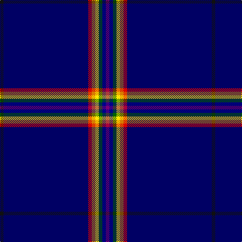

**Bands:** [BBGYYRBK](/stripes/bbgyyrbk/) · **Stripes:** [DP DB G LY LO R DB K](/stripes/stripes8/) DP DB G LY LO R DB K

This was sourced from register-of-tartans.  It is a [8 band tartan](/bands/bands8/).

Original link https://www.tartanregister.gov.uk/tartanDetails.aspx?ref=11048

## Register references

External register numbers recorded for this tartan.

- Scottish Register of Tartans: [11048](https://www.tartanregister.gov.uk/tartanDetails.aspx?ref=11048)

## Thread count
K/7 DB168 R7 O7 Y7 G7 DBa7 P/7

## Palette
Each colour and its ΔE from the base-6 reference it is a variant of.

| Colour | Shade | Base | ΔE (OKLab) |
|---|---|---|---|
| DB | <code style="background-color:#000064;">#000064</code> `#000064` | B <code style="background-color:#2A418A;">#2A418A</code> | 0.18 |
| DBa | <code style="background-color:#00008C;">#00008C</code> `#00008C` | B <code style="background-color:#2A418A;">#2A418A</code> | 0.13 |
| G | <code style="background-color:#006400;">#006400</code> `#006400` | G <code style="background-color:#006100;">#006100</code> | 0.01 |
| K | <code style="background-color:#101010;">#101010</code> `#101010` | K <code style="background-color:#000000;">#000000</code> | 0.17 |
| O | <code style="background-color:#D87C00;">#D87C00</code> `#D87C00` | Y <code style="background-color:#F2BF00;">#F2BF00</code> | 0.17 |
| P | <code style="background-color:#780078;">#780078</code> `#780078` | B <code style="background-color:#2A418A;">#2A418A</code> | 0.17 |
| R | <code style="background-color:#DC0000;">#DC0000</code> `#DC0000` | R <code style="background-color:#CC0000;">#CC0000</code> | 0.03 |
| Y | <code style="background-color:#FFE600;">#FFE600</code> `#FFE600` | Y <code style="background-color:#F2BF00;">#F2BF00</code> | 0.10 |

# Sample pattern

## Nearest tartans

The nearest existing variants by ΔTartan distance.

1. [Way of the Rainbow](/setts/s8/k1db24r1ly1ly1g1db1lp1~x7/) — ΔT 1.06
1. [Royal Canadian Mounted Police](/setts/s9/db152b2k4w2g28r10k26r1ly2/) — ΔT 2.00
1. [Yorston (2014)](/setts/s10/db109t12r4w4db5ly4g5k4r4t18/) — ΔT 2.28
1. [Yorston (2014)](/setts/s10/db109lb12r4w4db5ly4g5k4r4lb18/) — ΔT 2.33
1. [U.S. Law Enforcement](/setts/s10/lg4k3db6db4db57o3db3o3db3r3~x2/) — ΔT 2.37
1. [St. Petersburg City (District)](/setts/s8/db60g10db3lb6ly2db9r2w2~x2/) — ΔT 2.38
1. [Boat of Garten](/setts/s8/db62w4k2w7dp2dg3ly2db16~x2/) — ΔT 2.43
1. [Platinum Golf Scotland](/setts/s12/o2k3dp1k45o1k2o2k2dg4r1dg1w1~x2/) — ΔT 2.47
1. [London '88](/setts/s12/ly4db55o4k4db2ly2db2w5db3r2o2k2~x2/) — ΔT 2.53
1. [Tau-Taurini (Provisional) (Personal)](/setts/s10/db64ly3w3r12r3g3dp3w3t10db10/) — ΔT 2.53

## Neighbour map

Every grey dot is one of 14313 variants placed by the first two principal components of the ΔTartan feature space (44% of its variance). Red is this tartan; blue dots are its nearest — click one to open its page.

<svg viewBox="0 0 640 380" role="img" style="max-width:100%;height:auto;border:1px solid #e0e0e0;border-radius:4px;display:block" xmlns="http://www.w3.org/2000/svg"><image href="/nn/cloud.v1.png" width="640" height="380"/><a href="/setts/s8/k1db24r1ly1ly1g1db1lp1~x7/"><circle cx="464.9" cy="66.1" r="4" fill="#3465a4"><title>Way of the Rainbow</title></circle></a><a href="/setts/s9/db152b2k4w2g28r10k26r1ly2/"><circle cx="407.2" cy="49.4" r="4" fill="#3465a4"><title>Royal Canadian Mounted Police</title></circle></a><a href="/setts/s10/db109t12r4w4db5ly4g5k4r4t18/"><circle cx="385.2" cy="59.4" r="4" fill="#3465a4"><title>Yorston (2014)</title></circle></a><a href="/setts/s10/db109lb12r4w4db5ly4g5k4r4lb18/"><circle cx="372.7" cy="51.3" r="4" fill="#3465a4"><title>Yorston (2014)</title></circle></a><a href="/setts/s10/lg4k3db6db4db57o3db3o3db3r3~x2/"><circle cx="518.0" cy="119.9" r="4" fill="#3465a4"><title>U.S. Law Enforcement</title></circle></a><a href="/setts/s8/db60g10db3lb6ly2db9r2w2~x2/"><circle cx="479.5" cy="97.6" r="4" fill="#3465a4"><title>St. Petersburg City (District)</title></circle></a><a href="/setts/s8/db62w4k2w7dp2dg3ly2db16~x2/"><circle cx="486.4" cy="90.9" r="4" fill="#3465a4"><title>Boat of Garten</title></circle></a><a href="/setts/s12/o2k3dp1k45o1k2o2k2dg4r1dg1w1~x2/"><circle cx="552.0" cy="65.1" r="4" fill="#3465a4"><title>Platinum Golf Scotland</title></circle></a><a href="/setts/s12/ly4db55o4k4db2ly2db2w5db3r2o2k2~x2/"><circle cx="430.0" cy="60.4" r="4" fill="#3465a4"><title>London '88</title></circle></a><a href="/setts/s10/db64ly3w3r12r3g3dp3w3t10db10/"><circle cx="337.6" cy="62.4" r="4" fill="#3465a4"><title>Tau-Taurini (Provisional) (Personal)</title></circle></a><circle cx="460.7" cy="72.7" r="5" fill="#c00000"/></svg>

ID: /setts/s8/dp1db1g1ly1lo1r1db24k1~x7/
